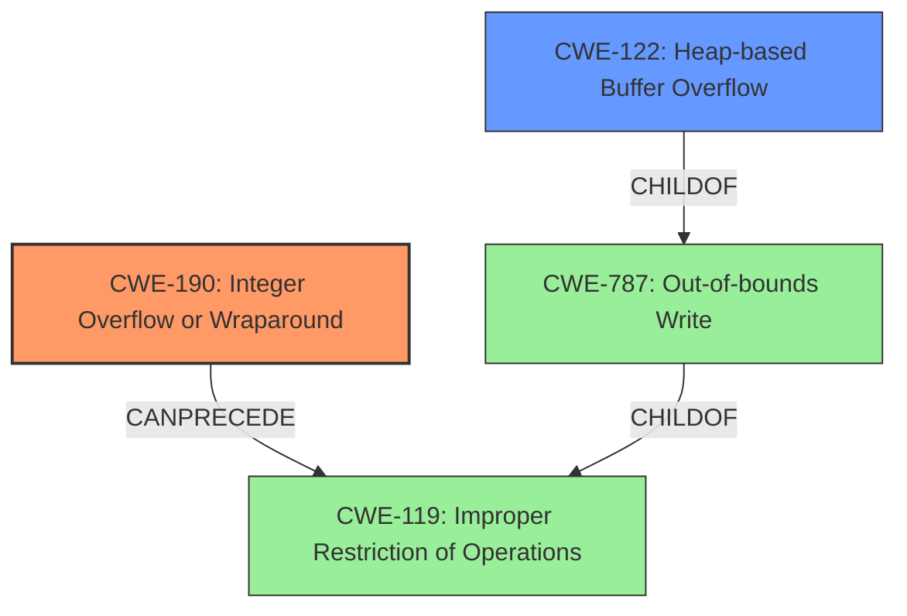

# Analysis for CVE-2021-30019

# Summary
| CWE ID  | CWE Name                                        | Confidence | CWE Abstraction Level | CWE Vulnerability Mapping Label | CWE-Vulnerability Mapping Notes |
| :------- | :---------------------------------------------- | :--------- | :-------------------- | :------------------------------ | :------------------------------ |
| CWE-190 | Integer Overflow or Wraparound                  | 0.9        | Base                  | Primary CWE                     | Allowed                       |
| CWE-122 | Heap-based Buffer Overflow                      | 0.8        | Variant               | Secondary Candidate             | Allowed                       |

## Evidence and Confidence

*   **Confidence Score:** 0.85
*   **Evidence Strength:** HIGH

## Relationship Analysis
The primary CWE is CWE-190, which represents the root cause of the vulnerability where the **size is a negative number** due to an integer overflow or wraparound. CWE-122 is a secondary CWE, representing the heap-based buffer overflow that results from the integer overflow. CWE-190 can precede CWE-119 (Improper Restriction of Operations within the Bounds of a Memory Buffer), and CWE-122 is a variant of CWE-787 (Out-of-bounds Write). The abstraction levels are appropriate, with CWE-190 being a Base CWE and CWE-122 being a Variant CWE.

## Vulnerability Chain
The vulnerability chain starts with a crafted file leading to a calculation where `ctx->hdr.frame_size` is smaller than `ctx->hdr.hdr_size`. This results in CWE-190, **Integer Overflow or Wraparound**, as `size` becomes a negative number. This negative value is then used in `memcpy`, leading to CWE-122, **Heap-based Buffer Overflow**.

Crafted File ->  **size to be a negative number** (CWE-190) -> **heap overflow** in memcpy (CWE-122)

## Summary of Analysis
The initial assessment and final conclusion are based on the provided evidence, including the vulnerability description and CVE reference links content summary. The vulnerability description key phrases also highlight the **negative number** and **heap overflow** as key indicators.

The vulnerability is caused by an integer overflow in the `adts_dmx_process` function. Specifically, the code calculates a size value, and if `ctx->hdr.frame_size` is smaller than `ctx->hdr.hdr_size`, the resulting `size` becomes negative due to integer wraparound. This negative value is then passed to `memcpy`, which interprets it as a very large unsigned value, leading to a heap overflow.

CWE-190 accurately captures the root cause where the calculation results in an integer overflow or wraparound, causing `size` to become negative. The supporting evidence is the vulnerability description stating "**size to be a negative number**" and the CVE reference links content summary mentioning "If `ctx->hdr.frame_size` is smaller than `ctx->hdr.hdr_size`, the `size` variable becomes negative due to integer underflow."

CWE-122 is selected because the negative size is then used in a `memcpy` operation, resulting in a heap overflow. The vulnerability description key phrases highlight "**heap overflow**" as a key indicator.

The selected CWEs are at the optimal level of specificity, with CWE-190 being a Base CWE and CWE-122 being a Variant CWE that provides more detail about the location of the buffer overflow.

The following CWEs were considered but not used:

*   CWE-191: Integer Underflow (Wrap or Wraparound) - While the CVE reference summary states "integer underflow", CWE-190 more accurately represents what happened in the memcpy operation
*   CWE-197: Numeric Truncation Error - This is not a truncation issue, but rather an overflow/wraparound.
*   CWE-681: Incorrect Conversion between Numeric Types - While there might be implicit type conversions, the core issue is the integer overflow, not the conversion itself.
*   CWE-1284: Improper Validation of Specified Quantity in Input - The code doesn't validate the calculated size, but the root cause is the integer overflow, not the missing validation.
*   CWE-126: Buffer Over-read - The issue is an out-of-bounds write, not read.
*   CWE-195: Signed to Unsigned Conversion Error - While a signed integer might be converted to unsigned, the overflow is the primary issue.
*   CWE-839: Numeric Range Comparison Without Minimum Check - Not applicable, as the issue is not a missing minimum check, but rather an overflow.
*   CWE-194: Unexpected Sign Extension - This is not a sign extension issue.
Relevant CWE Information:

# Enhanced Query for CVE-2021-30019

## Vulnerability Description
In the adts_dmx_process function in filters/reframe_adts.c in GPAC 1.0.1, a crafted file may cause ctx->hdr.frame_size to be smaller than ctx->hdr.hdr_size, resulting in **size to be a negative number** and a **heap overflow** in the memcpy.

### Vulnerability Description Key Phrases
- **rootcause:** **size to be a negative number**
- **weakness:** **heap overflow**
- **vector:** crafted file
- **product:** GPAC
- **version:** 1.0.1
- **component:** adts_dmx_process function in filters/reframe_adts.c

## CVE Reference Links Content Summary
Based on the provided content, here's an analysis of the vulnerability:

**Root Cause:**
The vulnerability is caused by an integer overflow in the `adts_dmx_process` function within the `src/filters/reframe_adts.c` file of the GPAC project.

**Weaknesses/Vulnerabilities:**
- **Integer Overflow:** The code calculates the size of data to copy using `size = ctx->hdr.frame_size - ctx->hdr.hdr_size;`. If `ctx->hdr.frame_size` is smaller than `ctx->hdr.hdr_size`, the `size` variable becomes negative due to integer underflow.
- **Heap Overflow:** This negative `size` value is then used in a `memcpy` operation `memcpy(output, sync + offset, size);`, leading to a heap overflow because `memcpy` interprets the negative size as a very large unsigned value.

**Impact of Exploitation:**
- **Heap Overflow:** A heap overflow can lead to memory corruption, potentially allowing an attacker to overwrite critical program data or control flow.
- **Crash:** The vulnerability can cause the application to crash.

**Attack Vectors:**
- **Crafted Input File:** An attacker can craft a malicious ADTS file where the `frame_size` in the header is smaller than the `hdr_size`, triggering the integer underflow.
- **File Processing:** The vulnerability is triggered when the application processes this crafted ADTS file.

**Required Attacker Capabilities/Position:**
- **Ability to Provide Malicious Input:** An attacker needs the ability to provide a crafted ADTS file to the vulnerable application. This may occur through opening a malicious file or through a network connection.

## Retriever Results

### Top Combined Results

| Rank | CWE ID | Name | Abstraction | Usage  | Retrievers | Individual Scores |
|------|--------|------|-------------|-------|------------|-------------------|
| 1 | 190 | Integer Overflow or Wraparound | Base | Allowed | alternate_terms | 0.800 |
| 2 | 197 | Numeric Truncation Error | Base | Allowed | sparse | 0.362 |
| 3 | 681 | Incorrect Conversion between Numeric Types | Base | Allowed | sparse | 0.335 |
| 4 | 122 | Heap-based Buffer Overflow | Variant | Allowed | sparse | 0.335 |
| 5 | 1284 | Improper Validation of Specified Quantity in Input | Base | Allowed | sparse | 0.313 |
| 6 | 126 | Buffer Over-read | Variant | Allowed | dense | 0.491 |
| 7 | 195 | Signed to Unsigned Conversion Error | Variant | Allowed | graph | 0.003 |
| 8 | 191 | Integer Underflow (Wrap or Wraparound) | Base | Allowed | sparse | 0.309 |
| 9 | 839 | Numeric Range Comparison Without Minimum Check | Base | Allowed | sparse | 0.307 |
| 10 | 194 | Unexpected Sign Extension | Variant | Allowed | sparse | 0.305 |

# Complete CWE Specifications

## CWE-190: Integer Overflow or Wraparound
**Abstraction:** Base
**Status:** Stable

### Description
The product performs a calculation that can
         produce an integer overflow or wraparound when the logic
         assumes that the resulting value will always be larger than
         the original value. This occurs when an integer value is
         incremented to a value that is too large to store in the
         associated representation. When this occurs, the value may
         become a very small or negative number.

### Extended Description
Not provided

### Alternative Terms
Overflow: The terms "overflow" and "wraparound" are used interchangeably by some people, but they can have more precise distinctions by others. See Terminology Notes.
Wraparound: The terms "overflow" and "wraparound" are used interchangeably by some people, but they can have more precise distinctions by others. See Terminology Notes.
wrap, wrap-around, wrap around: Alternate spellings of "wraparound"

### Relationships
ChildOf -> CWE-682
ChildOf -> CWE-682
ChildOf -> CWE-20
CanPrecede -> CWE-119

### Mapping Guidance
**Usage:** Allowed
**Rationale:** This CWE entry is at the Base level of abstraction, which is a preferred level of abstraction for mapping to the root causes of vulnerabilities.
**Comments:** Be careful of terminology problems with "overflow," "underflow," and "wraparound" - see Terminology Notes. Carefully read both the name and description to ensure that this mapping is an appropriate fit. Do not try to 'force' a mapping to a lower-level Base/Variant simply to comply with this preferred level of abstraction.
**Reasons:**
- Acceptable-Use
**Suggested Alternatives:**
- CWE-191: Integer Underflow (Wrap or Wraparound). Consider CWE-191 when the result is less than the minimum value that can be represented (sometimes called "underflows").

### Additional Notes
**[Relationship]** Integer overflows can be primary to buffer overflows when they cause less memory to be allocated than expected.

**[Terminology]** 

"Integer overflow" is sometimes used to cover several types of errors, including signedness errors, or buffer overflows that involve manipulation of integer data types instead of characters. Part of the confusion results from the fact that 0xffffffff is -1 in a signed context. Other confusion also arises because of the role that integer overflows have in chains.

A "wraparound" is a well-defined, standard behavior that follows specific rules for how to handle situations when the intended numeric value is too large or too small to be represented, as specified in standards such as C11.

"Overflow" is sometimes conflated with "wraparound" but typically indicates a non-standard or undefined behavior.

The "overflow" term is sometimes used to indicate cases where either the maximum or the minimum is exceeded, but others might only use "overflow" to indicate exceeding the maximum while using "underflow" for exceeding the minimum.

Some people use "overflow" to mean any value outside the representable range - whether greater than the maximum, or less than the minimum - but CWE uses "underflow" for cases in which the intended result is less than the minimum.

See [REF-1440] for additional explanation of the ambiguity of terminology.

**[Other]** While there may be circumstances in which the logic intentionally relies on wrapping - such as with modular arithmetic in timers or counters - it can have security consequences if the wrap is unexpected. This is especially the case if the integer overflow can be triggered using user-supplied inputs.

### Observed Examples
- **CVE-2021-43537:** Chain: in a web browser, an unsigned 64-bit integer is forcibly cast to a 32-bit integer (CWE-681) and potentially leading to an integer overflow (CWE-190). If an integer overflow occurs, this can cause heap memory corruption (CWE-122)
- **CVE-2022-21668:** Chain: Python library does not limit the resources used to process images that specify a very large number of bands (CWE-1284), leading to excessive memory consumption (CWE-789) or an integer overflow (CWE-190).
- **CVE-2022-0545:** Chain: 3D renderer has an integer overflow (CWE-190) leading to write-what-where condition (CWE-123) using a crafted image.

## CWE-197: Numeric Truncation Error
**Abstraction:** Base
**Status:** Incomplete

### Description
Truncation errors occur when a primitive is cast to a primitive of a smaller size and data is lost in the conversion.

### Extended Description
When a primitive is cast to a smaller primitive, the high order bits of the large value are lost in the conversion, potentially resulting in an unexpected value that is not equal to the original value. This value may be required as an index into a buffer, a loop iterator, or simply necessary state data. In any case, the value cannot be trusted and the system will be in an undefined state. While this method may be employed viably to isolate the low bits of a value, this usage is rare, and truncation usually implies that an implementation error has occurred.

### Alternative Terms
None

### Relationships
ChildOf -> CWE-681
ChildOf -> CWE-681
ChildOf -> CWE-681
CanAlsoBe -> CWE-195
CanAlsoBe -> CWE-196
CanAlsoBe -> CWE-192
CanAlsoBe -> CWE-194

### Mapping Guidance
**Usage:** Allowed
**Rationale:** This CWE entry is at the Base level of abstraction, which is a preferred level of abstraction for mapping to the root causes of vulnerabilities.
**Comments:** Carefully read both the name and description to ensure that this mapping is an appropriate fit. Do not try to 'force' a mapping to a lower-level Base/Variant simply to comply with this preferred level of abstraction.
**Reasons:**
- Acceptable-Use

### Additional Notes
**[Research Gap]** This weakness has traditionally been under-studied and under-reported, although vulnerabilities in popular software have been published in 2008 and 2009.

### Observed Examples
- **CVE-2020-17087:** Chain: integer truncation (CWE-197) causes small buffer allocation (CWE-131) leading to out-of-bounds write (CWE-787) in kernel pool, as exploited in the wild per CISA KEV.
- **CVE-2009-0231:** Integer truncation of length value leads to heap-based buffer overflow.
- **CVE-2008-3282:** Size of a particular type changes for 64-bit platforms, leading to an integer truncation in document processor causes incorrect index to be generated.

## CWE-681: Incorrect Conversion between Numeric Types
**Abstraction:** Base
**Status:** Draft

### Description
When converting from one data type to another, such as long to integer, data can be omitted or translated in a way that produces unexpected values. If the resulting values are used in a sensitive context, then dangerous behaviors may occur.

### Extended Description
Not provided

### Alternative Terms
None

### Relationships
ChildOf -> CWE-704
ChildOf -> CWE-704
CanPrecede -> CWE-682

### Mapping Guidance
**Usage:** Allowed
**Rationale:** This CWE entry is at the Base level of abstraction, which is a preferred level of abstraction for mapping to the root causes of vulnerabilities.
**Comments:** Carefully read both the name and description to ensure that this mapping is an appropriate fit. Do not try to 'force' a mapping to a lower-level Base/Variant simply to comply with this preferred level of abstraction.
**Reasons:**
- Acceptable-Use

### Observed Examples
- **CVE-2022-2639:** Chain: integer coercion error (CWE-192) prevents a return value from indicating an error, leading to out-of-bounds write (CWE-787)
- **CVE-2021-43537:** Chain: in a web browser, an unsigned 64-bit integer is forcibly cast to a 32-bit integer (CWE-681) and potentially leading to an integer overflow (CWE-190). If an integer overflow occurs, this can cause heap memory corruption (CWE-122)
- **CVE-2007-4268:** Chain: integer signedness error (CWE-195) passes signed comparison, leading to heap overflow (CWE-122)

## CWE-122: Heap-based Buffer Overflow
**Abstraction:** Variant
**Status:** Draft

### Description
A heap overflow condition is a buffer overflow, where the buffer that can be overwritten is allocated in the heap portion of memory, generally meaning that the buffer was allocated using a routine such as malloc().

### Extended Description
Not provided

### Alternative Terms
None

### Relationships
ChildOf -> CWE-788
ChildOf -> CWE-787

### Mapping Guidance
**Usage:** Allowed
**Rationale:** This CWE entry is at the Variant level of abstraction, which is a preferred level of abstraction for mapping to the root causes of vulnerabilities.
**Comments:** Carefully read both the name and description to ensure that this mapping is an appropriate fit. Do not try to 'force' a mapping to a lower-level Base/Variant simply to comply with this preferred level of abstraction.
**Reasons:**
- Acceptable-Use

### Additional Notes
**[Relationship]** Heap-based buffer overflows are usually just as dangerous as stack-based buffer overflows.

### Observed Examples
- **CVE-2021-43537:** Chain: in a web browser, an unsigned 64-bit integer is forcibly cast to a 32-bit integer (CWE-681) and potentially leading to an integer overflow (CWE-190). If an integer overflow occurs, this can cause heap memory corruption (CWE-122)
- **CVE-2007-4268:** Chain: integer signedness error (CWE-195) passes signed comparison, leading to heap overflow (CWE-122)
- **CVE-2009-2523:** Chain: product does not handle when an input string is not NULL terminated (CWE-170), leading to buffer over-read (CWE-125) or heap-based buffer overflow (CWE-122).

## CWE-1284: Improper Validation of Specified Quantity in Input
**Abstraction:** Base
**Status:** Incomplete

### Description
The product receives input that is expected to specify a quantity (such as size or length), but it does not validate or incorrectly validates that the quantity has the required properties.

### Extended Description

Specified quantities include size, length, frequency, price, rate, number of operations, time, and others. Code may rely on specified quantities to allocate resources, perform calculations, control iteration, etc. When the quantity is not properly validated, then attackers can specify malicious quantities to cause excessive resource allocation, trigger unexpected failures, enable buffer overflows, etc.

### Alternative Terms
None

### Relationships
ChildOf -> CWE-20
ChildOf -> CWE-20
CanPrecede -> CWE-789

### Mapping Guidance
**Usage:** Allowed
**Rationale:** This CWE entry is at the Base level of abstraction, which is a preferred level of abstraction for mapping to the root causes of vulnerabilities.
**Comments:** Carefully read both the name and description to ensure that this mapping is an appropriate fit. Do not try to 'force' a mapping to a lower-level Base/Variant simply to comply with this preferred level of abstraction.
**Reasons:**
- Acceptable-Use

### Additional Notes
**[Maintenance]** This entry is still under development and will continue to see updates and content improvements.

### Observed Examples
- **CVE-2022-21668:** Chain: Python library does not limit the resources used to process images that specify a very large number of bands (CWE-1284), leading to excessive memory consumption (CWE-789) or an integer overflow (CWE-190).
- **CVE-2008-1440:** lack of validation of length field leads to infinite loop
- **CVE-2008-2374:** lack of validation of string length fields allows memory consumption or buffer over-read

## CWE-126: Buffer Over-read
**Abstraction:** Variant
**Status:** Draft

### Description
The product reads from a buffer using buffer access mechanisms such as indexes or pointers that reference memory locations after the targeted buffer.

### Extended Description
This typically occurs when the pointer or its index is incremented to a position beyond the bounds of the buffer or when pointer arithmetic results in a position outside of the valid memory location to name a few. This may result in exposure of sensitive information or possibly a crash.

### Alternative Terms
None

### Relationships
ChildOf -> CWE-125
ChildOf -> CWE-788

### Mapping Guidance
**Usage:** Allowed
**Rationale:** This CWE entry is at the Variant level of abstraction, which is a preferred level of abstraction for mapping to the root causes of vulnerabilities.
**Comments:** Carefully read both the name and description to ensure that this mapping is an appropriate fit. Do not try to 'force' a mapping to a lower-level Base/Variant simply to comply with this preferred level of abstraction.
**Reasons:**
- Acceptable-Use

### Additional Notes
**[Relationship]** These problems may be resultant from missing sentinel values (CWE-463) or trusting a user-influenced input length variable.

### Observed Examples
- **CVE-2022-1733:** Text editor has out-of-bounds read past end of line while indenting C code
- **CVE-2014-0160:** Chain: "Heartbleed" bug receives an inconsistent length parameter (CWE-130) enabling an out-of-bounds read (CWE-126), returning memory that could include private cryptographic keys and other sensitive data.
- **CVE-2009-2523:** Chain: product does not handle when an input string is not NULL terminated, leading to buffer over-read or heap-based buffer overflow.

## CWE-195: Signed to Unsigned Conversion Error
**Abstraction:** Variant
**Status:** Draft

### Description
The product uses a signed primitive and performs a cast to an unsigned primitive, which can produce an unexpected value if the value of the signed primitive can not be represented using an unsigned primitive.

### Extended Description

It is dangerous to rely on implicit casts between signed and unsigned numbers because the result can take on an unexpected value and violate assumptions made by the program.

Often, functions will return negative values to indicate a failure. When the result of a function is to be used as a size parameter, using these negative return values can have unexpected results. For example, if negative size values are passed to the standard memory copy or allocation functions they will be implicitly cast to a large unsigned value. This may lead to an exploitable buffer overflow or underflow condition.

### Alternative Terms
None

### Relationships
ChildOf -> CWE-681
ChildOf -> CWE-681
ChildOf -> CWE-681
CanPrecede -> CWE-119

### Mapping Guidance
**Usage:** Allowed
**Rationale:** This CWE entry is at the Variant level of abstraction, which is a preferred level of abstraction for mapping to the root causes of vulnerabilities.
**Comments:** Carefully read both the name and description to ensure that this mapping is an appropriate fit. Do not try to 'force' a mapping to a lower-level Base/Variant simply to comply with this preferred level of abstraction.
**Reasons:**
- Acceptable-Use

### Observed Examples
- **CVE-2007-4268:** Chain: integer signedness error (CWE-195) passes signed comparison, leading to heap overflow (CWE-122)

## CWE-191: Integer Underflow (Wrap or Wraparound)
**Abstraction:** Base
**Status:** Draft

### Description
The product subtracts one value from another, such that the result is less than the minimum allowable integer value, which produces a value that is not equal to the correct result.

### Extended Description
This can happen in signed and unsigned cases.

### Alternative Terms
Integer underflow: 

"Integer underflow" is sometimes used to identify signedness errors in which an originally positive number becomes negative as a result of subtraction. However, there are cases of bad subtraction in which unsigned integers are involved, so it's not always a signedness issue.

"Integer underflow" is occasionally used to describe array index errors in which the index is negative.

### Relationships
ChildOf -> CWE-682
ChildOf -> CWE-682

### Mapping Guidance
**Usage:** Allowed
**Rationale:** This CWE entry is at the Base level of abstraction, which is a preferred level of abstraction for mapping to the root causes of vulnerabilities.
**Comments:** Carefully read both the name and description to ensure that this mapping is an appropriate fit. Do not try to 'force' a mapping to a lower-level Base/Variant simply to comply with this preferred level of abstraction.
**Reasons:**
- Acceptable-Use

### Observed Examples
- **CVE-2004-0816:** Integer underflow in firewall via malformed packet.
- **CVE-2004-1002:** Integer underflow by packet with invalid length.
- **CVE-2005-0199:** Long input causes incorrect length calculation.

## CWE-839: Numeric Range Comparison Without Minimum Check
**Abstraction:** Base
**Status:** Incomplete

### Description
The product checks a value to ensure that it is less than or equal to a maximum, but it does not also verify that the value is greater than or equal to the minimum.

### Extended Description

Some products use signed integers or floats even when their values are only expected to be positive or 0. An input validation check might assume that the value is positive, and only check for the maximum value. If the value is negative, but the code assumes that the value is positive, this can produce an error. The error may have security consequences if the negative value is used for memory allocation, array access, buffer access, etc. Ultimately, the error could lead to a buffer overflow or other type of memory corruption.

The use of a negative number in a positive-only context could have security implications for other types of resources. For example, a shopping cart might check that the user is not requesting more than 10 items, but a request for -3 items could cause the application to calculate a negative price and credit the attacker's account.

### Alternative Terms
Signed comparison: The "signed comparison" term is often used to describe when the product uses a signed variable and checks it to ensure that it is less than a maximum value (typically a maximum buffer size), but does not verify that it is greater than 0.

### Relationships
ChildOf -> CWE-1023
CanPrecede -> CWE-195
CanPrecede -> CWE-682
CanPrecede -> CWE-119
CanPrecede -> CWE-124

### Mapping Guidance
**Usage:** Allowed
**Rationale:** This CWE entry is at the Base level of abstraction, which is a preferred level of abstraction for mapping to the root causes of vulnerabilities.
**Comments:** Carefully read both the name and description to ensure that this mapping is an appropriate fit. Do not try to 'force' a mapping to a lower-level Base/Variant simply to comply with this preferred level of abstraction.
**Reasons:**
- Acceptable-Use

### Observed Examples
- **CVE-2010-1866:** Chain: integer overflow (CWE-190) causes a negative signed value, which later bypasses a maximum-only check (CWE-839), leading to heap-based buffer overflow (CWE-122).
- **CVE-2009-1099:** Chain: 16-bit counter can be interpreted as a negative value, compared to a 32-bit maximum value, leading to buffer under-write.
- **CVE-2011-0521:** Chain: kernel's lack of a check for a negative value leads to memory corruption.

## CWE-194: Unexpected Sign Extension
**Abstraction:** Variant
**Status:** Incomplete

### Description
The product performs an operation on a number that causes it to be sign extended when it is transformed into a larger data type. When the original number is negative, this can produce unexpected values that lead to resultant weaknesses.

### Extended Description
Not provided

### Alternative Terms
None

### Relationships
ChildOf -> CWE-681
ChildOf -> CWE-681
ChildOf -> CWE-681

### Mapping Guidance
**Usage:** Allowed
**Rationale:** This CWE entry is at the Variant level of abstraction, which is a preferred level of abstraction for mapping to the root causes of vulnerabilities.
**Comments:** Carefully read both the name and description to ensure that this mapping is an appropriate fit. Do not try to 'force' a mapping to a lower-level Base/Variant simply to comply with this preferred level of abstraction.
**Reasons:**
- Acceptable-Use

### Additional Notes
**[Relationship]** Sign extension errors can lead to buffer overflows and other memory-based problems. They are also likely to be factors in other weaknesses that are not based on memory operations, but rely on numeric calculation.

**[Maintenance]** This entry is closely associated with signed-to-unsigned conversion errors (CWE-195) and other numeric errors. These relationships need to be more closely examined within CWE.

### Observed Examples
- **CVE-2018-10887:** Chain: unexpected sign extension (CWE-194) leads to integer overflow (CWE-190), causing an out-of-bounds read (CWE-125)
- **CVE-1999-0234:** Sign extension error produces -1 value that is treated as a command separator, enabling OS command injection.
- **CVE-2003-0161:** Product uses "char" type for input character. When char is implemented as a signed type, ASCII value 0xFF (255), a sign extension produces a -1 value that is treated as a program-specific separator value, effectively disabling a length check and leading to a buffer overflow. This is also a multiple interpretation error.

