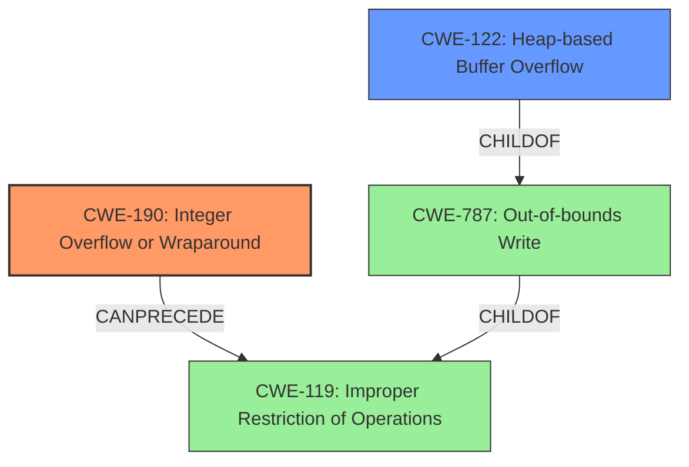

# Analysis Report for CVE-2021-30019

# Vulnerability Analysis Report: CVE-2021-30019

## Description


## Analysis (with Relationship Data)

# Summary
| CWE ID  | CWE Name                                        | Confidence | CWE Abstraction Level | CWE Vulnerability Mapping Label | CWE-Vulnerability Mapping Notes |
| :------- | :---------------------------------------------- | :--------- | :-------------------- | :------------------------------ | :------------------------------ |
| CWE-190 | Integer Overflow or Wraparound                  | 0.9        | Base                  | Primary CWE                     | Allowed                       |
| CWE-122 | Heap-based Buffer Overflow                      | 0.8        | Variant               | Secondary Candidate             | Allowed                       |

## Evidence and Confidence

*   **Confidence Score:** 0.85
*   **Evidence Strength:** HIGH

## Relationship Analysis
The primary CWE is CWE-190, which represents the root cause of the vulnerability where the **size is a negative number** due to an integer overflow or wraparound. CWE-122 is a secondary CWE, representing the heap-based buffer overflow that results from the integer overflow. CWE-190 can precede CWE-119 (Improper Restriction of Operations within the Bounds of a Memory Buffer), and CWE-122 is a variant of CWE-787 (Out-of-bounds Write). The abstraction levels are appropriate, with CWE-190 being a Base CWE and CWE-122 being a Variant CWE.



## Vulnerability Chain
The vulnerability chain starts with a crafted file leading to a calculation where `ctx->hdr.frame_size` is smaller than `ctx->hdr.hdr_size`. This results in CWE-190, **Integer Overflow or Wraparound**, as `size` becomes a negative number. This negative value is then used in `memcpy`, leading to CWE-122, **Heap-based Buffer Overflow**.

Crafted File ->  **size to be a negative number** (CWE-190) -> **heap overflow** in memcpy (CWE-122)

## Summary of Analysis
The initial assessment and final conclusion are based on the provided evidence, including the vulnerability description and CVE reference links content summary. The vulnerability description key phrases also highlight the **negative number** and **heap overflow** as key indicators.

The vulnerability is caused by an integer overflow in the `adts_dmx_process` function. Specifically, the code calculates a size value, and if `ctx->hdr.frame_size` is smaller than `ctx->hdr.hdr_size`, the resulting `size` becomes negative due to integer wraparound. This negative value is then passed to `memcpy`, which interprets it as a very large unsigned value, leading to a heap overflow.

CWE-190 accurately captures the root cause where the calculation results in an integer overflow or wraparound, causing `size` to become negative. The supporting evidence is the vulnerability description stating "**size to be a negative number**" and the CVE reference links content summary mentioning "If `ctx->hdr.frame_size` is smaller than `ctx->hdr.hdr_size`, the `size` variable becomes negative due to integer underflow."

CWE-122 is selected because the negative size is then used in a `memcpy` operation, resulting in a heap overflow. The vulnerability description key phrases highlight "**heap overflow**" as a key indicator.

The selected CWEs are at the optimal level of specificity, with CWE-190 being a Base CWE and CWE-122 being a Variant CWE that provides more detail about the location of the buffer overflow.

The following CWEs were considered but not used:

*   CWE-191: Integer Underflow (Wrap or Wraparound) - While the CVE reference summary states "integer underflow", CWE-190 more accurately represents what happened in the memcpy operation
*   CWE-197: Numeric Truncation Error - This is not a truncation issue, but rather an overflow/wraparound.
*   CWE-681: Incorrect Conversion between Numeric Types - While there might be implicit type conversions, the core issue is the integer overflow, not the conversion itself.
*   CWE-1284: Improper Validation of Specified Quantity in Input - The code doesn't validate the calculated size, but the root cause is the integer overflow, not the missing validation.
*   CWE-126: Buffer Over-read - The issue is an out-of-bounds write, not read.
*   CWE-195: Signed to Unsigned Conversion Error - While a signed integer might be converted to unsigned, the overflow is the primary issue.
*   CWE-839: Numeric Range Comparison Without Minimum Check - Not applicable, as the issue is not a missing minimum check, but rather an overflow.
*   CWE-194: Unexpected Sign Extension - This is not a sign extension issue.
Relevant CWE Information:


## CWE Relationship Analysis

Current CWEs represent these abstraction levels: .


### Vulnerability Chain Analysis

**Chain starting from CWE-787:**
- 787 (Out-of-bounds Write) - ROOT


**Chain starting from CWE-839:**
- 839 (Numeric Range Comparison Without Minimum Check) - ROOT


### CWE Relationship Diagram

```mermaid
graph TD
    classDef primary fill:#f96,stroke:#333,stroke-width:2px
    classDef secondary fill:#69f,stroke:#333
    classDef tertiary fill:#9e9,stroke:#333
```


*Report generated on 2025-04-01 20:53:11*
