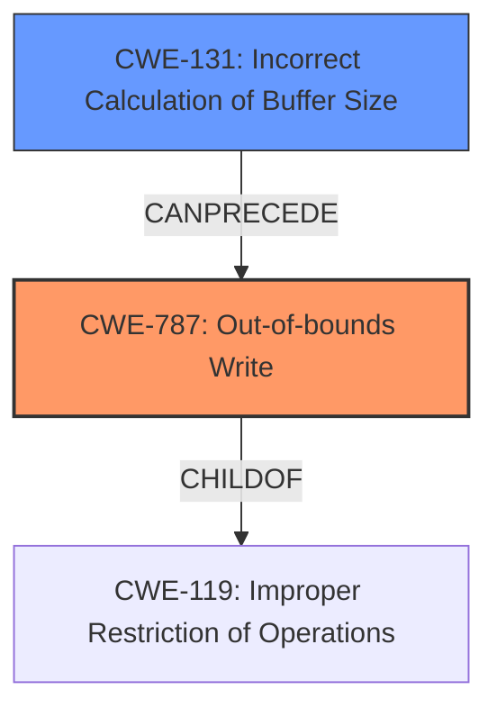

# Analysis for CVE-2021-30020

# Summary
| CWE ID | CWE Name | Confidence | CWE Abstraction Level | CWE Vulnerability Mapping Label | CWE-Vulnerability Mapping Notes |
|---|---|---|---|---|---|
| CWE-787 | Out-of-bounds Write | 0.9 | Base | Allowed | Primary CWE |
| CWE-131 | Incorrect Calculation of Buffer Size | 0.6 | Base | Allowed | Secondary CWE |

## Evidence and Confidence

*   **Confidence Score:** 0.8
*   **Evidence Strength:** HIGH

## Relationship Analysis
The primary CWE is CWE-787, Out-of-bounds Write, which is a base-level CWE. CWE-131, Incorrect Calculation of Buffer Size, is included as a contributing factor. CWE-787 is a child of CWE-119, Improper Restriction of Operations within the Bounds of a Memory Buffer. The relationship analysis reveals that an incorrect buffer size calculation (CWE-131) can lead to an out-of-bounds write (CWE-787).

## Vulnerability Chain
The vulnerability chain starts with a crafted file, leading to the execution of `gf_hevc_read_pps_bs_internal` function. The **incorrect calculation of buffer size** (CWE-131) results in a **heap overflow** (CWE-787) during a loop that writes to `pps->column_width`.

## Summary of Analysis
The analysis is primarily based on the vulnerability description and CVE reference links content summary. The key phrases "heap overflow" and the description of the loop in `gf_hevc_read_pps_bs_internal` function writing to `pps->column_width` without proper bounds checking strongly suggest CWE-787 (Out-of-bounds Write).

The vulnerability description states: "In the function gf_hevc_read_pps_bs_internal function in media_tools/av_parsers.c in GPAC 1.0.1 there is a loop, which with crafted file, pps->num_tile_columns may be larger than sizeof(pps->column_width), which results in a **heap overflow** in the loop."

The CVE Reference Links Content Summary states:
- "The code reads `pps->num_tile_columns` from the bitstream."
- "It then uses this value in a loop that writes to `pps->column_width`, without proper bounds checking."
- "If a crafted bitstream provides a value for `pps->num_tile_columns` that is larger than the allocated size of `pps->column_width`, a heap overflow occurs."

The retriever results also suggest CWE-787, though with a lower score. The higher-scoring CWEs like CWE-190 (Integer Overflow or Wraparound) and CWE-191 (Integer Underflow) are less directly relevant, although an integer overflow/underflow could potentially contribute to the incorrect calculation of the buffer size. Given the explicit mention of a heap overflow due to writing beyond the allocated buffer, CWE-787 is the most appropriate primary CWE.

CWE-131 (Incorrect Calculation of Buffer Size) is included as a secondary CWE because the vulnerability involves `pps->num_tile_columns` being larger than `sizeof(pps->column_width)`, implying an incorrect calculation or validation of the buffer size.

The selected CWEs are at the optimal level of specificity, representing the root cause (out-of-bounds write) and a contributing factor (incorrect buffer size calculation).

Relevant CWE Information:

# Enhanced Context (25 CWEs)
The following CWEs were identified as potentially relevant to this vulnerability:

## CWE-191: Integer Underflow (Wrap or Wraparound)
**Abstraction Level**: Base
**Similarity Score**: 0.80
**Source**: dense

**Description**:
The product subtracts one value from another, such that the result is less than the minimum allowable integer value, which produces a value that is not equal to the correct result.

**Mapping Guidance**:
- Usage: Allowed
- Rationale: This CWE entry is at the Base level of abstraction, which is a preferred level of abstraction for mapping to the root causes of vulnerabilities.

## CWE-197: Numeric Truncation Error
**Abstraction Level**: Base
**Similarity Score**: 0.79
**Source**: dense

**Description**:
Truncation errors occur when a primitive is cast to a primitive of a smaller size and data is lost in the conversion.

**Mapping Guidance**:
- Usage: Allowed
- Rationale: This CWE entry is at the Base level of abstraction, which is a preferred level of abstraction for mapping to the root causes of vulnerabilities.

## CWE-131: Incorrect Calculation of Buffer Size
**Abstraction Level**: Base
**Similarity Score**: 0.78
**Source**: dense

**Description**:
The product does not correctly calculate the size to be used when allocating a buffer, which could lead to a buffer overflow.

**Mapping Guidance**:
- Usage: Allowed
- Rationale: This CWE entry is at the Base level of abstraction, which is a preferred level of abstraction for mapping to the root causes of vulnerabilities.

## CWE-125: Out-of-bounds Read
**Abstraction Level**: Base
**Similarity Score**: 0.77
**Source**: dense

**Description**:
The product reads data past the end, or before the beginning, of the intended buffer.

**Mapping Guidance**:
- Usage: Allowed
- Rationale: This CWE entry is at the Base level of abstraction, which is a preferred level of abstraction for mapping to the root causes of vulnerabilities.

## CWE-190: Integer Overflow or Wraparound
**Abstraction Level**: Base
**Similarity Score**: 0.77
**Source**: dense

**Description**:
The product performs a calculation that can
         produce an integer overflow or wraparound when the logic
         assumes that the resulting value will always be larger than
         the original value. This occurs when an integer value is
         incremented to a value that is too large to store in the
         associated representation. When this occurs, the value may
         become a very small or negative number.

**Mapping Guidance**:
- Usage: Allowed
- Rationale: This CWE entry is at the Base level of abstraction, which is a preferred level of abstraction for mapping to the root causes of vulnerabilities.

## CWE-126: Buffer Over-read
**Abstraction Level**: Variant
**Similarity Score**: 0.77
**Source**: dense

**Description**:
The product reads from a buffer using buffer access mechanisms such as indexes or pointers that reference memory locations after the targeted buffer.

**Mapping Guidance**:
- Usage: Allowed
- Rationale: This CWE entry is at the Variant level of abstraction, which is a preferred level of abstraction for mapping to the root causes of vulnerabilities.

## CWE-805: Buffer Access with Incorrect Length Value
**Abstraction Level**: Base
**Similarity Score**: 0.77
**Source**: dense

**Description**:
The product uses a sequential operation to read or write a buffer, but it uses an incorrect length value that causes it to access memory that is outside of the bounds of the buffer.

**Mapping Guidance**:
- Usage: Allowed
- Rationale: This CWE entry is at the Base level of abstraction, which is a preferred level of abstraction for mapping to the root causes of vulnerabilities.

## CWE-681: Incorrect Conversion between Numeric Types
**Abstraction Level**: Base
**Similarity Score**: 0.76
**Source**: dense

**Description**:
When converting from one data type to another, such as long to integer, data can be omitted or translated in a way that produces unexpected values. If the resulting values are used in a sensitive context, then dangerous behaviors may occur.

**Mapping Guidance**:
- Usage: Allowed
- Rationale: This CWE entry is at the Base level of abstraction, which is a preferred level of abstraction for mapping to the root causes of vulnerabilities.

## CWE-193: Off-by-one Error
**Abstraction Level**: Base
**Similarity Score**: 0.76
**Source**: dense

**Description**:
A product calculates or uses an incorrect maximum or minimum value that is 1 more, or 1 less, than the correct value.

**Mapping Guidance**:
- Usage: Allowed
- Rationale: This CWE entry is at the Base level of abstraction, which is a preferred level of abstraction for mapping to the root causes of vulnerabilities.

## CWE-129: Improper Validation of Array Index
**Abstraction Level**: Variant
**Similarity Score**: 0.