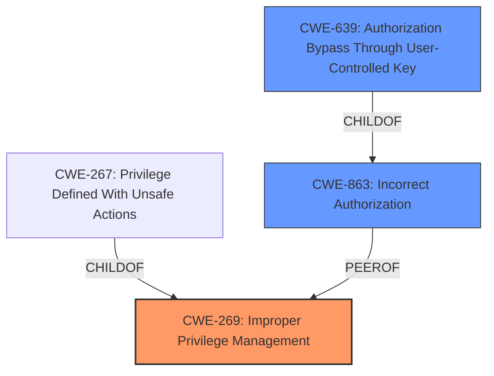

# Enhanced Analysis for CVE-2021-30158

# Summary
| CWE ID  | CWE Name                                                        | Confidence | CWE Abstraction Level | CWE Vulnerability Mapping Label | CWE-Vulnerability Mapping Notes |
| :-------- | :-------------------------------------------------------------- | :--------- | :---------------------- | :------------------------------ | :------------------------------ |
| CWE-269 | Improper Privilege Management                   | 0.8      | Class                    | Allowed-with-Review                 | Primary CWE                     |
| CWE-863   | Incorrect Authorization                                         | 0.6      | Class                    | Allowed-with-Review                 | Secondary candidate             |
| CWE-639   | Authorization Bypass Through User-Controlled Key                | 0.5      | Base                     | Allowed                         | Secondary candidate             |

## Evidence and Confidence

*   **Confidence Score:** 0.7
*   **Evidence Strength:** MEDIUM

## Relationship Analysis
The primary CWE selected is CWE-269, Improper Privilege Management which is a parent of CWE-267 Privilege Defined With Unsafe Actions. The vulnerability indicates that a blocked user should not have access to SpecialResetTokens, and the fact that they do have access indicates a failure in the privilege management. CWE-863 Incorrect Authorization and CWE-639 Authorization Bypass Through User-Controlled Key were also considered as secondary issues.



## Vulnerability Chain
The vulnerability chain starts with **improper privilege management**, leading to **unauthorized access** for blocked users, and ultimately resulting in the **inability to block potential future use of compromised tokens**.

## Summary of Analysis
The initial assessment focused on the fact that a blocked user was **unable to use SpecialResetTokens** which has security relevance because the user is not able to block potential future use of the token. The **root cause** is that the blocked user is **unable to use SpecialResetTokens**. The inability of blocked users to use SpecialResetTokens suggests a problem with access control.

The analysis considered CWE-863 (Incorrect Authorization) and CWE-639 (Authorization Bypass Through User-Controlled Key) as possibilities, but ultimately settled on CWE-269 (Improper Privilege Management) as the primary weakness because the core issue is that a blocked user (with limited privileges) is not able to perform an action that they should be able to perform in certain circumstances (compromised token).

The vulnerability description states: "Blocked users are **unable to use SpecialResetTokens**. This has security relevance because a blocked user might have accidentally shared a token, or might know that a token has been compromised, and yet is not able to block any potential future use of the token by an unauthorized party." The phrase "**unable to use SpecialResetTokens**" indicates a privilege management issue, where the blocked user is being improperly restricted.

The final decision is based on the provided evidence and the relationships between the considered CWEs. CWE-269 is at the optimal level of specificity, representing the core weakness in privilege management that leads to the vulnerability.

Relevant CWE Information:
# Enhanced Context (25 CWEs)
The following CWEs were identified as potentially relevant to this vulnerability:

## CWE-1391: Use of Weak Credentials
**Abstraction Level**: Class
**Similarity Score**: 0.78
**Source**: dense

**Description**:
The product uses weak credentials (such as a default key or hard-coded password) that can be calculated, derived, reused, or guessed by an attacker.

**Mapping Guidance**:
- Usage: Allowed-with-Review
- Rationale: This CWE entry is a Class and might have Base-level children that would be more appropriate
- Not Applicable: This CWE is not related to the **rootcause** of **unable to use SpecialResetTokens**.

## CWE-226: Sensitive Information in Resource Not Removed Before Reuse
**Abstraction Level**: Base
**Similarity Score**: 0.77
**Source**: dense

**Description**:
The product releases a resource such as memory or a file so that it can be made available for reuse, but it does not clear or "zeroize" the information contained in the resource before the product performs a critical state transition or makes the resource available for reuse by other entities.

**Mapping Guidance**:
- Usage: Allowed
- Rationale: This CWE entry is at the Base level of abstraction, which is a preferred level of abstraction for mapping to the root causes of vulnerabilities.
- Not Applicable: This CWE is not related to the **rootcause** of **unable to use SpecialResetTokens**.

## CWE-312: Cleartext Storage of Sensitive Information
**Abstraction Level**: Base
**Similarity Score**: 0.77
**Source**: dense

**Description**:
The product stores sensitive information in cleartext within a resource that might be accessible to another control sphere.

**Mapping Guidance**:
- Usage: Allowed
- Rationale: This CWE entry is at the Base level of abstraction, which is a preferred level of abstraction for mapping to the root causes of vulnerabilities.
- Not Applicable: This CWE is not related to the **rootcause** of **unable to use SpecialResetTokens**.

## CWE-319: Cleartext Transmission of Sensitive Information
**Abstraction Level**: Base
**Similarity Score**: 0.77
**Source**: dense

**Description**:
The product transmits sensitive or security-critical data in cleartext in a communication channel that can be sniffed by unauthorized actors.

**Mapping Guidance**:
- Usage: Allowed
- Rationale: This CWE entry is at the Base level of abstraction, which is a preferred level of abstraction for mapping to the root causes of vulnerabilities.
- Not Applicable: This CWE is not related to the **rootcause** of **unable to use SpecialResetTokens**.

## CWE-1390: Weak Authentication
**Abstraction Level**: Class
**Similarity Score**: 0.77
**Source**: dense

**Description**:
The product uses an authentication mechanism to restrict access to specific users or identities, but the mechanism does not sufficiently prove that the claimed identity is correct.

**Mapping Guidance**:
- Usage: Allowed-with-Review
- Rationale: This CWE entry is a Class and might have Base-level children that would be more appropriate
- Not Applicable: This CWE is not related to the **rootcause** of **unable to use SpecialResetTokens**.

## CWE-639: Authorization Bypass Through User-Controlled Key
**Abstraction Level**: Base
**Similarity Score**: 0.77
**Source**: dense

**Description**:
The system's authorization functionality does not prevent one user from gaining access to another user's data or record by modifying the key value identifying the data.

**Mapping Guidance**:
- Usage: Allowed
- Rationale: This CWE entry is at the Base level of abstraction, which is a preferred level of abstraction for mapping to the root causes of vulnerabilities.
- Partially Applicable: A blocked user is prevented from using SpecialResetTokens, which is related to authorization.

## CWE-807: Reliance on Untrusted Inputs in a Security Decision
**Abstraction Level**: Base
**Similarity Score**: 0.77
**Source**: dense

**Description**:
The product uses a protection mechanism that relies on the existence or values of an input, but the input can be modified by an untrusted actor in a way that bypasses the protection mechanism.

**Mapping Guidance**:
- Usage: Allowed
- Rationale: This CWE entry is at the Base level of abstraction, which is a preferred level of abstraction for mapping to the root causes of vulnerabilities.
- Not Applicable: This CWE is not related to the **rootcause** of **unable to use SpecialResetTokens**.

## CWE-345: Insufficient Verification of Data Authenticity
**Abstraction Level**: Class
**Similarity Score**: 0.77
**Source**: dense

**Description**:
The product does not sufficiently verify the origin or authenticity of data, in a way that causes it to accept invalid data.

**Mapping Guidance**:
- Usage: Discouraged
- Rationale: This CWE entry is a level-1 Class (i.e., a child of a Pillar). It might have lower-level children that would be more appropriate
- Not Applicable: This CWE is not related to the **rootcause** of **unable to use SpecialResetTokens**.

## CWE-1240: Use of a Cryptographic Primitive with a Risky Implementation
**Abstraction Level**: Base
**Similarity Score**: 0.76
**Source**: dense

**Description**:
To fulfill the need for a cryptographic primitive, the product implements a cryptographic algorithm using a non


## CWE Relationship Analysis

Current CWEs represent these abstraction levels: .


### Vulnerability Chain Analysis

**Chain starting from CWE-312:**
- 312 (Cleartext Storage of Sensitive Information) - ROOT


**Chain starting from CWE-807:**
- 807 (Reliance on Untrusted Inputs in a Security Decision) - ROOT


### CWE Relationship Diagram

```mermaid
graph TD
    classDef primary fill:#f96,stroke:#333,stroke-width:2px
    classDef secondary fill:#69f,stroke:#333
    classDef tertiary fill:#9e9,stroke:#333
```