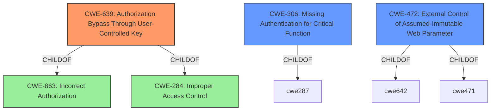

# Analysis for CVE-2021-30167

# Summary
| CWE ID | CWE Name | Confidence | CWE Abstraction Level | CWE Vulnerability Mapping Label | CWE-Vulnerability Mapping Notes |
|---|---|---|---|---|---|
| **CWE-639** | **Authorization Bypass Through User-Controlled Key** | 0.9 | Base | Primary | Allowed |
| CWE-306 | Missing Authentication for Critical Function | 0.7 | Base | Secondary | Allowed |
| CWE-472 | External Control of Assumed-Immutable Web Parameter | 0.6 | Base | Secondary | Allowed |

## Evidence and Confidence

*   **Confidence Score:** 0.8
*   **Evidence Strength:** HIGH

## Relationship Analysis
The primary CWE selected is CWE-639, which describes an authorization bypass due to user-controlled keys. This CWE is a child of CWE-863 (Incorrect Authorization) and CWE-284 (Improper Access Control), indicating a more specific type of authorization failure. CWE-306 (Missing Authentication for Critical Function) is a related weakness, as the absence of authentication can lead to authorization bypass. CWE-472 (External Control of Assumed-Immutable Web Parameter) also aligns because URL parameters, which are externally controllable, are being modified to bypass authorization. The base abstraction level of CWE-639, CWE-306 and CWE-472 makes them preferred mappings.

## Vulnerability Chain
The vulnerability chain begins with a **missing authentication check** and **improper authorization**, allowing attackers to **modify URL parameters** (external control of input) and **escalate privileges**.

## Summary of Analysis
The initial assessment identified that the vulnerability allows authenticated remote attackers to modify URL parameters, amend user information, and escalate privileges to control devices. This is supported by the evidence from CVE Reference Links Content Summary, which highlights a **lack of authentication checks** for the `/apply2.cgi` endpoint, leading to unauthorized access and the ability to create arbitrary user accounts.

The primary CWE selection, CWE-639 **Authorization Bypass Through User-Controlled Key**, is justified because the vulnerability involves modifying URL parameters (a user-controlled key) to gain unauthorized access. This aligns with the CWE description, which states that "the system's authorization functionality does not prevent one user from gaining access to another user's data or record by modifying the key value identifying the data."

CWE-306 **Missing Authentication for Critical Function** is a secondary CWE because the lack of authentication for the `/apply2.cgi` endpoint is a contributing factor to the vulnerability. The description of CWE-306, "The product does not perform any authentication for functionality that requires a provable user identity or consumes a significant amount of resources," accurately reflects this aspect of the vulnerability.

CWE-472 **External Control of Assumed-Immutable Web Parameter** is also a secondary CWE because the vulnerability involves modifying URL parameters to bypass authorization. The description of CWE-472, "The web application does not sufficiently verify inputs that are assumed to be immutable but are actually externally controllable, such as hidden form fields," aligns with this aspect of the vulnerability.

The selected CWEs are at the optimal level of specificity (Base level) and accurately reflect the root cause and contributing factors to the vulnerability.

Relevant CWE Information:

## CWE-74: Improper Neutralization of Special Elements in Output Used by a Downstream Component ('Injection')
**Abstraction Level**: Class
**Similarity Score**: 0.80
**Source**: dense

**Description**:
The product constructs all or part of a command, data structure, or record using externally-influenced input from an upstream component, but it does not neutralize or incorrectly neutralizes special elements that could modify how it is parsed or interpreted when it is sent to a downstream component.

**Mapping Guidance**:
- Usage: Discouraged
- Rationale: CWE-74 is high-level and often misused when lower-level weaknesses are more appropriate.

This CWE was considered but is not applicable because the vulnerability doesn't primarily involve injection of special elements. Instead, it involves bypassing authorization through modification of user-controlled keys.

## CWE-472: External Control of Assumed-Immutable Web Parameter
**Abstraction Level**: Base
**Similarity Score**: 0.79
**Source**: dense

**Description**:
The web application does not sufficiently verify inputs that are assumed to be immutable but are actually externally controllable, such as hidden form fields.

**Mapping Guidance**:
- Usage: Allowed
- Rationale: This CWE entry is at the Base level of abstraction, which is a preferred level of abstraction for mapping to the root causes of vulnerabilities.

This CWE was selected as a secondary CWE because URL parameters are externally controllable.

## CWE-807: Reliance on Untrusted Inputs in a Security Decision
**Abstraction Level**: Base
**Similarity Score**: 0.79
**Source**: dense

**Description**:
The product uses a protection mechanism that relies on the existence or values of an input, but the input can be modified by an untrusted actor in a way that bypasses the protection mechanism.

**Mapping Guidance**:
- Usage: Allowed
- Rationale: This CWE entry is at the Base level of abstraction, which is a preferred level of abstraction for mapping to the root causes of vulnerabilities.

This CWE was considered but is not as specific as CWE-639. While the vulnerability does involve reliance on untrusted inputs, the core issue is the authorization bypass through user-controlled keys.

## CWE-41: Improper Resolution of Path Equivalence
**Abstraction Level**: Base
**Similarity Score**: 0.78
**Source**: dense

**Description**:
The product is vulnerable to file system contents disclosure through path equivalence. Path equivalence involves the use of special characters in file and directory names. The associated manipulations are intended to generate multiple names for the same object.

**Mapping Guidance**:
- Usage: Allowed
- Rationale: This CWE entry is at the Base level of abstraction, which is a preferred level of abstraction for mapping to the root causes of vulnerabilities.

This CWE was considered but is not applicable because the vulnerability doesn't involve path equivalence issues.

## CWE-639: Authorization Bypass Through User-Controlled Key
**Abstraction Level**: Base
**Similarity Score**: 0.78
**Source**: dense

**Description**:
The system's authorization functionality does not prevent one user from gaining access to another user's data or record by modifying the key value identifying the data.

**Mapping Guidance**:
- Usage: Allowed
- Rationale: This CWE entry is at the Base level of abstraction, which is a preferred level of abstraction for mapping to the root causes of vulnerabilities.

This CWE was selected as the primary CWE because the vulnerability involves bypassing authorization through modification of user-controlled keys.

## CWE-1391: Use of Weak Credentials
**Abstraction Level**: Class
**Similarity Score**: 0.78
**Source**: dense

**Description**:
The product uses weak credentials (such as a default key or hard-coded password) that can be calculated, derived, reused, or guessed by an attacker.

**Mapping Guidance**:
- Usage: Allowed-with-Review
- Rationale: This CWE entry is a Class and might have Base-level children that would be more appropriate

This CWE was considered but is not applicable because the vulnerability doesn't involve the use of weak credentials. The issue is authorization bypass, not weak credential usage.

## CWE-73: External Control of File Name or Path
**Abstraction Level**: Base
**Similarity Score**: 0.78
**Source**: dense

**Description**:
The product allows user input to control or influence paths or file names that are used in filesystem operations.

**Mapping Guidance**:
- Usage: Allowed
- Rationale: This CWE entry is at the Base level of abstraction, which is a preferred level of abstraction for mapping to the root causes of vulnerabilities.

This CWE was considered but is not applicable because the vulnerability doesn't involve external control of file names or paths.

## CWE-184: Incomplete List of Disallowed Inputs
**Abstraction Level**: Base
**Similarity Score**: 0.78
**Source**: