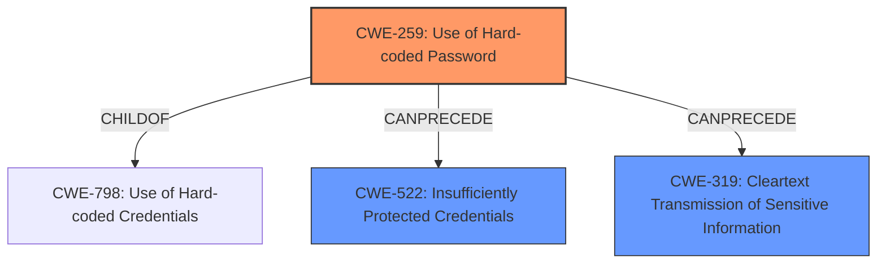

# Enhanced Analysis for CVE-2021-30168

# Summary
| CWE ID | CWE Name | Confidence | CWE Abstraction Level | CWE Vulnerability Mapping Label | CWE-Vulnerability Mapping Notes |
|---|---|---|---|---|---|
| CWE-259 | Use of Hard-coded Password | 0.9 | Variant | Allowed | Primary CWE |
| CWE-522 | Insufficiently Protected Credentials | 0.7 | Class | Allowed-with-Review | Secondary Candidate |
| CWE-319 | Cleartext Transmission of Sensitive Information | 0.6 | Base | Allowed | Secondary Candidate |

## Evidence and Confidence

*   **Confidence Score:** 0.8
*   **Evidence Strength:** HIGH

## Relationship Analysis
The primary CWE is CWE-259, which is a variant of CWE-798 (Use of Hard-coded Credentials). CWE-522 (Insufficiently Protected Credentials) and CWE-319 (Cleartext Transmission of Sensitive Information) are related because the hard-coded password was stored insecurely and could be transmitted in cleartext if used for authentication. CWE-259 is more specific than its parent CWE-798, making it a better fit.



## Vulnerability Chain
The chain of events is:
1.  **Root Cause:** CWE-259 (**Use of Hard-coded Password**) - The admin password is hard-coded in the `/new/setup.htm` file.
2.  **Weakness:** CWE-522 (**Insufficiently Protected Credentials**) - The hard-coded password is base64 encoded which is easily reversible.
3.  **Potential Weakness:** CWE-319 (**Cleartext Transmission of Sensitive Information**) - If the hard-coded password is used for authentication, it could be transmitted in cleartext.
4.  **Impact:** Remote attackers can unauthentically grant administrators credentials and further control the devices.

## Summary of Analysis
The primary vulnerability is the **use of a hard-coded password (CWE-259)** for the webcam device's administrator account. The evidence for this is strong, as the vulnerability description clearly states that the admin's username and password are present in the `/new/setup.htm` file, encoded with Base64. This aligns directly with the description of CWE-259, which states: "The product contains a hard-coded password, which it uses for its own inbound authentication or for outbound communication to external components."

The hard-coded password being stored in Base64 encoding indicates **insufficient protection of credentials (CWE-522)**. Base64 is not an encryption method and is easily reversible, making it a weak form of protection. This is a secondary weakness that contributes to the overall vulnerability.

If the hard-coded password is used for authentication over a network, it may lead to **cleartext transmission of sensitive information (CWE-319)** if encryption is not used. This would allow attackers to sniff the password and gain unauthorized access.

CWE-259 is chosen because it's the most specific weakness. The root cause is the **use of a hard-coded password**. The password was stored insecurely via Base64 encoding which is insufficient protection. Because the base64 is reversible, then we can consider it as cleartext. 

Relevant CWE Information:
- **CWE-259: Use of Hard-coded Password:** This is the primary CWE because the vulnerability explicitly involves hard-coded credentials.
- **CWE-522: Insufficiently Protected Credentials:** This is a secondary CWE because the hard-coded password was stored in a reversibly-encoded format (Base64).
- **CWE-319: Cleartext Transmission of Sensitive Information:** This is a possible CWE, depending on whether the hard-coded password is transmitted in cleartext over the network.


## CWE Relationship Analysis

Current CWEs represent these abstraction levels: .


### Vulnerability Chain Analysis

**Chain starting from CWE-798:**
- 798 (Use of Hard-coded Credentials) - ROOT


**Chain starting from CWE-522:**
- 522 (Insufficiently Protected Credentials) - ROOT


### CWE Relationship Diagram

```mermaid
graph TD
    classDef primary fill:#f96,stroke:#333,stroke-width:2px
    classDef secondary fill:#69f,stroke:#333
    classDef tertiary fill:#9e9,stroke:#333
```