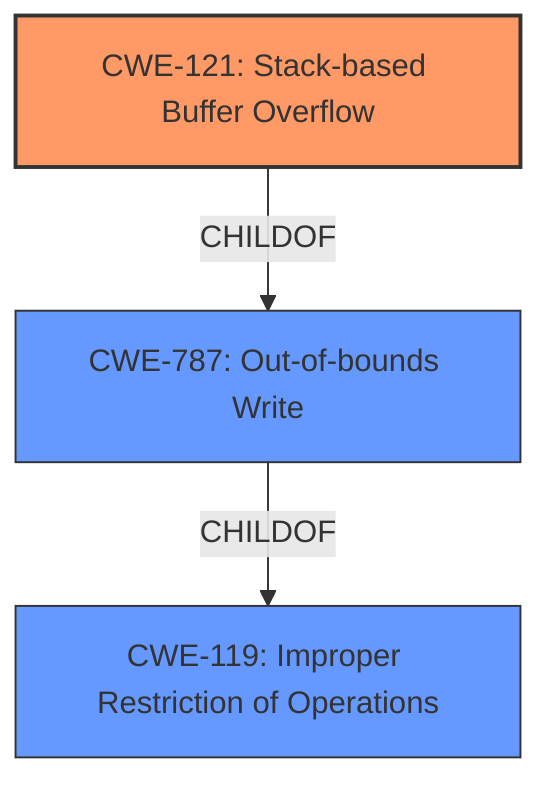

# Enhanced Analysis for CVE-2021-30188

# Summary
| CWE ID | CWE Name | Confidence | CWE Abstraction Level | CWE Vulnerability Mapping Label | CWE-Vulnerability Mapping Notes |
|---|---|---|---|---|---|
| CWE-121 | Stack-based Buffer Overflow | 1.0 | Variant | Allowed | Primary CWE |
| CWE-119 | Improper Restriction of Operations within the Bounds of a Memory Buffer | 0.5 | Class | Discouraged | Secondary Candidate |

## Evidence and Confidence

*   **Confidence Score:** 1.0
*   **Evidence Strength:** HIGH

## Relationship Analysis
The primary CWE is CWE-121 which is a variant of the base CWE-787 (Out-of-bounds Write). CWE-787 is a child of the class CWE-119 (Improper Restriction of Operations within the Bounds of a Memory Buffer). The vulnerability is a stack-based buffer overflow, which is a specific type of out-of-bounds write that occurs on the stack. Thus, CWE-121 is the most specific and appropriate CWE.



## Vulnerability Chain
The vulnerability chain starts with the software failing to properly restrict operations within the bounds of a memory buffer (CWE-119). This leads to an out-of-bounds write (CWE-787), specifically on the stack (CWE-121). The root cause is the **lack of input validation** or **improper bounds checking** before writing data to the stack buffer. The impact is potential denial of service (DoS) and remote code execution (RCE).

## Summary of Analysis
The vulnerability is a **Stack-based Buffer Overflow** in the CODESYS V2 runtime system.

The **Vulnerability Description Key Phrases** lists the weakness as "**Stack-based Buffer Overflow**".

The **CVE Reference Links Content Summary** lists the weakness as "CWE-121: Stack-based Buffer Overflow".

The **CWE for similar CVE Descriptions** lists the **Primary CWE Match** as CWE-787 (Out-of-bounds Write) and the **Top CWEs** includes CWE-125 (Out-of-bounds Read).

The **Retriever Results** lists CWE-121 (Stack-based Buffer Overflow) as rank 3, CWE-119 (Improper Restriction of Operations within the Bounds of a Memory Buffer) as rank 1 and CWE-125 (Out-of-bounds Read) as rank 10.

CWE-121 (Stack-based Buffer Overflow) is chosen as the primary CWE because the vulnerability description explicitly states that it is a stack-based buffer overflow. This is a variant level CWE, which is the preferred level of abstraction. The evidence is strong and the confidence is high.

CWE-119 (Improper Restriction of Operations within the Bounds of a Memory Buffer) was considered, but it is a class level CWE and is too general. The mapping guidance for CWE-119 says that it is commonly misused in low-information vulnerability reports when lower-level CWEs could be used instead.

CWE-125 (Out-of-bounds Read) was considered, but the vulnerability is a buffer overflow (write), not a read.

I am overriding the retriever results recommending CWE-119 as the best match because CWE-121 is a better fit.


## CWE Relationship Analysis

Current CWEs represent these abstraction levels: .


### Vulnerability Chain Analysis

**Chain starting from CWE-121:**
- 121 (Stack-based Buffer Overflow) - ROOT


**Chain starting from CWE-119:**
- 119 (Improper Restriction of Operations within the Bounds of a Memory Buffer) - ROOT


### CWE Relationship Diagram

```mermaid
graph TD
    classDef primary fill:#f96,stroke:#333,stroke-width:2px
    classDef secondary fill:#69f,stroke:#333
    classDef tertiary fill:#9e9,stroke:#333
```