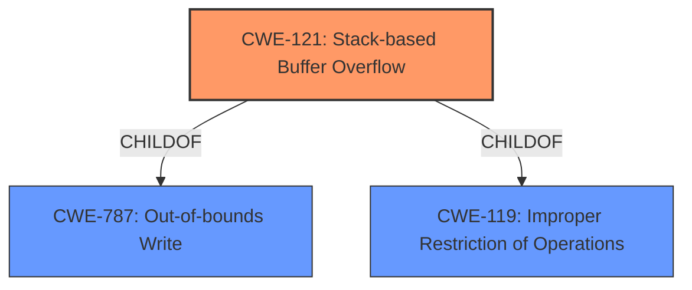

# Analysis Report for CVE-2021-30189

# Vulnerability Analysis Report: CVE-2021-30189

## Description


## Analysis (with Relationship Data)

# Summary
| CWE ID | CWE Name | Confidence | CWE Abstraction Level | CWE Vulnerability Mapping Label | CWE-Vulnerability Mapping Notes |
|---|---|---|---|---|---|
| CWE-121 | Stack-based Buffer Overflow | 1.0 | Variant | Allowed | Primary CWE |
| CWE-119 | Improper Restriction of Operations within the Bounds of a Memory Buffer | 0.7 | Class | Discouraged | Secondary Candidate |

## Evidence and Confidence

*   **Confidence Score:** 1.0
*   **Evidence Strength:** HIGH

## Relationship Analysis
The primary CWE is CWE-121, which is a Variant of CWE-787 (Out-of-bounds Write) and CWE-119 (Improper Restriction of Operations within the Bounds of a Memory Buffer). CWE-119 is a Class-level CWE, and is discouraged by MITRE, which recommends using more specific child CWEs.



## Vulnerability Chain
The chain of root cause and weaknesses is as follows:
1.  **ROOT CAUSE:** **Stack-based Buffer Overflow** (CWE-121) due to **improper** input validation.
2.  **IMPACT:** Arbitrary code execution or denial-of-service.

## Summary of Analysis
The analysis indicates a clear **Stack-based Buffer Overflow** (CWE-121) in the CODESYS V2 Web-Server. This is supported by the "Vulnerability Description Key Phrases" which lists **Stack-based Buffer Overflow** as a **weakness**. The "CVE Reference Links Content Summary" confirms that the root cause is a stack-based buffer overflow due to the web server's failure to properly manage the size of input data. It also specifies the presence of **CWE-121: Stack-based Buffer Overflow**. The evidence is strong, and the selection of CWE-121 is appropriate.

The Retriever Results also listed CWE-119 (Improper Restriction of Operations within the Bounds of a Memory Buffer) as the top combined result, but it is a Class-level CWE. As per MITRE's guidance, it's discouraged to use CWE-119 when more specific CWEs are available. Since CWE-121 is a child of CWE-119 and accurately describes the vulnerability, it is the better choice.

Relevant CWE Information:

# Enhanced Context (25 CWEs)

## CWE-124: Buffer Underwrite ('Buffer Underflow')
**Abstraction Level**: Base
**Similarity Score**: 0.78

This CWE was not selected because the vulnerability is an overflow, not an underflow.

## CWE-805: Buffer Access with Incorrect Length Value
**Abstraction Level**: Base
**Similarity Score**: 0.78

This CWE was not selected because while related to buffer handling, the core issue is the stack-based overflow itself, not necessarily an incorrect length value.

## CWE-131: Incorrect Calculation of Buffer Size
**Abstraction Level**: Base
**Similarity Score**: 0.77

This CWE was not selected because the provided information does not specify an incorrect calculation of buffer size, just the overflow.

## CWE-126: Buffer Over-read
**Abstraction Level**: Variant
**Similarity Score**: 0.77

This CWE was not selected because the vulnerability description specifies an *overflow*, not an over-read.

## CWE-191: Integer Underflow (Wrap or Wraparound)
**Abstraction Level**: Base
**Similarity Score**: 0.77

This CWE was not selected because there is no mention of integer underflow in the vulnerability description.

## CWE-127: Buffer Under-read
**Abstraction Level**: Variant
**Similarity Score**: 0.76

This CWE was not selected because the vulnerability description specifies an *overflow*, not an under-read.

## CWE-193: Off-by-one Error
**Abstraction Level**: Base
**Similarity Score**: 0.76

This CWE was not selected because the vulnerability description doesn't specify an off-by-one error.

## CWE-680: Integer Overflow to Buffer Overflow
**Abstraction Level**: Compound
**Similarity Score**: 0.75

This CWE was not selected because it is a compound CWE and there is no evidence of integer overflow leading to the buffer overflow.

## CWE-1325: Improperly Controlled Sequential Memory Allocation
**Abstraction Level**: Base
**Similarity Score**: 0.75

This CWE was not selected because there is no mention of sequential memory allocation issues.

## CWE-125: Out-of-bounds Read
**Abstraction Level**: Base
**Similarity Score**: 0.75

This CWE was not selected because the vulnerability is an overflow, not an out-of-bounds read.

## CWE-190: Integer Overflow or Wraparound
**Abstraction Level**: Base
**Similarity Score**: 6654.75

This CWE was not selected because the provided information does not explicitly mention or imply an integer overflow or wraparound as the root cause.

## CWE-119: Improper Restriction of Operations within the Bounds of a Memory Buffer
**Abstraction Level**: Class
**Similarity Score**: 5973.21

This CWE was considered but ultimately not selected as the primary CWE because it is a high-level Class CWE. The guidance discourages its usage when more specific CWEs like CWE-121 are applicable.

## CWE-1284: Improper Validation of Specified Quantity in Input
**Abstraction Level**: Base
**Similarity Score**: 5948.08

This CWE was not selected because the description focuses on the buffer overflow itself rather than specifically highlighting improper validation of input quantity.

## CWE-128: Wrap-around Error
**Abstraction Level**: base
**Similarity Score**: 5.03

This CWE was not selected because there is no mention of integer wraparound error.

## CWE-170: Improper Null Termination
**Abstraction Level**: base
**Similarity Score**: 5.03

This CWE was not selected because the issue is not related to null termination.

## CWE-120: Buffer Copy without Checking Size of Input ('Classic Buffer Overflow')
**Abstraction Level**: base
**Similarity Score**: 4.82

This CWE was not selected because CWE-121 provides more specificity by explicitly stating it is a stack-based overflow.

## CWE-123: Write-what-where Condition
**Abstraction Level**: base
**Similarity Score**: 4.33

This CWE was not selected because there is no explicit mention or implication of a write-what-where condition.

## CWE-770: Allocation of Resources Without Limits or Throttling
**Abstraction Level**: base
**Similarity Score**: 4.33

This CWE was not selected because the vulnerability doesn't appear to be directly related to resource allocation limits.

## CWE-617: Reachable Assertion
**Abstraction Level**: base
**Similarity Score**: 4.33

This CWE was not selected because this vulnerability does not involve assertions.

## CWE-476: NULL Pointer Dereference
**Abstraction Level**: base
**Similarity Score**: 4.33

This CWE was not selected because this vulnerability does not involve null pointers.

## CWE-195: Signed to Unsigned Conversion Error
**Abstraction Level**: variant
**Similarity Score**: 3.88

This CWE was not selected because the description does not suggest issues with signed to unsigned conversion.


## CWE Relationship Analysis

Current CWEs represent these abstraction levels: .


### Vulnerability Chain Analysis

**Chain starting from CWE-787:**
- 787 (Out-of-bounds Write) - ROOT


**Chain starting from CWE-680:**
- 680 (Integer Overflow to Buffer Overflow) - ROOT


### CWE Relationship Diagram

```mermaid
graph TD
    classDef primary fill:#f96,stroke:#333,stroke-width:2px
    classDef secondary fill:#69f,stroke:#333
    classDef tertiary fill:#9e9,stroke:#333
```


*Report generated on 2025-04-01 17:07:39*
