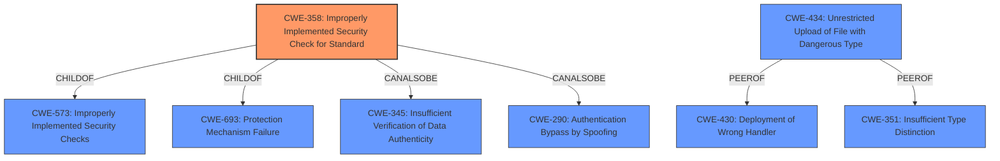

# Raw Analyzer Response for CVE-2021-30192

# Summary
| CWE ID | CWE Name | Confidence | CWE Abstraction Level | CWE Vulnerability Mapping Label | CWE-Vulnerability Mapping Notes |
|---|---|---|---|---|---|
| CWE-358 | Improperly Implemented Security Check for Standard | 1.0 | Base | Allowed | Primary CWE |
| CWE-434 | Unrestricted Upload of File with Dangerous Type | 0.5 | Base | Allowed | Secondary CWE |

## Evidence and Confidence

*   **Confidence Score:** 0.75
*   **Evidence Strength:** HIGH

## Relationship Analysis
The primary CWE identified is CWE-358, which falls under the broader categories of CWE-573 (Improperly Implemented Security Checks) and CWE-693 (Protection Mechanism Failure). It can also be related to CWE-345 (Insufficient Verification of Data Authenticity) and CWE-290 (Authentication Bypass by Spoofing), indicating potential overlaps or contributing factors.
CWE-434 is a peer of CWE-430 (Deployment of Wrong Handler) and CWE-351 (Insufficient Type Distinction).

## Vulnerability Chain
The chain of events for this vulnerability involves an **improperly implemented security check** (CWE-358) leading to a bypass of security measures, which allows an attacker to upload boot project related files. This could also be construed as leading to **unrestricted upload of file with dangerous type** (CWE-434).

## Summary of Analysis
The initial assessment based on the provided evidence points to CWE-358 as the primary weakness. The "CVE Reference Links Content Summary" explicitly states that the root cause is an "**Improperly Implemented Security Check** (CWE-358)". This is further supported by the description stating that the CODESYS web server "fails to properly validate security checks for boot project-related files" allowing crafted requests to bypass these checks.

The retriever results also lists CWE-358 as the top combined result.

While the end result allows uploading files, the root cause is the **improper security check**. Therefore, CWE-358 is the more accurate and specific classification.

The relationships also show potential chains, such as CWE-358 potentially leading to insufficient verification or authentication bypass.

CWE-434 is considered as a secondary weakness because the attacker is able to upload a boot project related file from the CODESYS Control runtime system because the security check was **improperly implemented**.

Relevant CWE Information:

*   **CWE-358: Improperly Implemented Security Check for Standard**
    *   The vulnerability description explicitly mentions an "**Improperly Implemented Security Check**".
    *   The CWE description aligns perfectly with the vulnerability, as the CODESYS web server fails to properly validate security checks.
    *   The suggested usage is "Allowed," and the rationale states that it is at the Base level of abstraction, which is preferred.

*   **CWE-434: Unrestricted Upload of File with Dangerous Type**
    *   The impact of the vulnerability allows an attacker to "upload boot project related files".
    *   While file upload is a consequence, the root cause is the bypassed security check (CWE-358).
    *   The suggested usage is "Allowed," and it is at the Base level of abstraction.

*   **CWE-863: Incorrect Authorization**
    *   CWE-863 was considered because authorization checks are a form of security check.
    *   However, CWE-358 is more specific because it explicitly refers to the **implementation** of the security check, rather than a general failure of authorization.
    *   The suggested usage is "Allowed-with-Review," indicating that a more specific CWE might be more appropriate.

*   **CWE-285: Improper Authorization**
    *   CWE-285 was also considered, but the same logic for CWE-863 applies. The **improper implementation** is the key factor, making CWE-358 a better fit.
    *   The suggested usage is "Discouraged," further suggesting a more specific alternative.

*   **CWE-73: External Control of File Name or Path**
    *   CWE-73 was considered due to the ability to upload files.
    *   However, the primary issue is not the external control of the file name or path, but the **bypassed security check** that allows the upload to occur in the first place.

I am confident in this assessment because it is directly supported by the vulnerability description and aligns with the provided root cause analysis. The selection of CWE-358 is at the optimal level of specificity, addressing the underlying **improper implementation** of the security check.