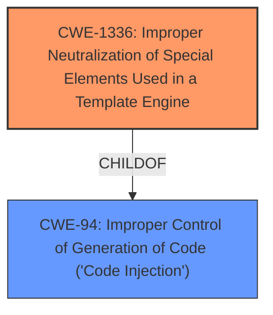

# Raw Analyzer Response for CVE-2021-30214

# Summary
| CWE ID | CWE Name | Confidence | CWE Abstraction Level | CWE Vulnerability Mapping Label | CWE-Vulnerability Mapping Notes |
|---|---|---|---|---|---|
| CWE-1336 | Improper Neutralization of Special Elements Used in a Template Engine | 1.00 | Base | Primary | Allowed |

## Evidence and Confidence

*   **Confidence Score:** 1.00
*   **Evidence Strength:** HIGH

## Relationship Analysis
The primary relationship influencing the decision is the direct match of the vulnerability description to the CWE-1336. The vulnerability involves **Stored Client-Side Template Injection**, which aligns perfectly with the description of CWE-1336, "Improper Neutralization of Special Elements Used in a Template Engine." CWE-1336 is a Base level CWE, which is the preferred level of abstraction.

## Vulnerability Chain
The vulnerability chain starts with the **improper neutralization** of special elements used in a template engine (CWE-1336). This leads to the ability to inject malicious code via the name parameter, resulting in potential execution of that code within the client-side template.

## Summary of Analysis
The initial assessment identified the vulnerability as **Stored Client-Side Template Injection**, which directly corresponds to CWE-1336. The "Vulnerability Description Key Phrases" highlight the **weakness** as **Stored Client-Side Template Injection**. The Retriever Results also listed CWE-1336 as the top candidate.

The final decision is strongly supported by the evidence, the direct match between the vulnerability description and the CWE description, and the high confidence score. The selected CWE is at the optimal level of specificity, as it accurately represents the **root cause** of the vulnerability.

Relevant CWE Information:

# Enhanced Context (25 CWEs)

## CWE-1336: Improper Neutralization of Special Elements Used in a Template Engine
**Abstraction:** Base
**Similarity Score**: 7916.95 (sparse), 0.800 (alternate_terms)
**Source**: sparse, alternate_terms

**Description**:
The product uses a template engine to insert or process externally-influenced input, but it does not neutralize or incorrectly neutralizes special elements or syntax that can be interpreted as template expressions or other code directives when processed by the engine.

**Mapping Guidance**:
- Usage: Allowed
- Rationale: This CWE entry is at the Base level of abstraction, which is a preferred level of abstraction for mapping to the root causes of vulnerabilities.

The vulnerability description states "Knowage Suite 7.3 is vulnerable to **Stored Client-Side Template Injection** in /knowage/restful-services/signup/update via the name parameter."

This aligns directly with CWE-1336, which describes the **improper neutralization** of special elements in a template engine. The vulnerability allows for the injection of malicious code via the name parameter, which is then processed by the template engine, leading to potential code execution. The "Alternative Terms" section of CWE-1336 also mentions "Client-Side Template Injection / CSTI", further solidifying this mapping.

The other CWEs listed in the Retriever Results were considered but not used because they did not accurately reflect the specific nature of the template injection vulnerability. For example, CWE-79 (Cross-site Scripting) is related to the improper neutralization of input during web page generation, but it does not specifically address template engines. Similarly, CWE-94 (Code Injection) is a more general category that encompasses various types of code injection vulnerabilities, but it is not as specific as CWE-1336.