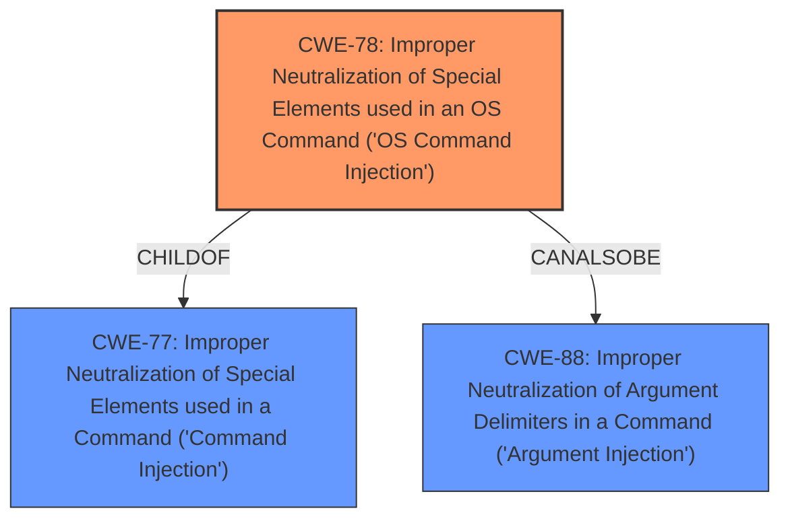

# Raw Analyzer Response for CVE-2021-30230

# Summary
| CWE ID  | CWE Name                                                                                                    | Confidence | CWE Abstraction Level | CWE Vulnerability Mapping Label | CWE-Vulnerability Mapping Notes |
| :-------- | :---------------------------------------------------------------------------------------------------------- | :--------- | :---------------------- | :------------------------------ | :-------------------------------- |
| CWE-78  | Improper Neutralization of Special Elements used in an OS Command ('OS Command Injection')                  | 1          | Base                    | Primary                         | Allowed                           |
| CWE-77  | Improper Neutralization of Special Elements used in a Command ('Command Injection')                        | 0.6        | Class                   | Secondary                       | Allowed-with-Review             |
| CWE-88  | Improper Neutralization of Argument Delimiters in a Command ('Argument Injection')                          | 0.5        | Base                    | Secondary                       | Allowed                           |

## Evidence and Confidence

*   **Confidence Score:** 0.8
*   **Evidence Strength:** HIGH

## Relationship Analysis
The primary weakness is CWE-78, which is a base-level weakness describing **improper neutralization** of special elements in an OS command. CWE-78 is a child of CWE-77, which is a more general class describing **improper neutralization** of special elements in a command. CWE-88, which describes **improper neutralization** of argument delimiters, is a peer of CWE-78 and could potentially be a contributing factor. The hierarchical relationship between CWE-78 and CWE-77 helps to refine the classification, while the peer relationship with CWE-88 suggests a possible nuance.

## Vulnerability Chain
The vulnerability chain starts with the **improper neutralization** of shell metacharacters in the `zonename` parameter. This leads to the ability for remote attackers to execute arbitrary commands. Therefore, the root cause is the **improper neutralization**, and the impact is arbitrary command execution.

## Summary of Analysis
The initial assessment identified CWE-78 as the primary candidate, supported by the vulnerability description indicating that shell metacharacters in the `zonename` parameter allow remote attackers to execute arbitrary commands. The evidence explicitly states "execute arbitrary commands via shell metacharacters in the zonename parameter," directly aligning with CWE-78's description of **improper neutralization** of special elements used in an OS command leading to command injection.

The relationship analysis further solidified this choice, as CWE-78 is a base-level weakness, providing a more specific classification than its parent, CWE-77. While CWE-77 (Improper Neutralization of Special Elements used in a Command) is a broader category, CWE-78 directly addresses OS command injection. CWE-88 (Improper Neutralization of Argument Delimiters in a Command) was also considered due to the potential for argument injection, but the primary driver is the **improper neutralization** of shell metacharacters, making CWE-78 the more accurate classification.

The final decision is based on the provided evidence, the relationship analysis, and the desire for specificity. CWE-78 is at the optimal level of specificity, addressing the root cause with high confidence.

Relevant CWE Information:

# Enhanced Context (25 CWEs)
The following CWEs were identified as potentially relevant to this vulnerability:

## CWE-78: Improper Neutralization of Special Elements used in an OS Command ('OS Command Injection')
**Abstraction:** Base
**Similarity Score**: 5.03
**Source**: graph

**Description**:
CWE-78: Improper Neutralization of Special Elements used in an OS Command ('OS Command Injection')

**Mapping Guidance**:
- Usage: Allowed
- Rationale: This CWE entry is at the Base level of abstraction, which is a preferred level of abstraction for mapping to the root causes of vulnerabilities.

**Relationships**:
- CANFOLLOW -> CWE-184
- CANALSOBE -> CWE-88
- CHILDOF -> CWE-77
- CHILDOF -> CWE-77
- CHILDOF -> CWE-74

## CWE-77: Improper Neutralization of Special Elements used in a Command ('Command Injection')
**Abstraction:** Class

**Mapping Guidance**:
- Usage: Allowed-with-Review

## CWE-88: Improper Neutralization of Argument Delimiters in a Command ('Argument Injection')
**Abstraction:** Base

**Mapping Guidance**:
- Usage: Allowed

## Other Considered CWEs
- CWE-184: Incomplete List of Disallowed Inputs: While a denylist might be in place, the primary issue is the **improper neutralization** of shell metacharacters, not necessarily an incomplete list. Therefore, this is not the primary weakness.
- CWE-95: Improper Neutralization of Directives in Dynamically Evaluated Code ('Eval Injection'): This is not relevant as the vulnerability involves OS commands, not dynamic code evaluation.
- CWE-625: Permissive Regular Expression: This is not relevant as the vulnerability involves OS commands, not regex.
- CWE-306: Missing Authentication for Critical Function: While authentication might be missing, the vulnerability specifically describes command injection via **improper neutralization**.
- CWE-259: Use of Hard-coded Password: This is not relevant as the vulnerability involves OS commands, not hardcoded passwords.