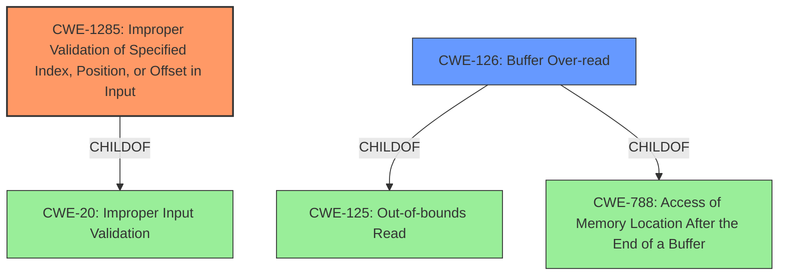

# Analysis for CVE-2021-30259

# Summary
| CWE ID  | CWE Name                                                       | Confidence | CWE Abstraction Level | CWE Vulnerability Mapping Label | CWE-Vulnerability Mapping Notes |
| :-------- | :------------------------------------------------------------- | :--------- | :-------------------- | :------------------------------ | :------------------------------ |
| CWE-1285 | Improper Validation of Specified Index, Position, or Offset in Input | 0.85       | Base                  | Primary                         | Allowed                       |
| CWE-126   | Buffer Over-read                                               | 0.6       | Variant                  | Secondary                         | Allowed                       |

## Evidence and Confidence

*   **Confidence Score:** 0.75
*   **Evidence Strength:** MEDIUM

## Relationship Analysis
The primary CWE selected is CWE-1285, which focuses on **improper validation** of an index, position, or offset. CWE-1285 is a child of CWE-20 (Improper Input Validation). CWE-126 (Buffer Over-read) is included as a secondary CWE as the impact of the **improper validation** leads to an out-of-bounds read. CWE-126 is a variant and a child of CWE-125 (Out-of-bounds Read) and CWE-788 (Access of Memory Location After the End of a Buffer).

## Vulnerability Chain
The vulnerability chain starts with **improper validation** (CWE-1285) of function table entries, leading to an out-of-bounds read (CWE-126).

## Summary of Analysis
The vulnerability description indicates a potential out-of-bounds access due to **improper validation** of function table entries. The description key phrases highlight the **rootcause** as **improper validation** and the impact as out-of-bounds access.

Based on the provided information:

*   The **rootcause** is **improper validation** of function table entries. This aligns with CWE-1285 (Improper Validation of Specified Index, Position, or Offset in Input), which describes scenarios where input specifying an index, position, or offset is not properly validated. The vulnerability description states "**improper validation**" as the root cause.
*   The impact, out-of-bounds access, suggests that the **improper validation** leads to reading beyond the intended buffer. This aligns with CWE-126 (Buffer Over-read), where the product reads from a buffer using access mechanisms that reference memory locations after the targeted buffer.

CWE-1285 is selected as the primary CWE because the description explicitly mentions **improper validation**. CWE-126 is included as a secondary CWE because it represents the direct consequence (out-of-bounds read) of the **improper validation**.

The retriever results list several other CWEs, but they are less directly relevant:

*   CWE-1314 (Missing Write Protection for Parametric Data Values): This relates to missing write protection, which is not the primary issue described.
*   CWE-823 (Use of Out-of-range Pointer Offset): While related to out-of-bounds access, the root cause here is the **improper validation**, not the pointer arithmetic itself.
*   CWE-367 (Time-of-check Time-of-use (TOCTOU) Race Condition): There's no mention of race conditions in the description.
*   CWE-822 (Untrusted Pointer Dereference): The provided description does not mention that the pointer comes from an untrusted source.
*   CWE-781 (Improper Address Validation in IOCTL with METHOD_NEITHER I/O Control Code): It's specific to IOCTL and METHOD_NEITHER, which are not mentioned in the description.
*   CWE-390 (Detection of Error Condition Without Action): The description doesn't indicate that an error condition is detected without any action.
*   CWE-415 (Double Free): There's no mention of memory being freed twice.
*   CWE-252 (Unchecked Return Value): There is no mention of return values being unchecked.

The selection of CWE-1285 and CWE-126 is based on direct evidence from the vulnerability description, focusing on the **rootcause** (**improper validation**) and the resulting impact (out-of-bounds access). The abstraction levels (Base for CWE-1285 and Variant for CWE-126) are appropriate for capturing the specific nature of the weakness and its direct consequence.