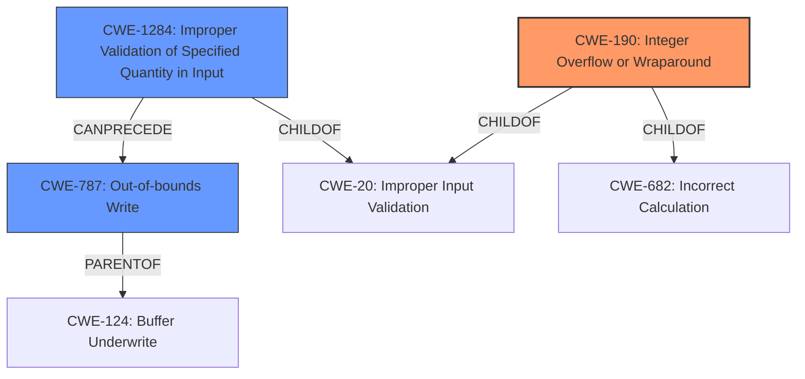

# Raw Analyzer Response for CVE-2021-30261

# Summary
| CWE ID    | CWE Name                                         | Confidence | CWE Abstraction Level | CWE Vulnerability Mapping Label | CWE-Vulnerability Mapping Notes |
| :--------- | :----------------------------------------------- | :--------- | :---------------------- | :------------------------------ | :------------------------------ |
| CWE-190     | Integer Overflow or Wraparound                 | 0.9        | Base                    | Primary                         | Allowed                         |
| CWE-1284   | Improper Validation of Specified Quantity in Input | 0.8        | Base                    | Secondary                       | Allowed                         |
| CWE-787     | Out-of-bounds Write                              | 0.7        | Base                    | Secondary                       | Allowed                         |

## Evidence and Confidence

*   **Confidence Score:** 0.8
*   **Evidence Strength:** HIGH

## Relationship Analysis
The primary weakness is an integer overflow (CWE-190), which can lead to an out-of-bounds write (CWE-787) or be caused by improper validation of input quantity (CWE-1284).
CWE-190 is a child of CWE-20 (Improper Input Validation) and CWE-682 (Incorrect Calculation).
CWE-1284 is a child of CWE-20 (Improper Input Validation) and can precede CWE-787.
CWE-787 is a parent of CWE-124 (Buffer Underwrite).

## Vulnerability Chain
The vulnerability chain starts with a **lack of input command size validation** (CWE-1284), which leads to a possible **integer overflow** (CWE-190), ultimately resulting in a **heap overflow** (CWE-787).

## Summary of Analysis
The vulnerability description clearly points to multiple weaknesses.

The primary weakness is the **integer overflow** (CWE-190). The description states, "Possible integer and **heap overflow** due to **lack of input command size validation** while handling beacon template update command from HLOS".

Supporting Evidence:

*   The vulnerability description explicitly mentions "integer overflow."
*   The "WEAKNESS: 'integer overflow'" section confirms this.

CWE-190 (Integer Overflow or Wraparound): This CWE accurately represents the scenario where a calculation produces a value outside the representable range, leading to unexpected behavior. The "**integer overflow**" can lead to an out-of-bounds write.

The secondary weakness is the **lack of input command size validation** (CWE-1284).

Supporting Evidence:

*   The vulnerability description states, "**lack of input command size validation**."
*   The "ROOTCAUSE: 'lack of input command size validation'" section further emphasizes this.

CWE-1284 (Improper Validation of Specified Quantity in Input): This CWE applies because the product does not validate the size of the input command, which is a quantity. This **lack of validation** can lead to an **integer overflow** if a large size is provided.

Another secondary weakness is the resulting **heap overflow** (CWE-787).

Supporting Evidence:

*   The vulnerability description explicitly mentions "**heap overflow**".

CWE-787 (Out-of-bounds Write): This CWE represents the consequence of the **integer overflow**, where data is written beyond the allocated buffer on the heap.

The retriever results show high scores for CWE-1284, CWE-190, and CWE-787, reinforcing these choices.

CWE-131 (Incorrect Calculation of Buffer Size) was considered but not chosen because the root cause is the lack of validation of the input size, which then leads to an integer overflow, rather than an incorrect calculation of the buffer size itself. The **lack of validation** is more directly related to the integer overflow, making CWE-1284 a better fit than CWE-131.

CWE-129 (Improper Validation of Array Index) was considered but not chosen because this vulnerability refers to an integer overflow and heap overflow related to command size validation, not specifically array index validation.

The selected CWEs are at the optimal level of specificity because they accurately capture the root cause (CWE-1284), the immediate weakness (CWE-190), and the resulting impact (CWE-787).