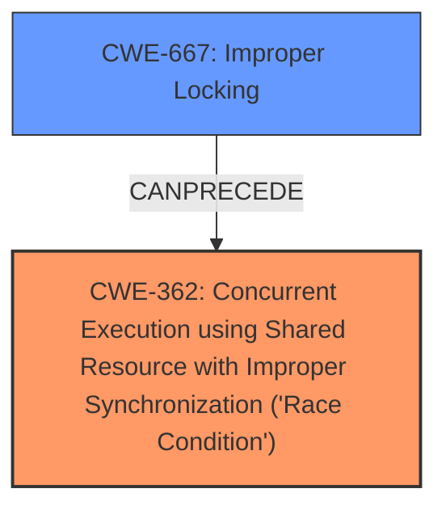

# Raw Analyzer Response for CVE-2021-30263

# Summary
| CWE ID | CWE Name | Confidence | CWE Abstraction Level | CWE Vulnerability Mapping Label | CWE-Vulnerability Mapping Notes |
|---|---|---|---|---|---|
| CWE-362 | Concurrent Execution using Shared Resource with Improper Synchronization ('Race Condition') | 0.9 | Class | Allowed-with-Review | Primary CWE |
| CWE-667 | Improper Locking | 0.6 | Class | Allowed-with-Review | Secondary Candidate |

## Evidence and Confidence

*   **Confidence Score:** 0.75
*   **Evidence Strength:** MEDIUM

## Relationship Analysis
The primary relationship is that CWE-362 is a class-level CWE that describes a race condition due to improper synchronization. CWE-667, Improper Locking, can be a cause of race conditions by failing to properly acquire or release a lock. Though the description mentions a "lack of synchronization mechanism," it does not specify locking, making CWE-667 a less direct fit.

## Vulnerability Chain
The vulnerability chain starts with a **lack of a synchronization mechanism**, leading to a **race condition** when the On-Device Logging node is opened concurrently.

## Summary of Analysis
The initial assessment identified CWE-362 as the primary weakness, as it directly addresses the **race condition** arising from the **lack of synchronization**. The description explicitly states the root cause is a "**lack of synchronization mechanism**" when the On-Device Logging node opens twice concurrently, leading to a potential **race condition**. This evidence strongly supports CWE-362.

CWE-667 was considered as a contributing factor, as improper locking can lead to race conditions. However, since the description does not explicitly mention locking, and only refers to a general "**lack of synchronization mechanism**", CWE-362 is the more appropriate primary classification. My decision is based on the provided evidence and the relationship between the identified CWEs. CWE-362 is at the optimal level of specificity, given the information provided.

Relevant CWE Information:

# Enhanced Context (25 CWEs)
The following CWEs were identified as potentially relevant to this vulnerability:

## CWE-667: Improper Locking
**Abstraction Level**: Class
**Similarity Score**: 0.80
**Source**: dense

**Description**:
The product does not properly acquire or release a lock on a resource, leading to unexpected resource state changes and behaviors.

**Mapping Guidance**:
- Usage: Allowed-with-Review
- Rationale: This CWE entry is a Class and might have Base-level children that would be more appropriate

## CWE-362: Concurrent Execution using Shared Resource with Improper Synchronization ('Race Condition')
**Abstraction Level**: Class
**Similarity Score**: 1.0
**Source**: alternate_terms

**Description**:
The product contains a concurrent code sequence that requires temporary, exclusive access to a shared resource, but a timing window exists in which the shared resource can be modified by another code sequence operating concurrently.

**Mapping Guidance**:
- Usage: Allowed-with-Review
- Rationale: This CWE entry is a Class and might have Base-level children that would be more appropriate

## CWE-366: Race Condition within a Thread
**Abstraction Level**: Base
**Similarity Score**: 0.79
**Source**: dense

**Description**:
If two threads of execution use a resource simultaneously, there exists the possibility that resources may be used while invalid, in turn making the state of execution undefined.

**Mapping Guidance**:
- Usage: Allowed
- Rationale: This CWE entry is at the Base level of abstraction, which is a preferred level of abstraction for mapping to the root causes of vulnerabilities.

## CWE-367: Time-of-check Time-of-use (TOCTOU) Race Condition
**Abstraction Level**: Base
**Similarity Score**: 0.79
**Source**: dense

**Description**:
The product checks the state of a resource before using that resource, but the resource's state can change between the check and the use in a way that invalidates the results of the check. This can cause the product to perform invalid actions when the resource is in an unexpected state.

**Mapping Guidance**:
- Usage: Allowed
- Rationale: This CWE entry is at the Base level of abstraction, which is a preferred level of abstraction for mapping to the root causes of vulnerabilities.