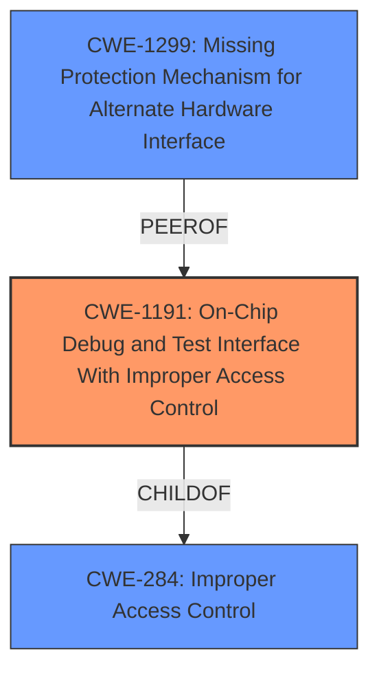

# Analysis for CVE-2021-30276

# Summary
| CWE ID  | CWE Name  | Confidence | CWE Abstraction Level | CWE Vulnerability Mapping Label | CWE-Vulnerability Mapping Notes |
|---|---|---|---|---|---|
| CWE-1191 | On-Chip Debug and Test Interface With **Improper Access Control** | 0.8 | Base  | Allowed | Primary CWE |
| CWE-1299 | Missing Protection Mechanism for Alternate Hardware Interface | 0.6 | Base | Allowed | Secondary Candidate |

## Evidence and Confidence

*   **Confidence Score:** 0.7
*   **Evidence Strength:** MEDIUM

## Relationship Analysis
The primary CWE, CWE-1191 (On-Chip Debug and Test Interface With **Improper Access Control**), is a base-level CWE that directly addresses the described vulnerability involving **improper access control** during XPU re-configuration. CWE-1191 is a child of CWE-284 which is a Class level CWE. CWE-1299 (Missing Protection Mechanism for Alternate Hardware Interface) is also a base-level CWE and is a peer of CWE-1191.

## Vulnerability Chain
The vulnerability involves **improper access control** during XPU re-configuration, leading to unauthorized access to secure resources.
  - Root Cause: **Improper Access Control** (CWE-1191)
  - Impact: Unauthorized Access to Secure Resource

## Summary of Analysis
The initial analysis focused on identifying the root cause of the vulnerability, which is **improper access control**. The vulnerability description clearly states that **improper access control** during XPU re-configuration leads to unauthorized access to a secure resource. The retriever results and graph relationships helped refine the selection to CWE-1191, which specifically addresses **improper access control** within on-chip debug and test interfaces.

The selection of CWE-1191 is primarily based on the vulnerability description key phrases, which explicitly mentions **"Improper access control"** as the root cause.

The following is quoted from the Vulnerability Description:
**Improper access control** while doing XPU re-configuration dynamically can lead to unauthorized access to a secure resource

CWE-1191 is at the optimal level of specificity because it directly relates to **improper access control** within on-chip debug and test interfaces, which aligns with the vulnerability description.

Relevant CWE Information:

# Enhanced Context (25 CWEs)
The following CWEs were identified as potentially relevant to this vulnerability:

## CWE-226: Sensitive Information in Resource Not Removed Before Reuse
**Abstraction Level**: Base
**Similarity Score**: 0.79

## CWE-415: Double Free
**Abstraction Level**: Variant
**Similarity Score**: 0.79

## CWE-667: Improper Locking
**Abstraction Level**: Class
**Similarity Score**: 0.79

## CWE-404: Improper Resource Shutdown or Release
**Abstraction Level**: Class
**Similarity Score**: 0.79

## CWE-131: Incorrect Calculation of Buffer Size
**Abstraction Level**: Base
**Similarity Score**: 0.77

## CWE-822: Untrusted Pointer Dereference
**Abstraction Level**: Base
**Similarity Score**: 0.77

## CWE-824: Access of Uninitialized Pointer
**Abstraction Level**: Base
**Similarity Score**: 0.76

## CWE-252: Unchecked Return Value
**Abstraction Level**: Base
**Similarity Score**: 0.76

## CWE-366: Race Condition within a Thread
**Abstraction Level**: Base
**Similarity Score**: 0.76

## CWE-362: Concurrent Execution using Shared Resource with Improper Synchronization ('Race Condition')
**Abstraction Level**: Class
**Similarity Score**: 0.76

## CWE-367: Time-of-check Time-of-use (TOCTOU) Race Condition
**Abstraction Level**: Base
**Similarity Score**: 6265.48

## CWE-823: Use of Out-of-range Pointer Offset
**Abstraction Level**: Base
**Similarity Score**: 6248.99

## CWE-822: Untrusted Pointer Dereference
**Abstraction Level**: Base
**Similarity Score**: 6064.86

## CWE-1299: Missing Protection Mechanism for Alternate Hardware Interface
**Abstraction Level**: Base
**Similarity Score**: 5952.37

## CWE-252: Unchecked Return Value
**Abstraction Level**: Base
**Similarity Score**: 5940.04

## CWE-123: Write-what-where Condition
**Abstraction Level**: base
**Similarity Score**: 5.03

## CWE-416: Use After Free
**Abstraction Level**: variant
**Similarity Score**: 4.53

## CWE-825: Expired Pointer Dereference
**Abstraction Level**: base
**Similarity Score**: 4.33

## CWE-823: Use of Out-of-range Pointer Offset
**Abstraction Level**: base
**Similarity Score**: 4.33

## CWE-787: Out-of-bounds Write
**Abstraction Level**: base
**Similarity Score**: 4.33

## CWE-1341: Multiple Releases of Same Resource or Handle
**Abstraction Level**: base
**Similarity Score**: 4.33

## CWE-420: Unprotected Alternate Channel
**Abstraction Level**: base
**Similarity Score**: 3.64

## CWE-1299: Missing Protection Mechanism for Alternate Hardware Interface
**Abstraction Level**: base
**Similarity Score**: 3.64

## CWE-288: Authentication Bypass Using an Alternate Path or Channel
**Abstraction Level**: base
**Similarity Score**: 3.64

## CWE-1314: Missing Write Protection for Parametric Data Values
**Abstraction Level**: base
**Similarity Score**: 3.64

### CWE Considerations:
- **CWE-126 (Buffer Over-read)**, **CWE-367 (Time-of-check Time-of-use Race Condition)**, **CWE-1314 (Missing Write Protection for Parametric Data Values)**, **CWE-823 (Use of Out-of-range Pointer Offset)**, and **CWE-415 (Double Free)** were considered but deemed less relevant as they focus on memory-related issues and race conditions, while the primary vulnerability is rooted in access control.
- **CWE-287 (Improper Authentication)** was considered but is a discouraged Class CWE.
- **CWE-1191 (On-Chip Debug and Test Interface With Improper Access Control)** directly aligns with the **improper access control** issue in the context of on-chip debug interfaces.
- **CWE-1299 (Missing Protection Mechanism for Alternate Hardware Interface)** could be a secondary factor if the XPU re-configuration uses an alternate, unprotected hardware interface. It is considered as a secondary candidate.