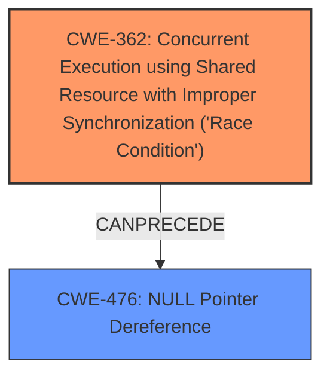

# Analysis for CVE-2021-30290

# Summary
| CWE ID | CWE Name | Confidence | CWE Abstraction Level | CWE Vulnerability Mapping Label | CWE-Vulnerability Mapping Notes |
|---|---|---|---|---|---|
| CWE-362 | Concurrent Execution using Shared Resource with Improper Synchronization ('Race Condition') | 0.9 | Class | Allowed-with-Review | Primary CWE |
| CWE-476 | NULL Pointer Dereference | 0.7 | Base | Allowed | Secondary Candidate |

## Evidence and Confidence

*   **Confidence Score:** 0.8
*   **Evidence Strength:** MEDIUM

## Relationship Analysis
The primary CWE identified is CWE-362 (Concurrent Execution using Shared Resource with Improper Synchronization ('Race Condition')), which is a Class-level CWE. The vulnerability description explicitly mentions a "**race condition**" as the root cause. CWE-362 can precede CWE-476 (NULL Pointer Dereference), indicating a potential chain where the race condition leads to a null pointer dereference. CWE-476 is a Base-level CWE, providing a more specific description of the impact. The hierarchical relationship and chain pattern support the selection of both CWEs to represent the vulnerability comprehensively.

## Vulnerability Chain
The vulnerability chain starts with a "**race condition**" (CWE-362) occurring between the timeline fence signal and timeline fence destroy. This **race condition** then leads to a null pointer dereference (CWE-476).

## Summary of Analysis
The initial analysis focused on identifying the root cause and the impact of the vulnerability. The vulnerability description explicitly states a "**race condition**" as the root cause, which directly aligns with CWE-362. The description also mentions a null pointer dereference, which aligns with CWE-476. The Retriever Results also list CWE-362 as the top candidate. The relationship analysis confirms that CWE-362 can precede CWE-476, establishing a chain. The final selection includes CWE-362 as the primary CWE representing the root cause and CWE-476 as a secondary CWE representing the impact.

The decision is primarily based on the vulnerability description key phrases: "**rootcause: race condition**" and "**impact: null pointer dereference**".

CWE-362 is appropriate because it is a Class-level CWE that describes the concurrent execution issue. CWE-476 is a Base-level CWE that describes the specific impact of the vulnerability.

Relevant CWE Information:

# Enhanced Context (25 CWEs)
The following CWEs were identified as potentially relevant to this vulnerability:

## CWE-476: NULL Pointer Dereference
**Abstraction Level**: Base
**Similarity Score**: 0.78
**Source**: dense

**Description**:
The product dereferences a pointer that it expects to be valid but is NULL.

**Mapping Guidance**:
- Usage: Allowed
- Rationale: This CWE entry is at the Base level of abstraction, which is a preferred level of abstraction for mapping to the root causes of vulnerabilities.

## CWE-362: Concurrent Execution using Shared Resource with Improper Synchronization ('Race Condition')
**Abstraction Level**: Class
**Similarity Score**: 0.76
**Source**: dense

**Description**:
The product contains a concurrent code sequence that requires temporary, exclusive access to a shared resource, but a timing window exists in which the shared resource can be modified by another code sequence operating concurrently.

**Mapping Guidance**:
- Usage: Allowed-with-Review
- Rationale: This CWE entry is a Class and might have Base-level children that would be more appropriate

## CWE-367: Time-of-check Time-of-use (TOCTOU) Race Condition
**Abstraction Level**: Base
**Similarity Score**: 5930.01
**Source**: sparse

**Description**:
The product checks the state of a resource before using that resource, but the resource's state can change between the check and the use in a way that invalidates the results of the check. This can cause the product to perform invalid actions when the resource is in an unexpected state.

## CWE-823: Use of Out-of-range Pointer Offset
**Abstraction Level**: Base
**Similarity Score**: 5995.88
**Source**: sparse

**Description**:
The product performs pointer arithmetic on a valid pointer, but it uses an offset that can point outside of the intended range of valid memory locations for the resulting pointer.

## CWE-822: Untrusted Pointer Dereference
**Abstraction Level**: Base
**Similarity Score**: 0.78
**Source**: dense

**Description**:
The product obtains a value from an untrusted source, converts this value to a pointer, and dereferences the resulting pointer.

## CWE-1298: Hardware Logic Contains Race Conditions
**Abstraction Level**: Base
**Similarity Score**: 0.511
**Source**: dense

**Description**:
A race condition in the hardware logic results in undermining security guarantees of the system.