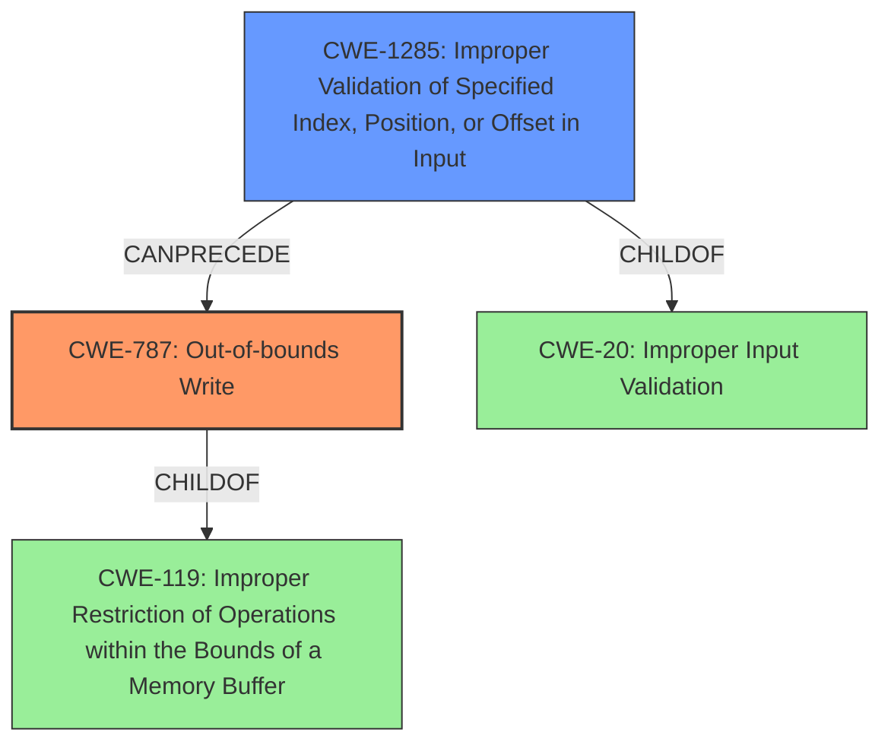

# Raw Analyzer Response for CVE-2021-30295

# Summary
| CWE ID | CWE Name | Confidence | CWE Abstraction Level | CWE Vulnerability Mapping Label | CWE-Vulnerability Mapping Notes |
|---|---|---|---|---|---|
| CWE-787 | Out-of-bounds Write | 0.8 | Base | Primary | Allowed |
| CWE-1285 | Improper Validation of Specified Index, Position, or Offset in Input | 0.7 | Base | Secondary | Allowed |

## Evidence and Confidence

*   **Confidence Score:** 0.75
*   **Evidence Strength:** MEDIUM

## Relationship Analysis
The primary CWE is CWE-787, which is a base-level CWE describing out-of-bounds writes. It is related to CWE-119 (Improper Restriction of Operations within the Bounds of a Memory Buffer), as it is a child of CWE-119. CWE-1285, the secondary CWE, is related to CWE-20 (Improper Input Validation) as it is a child of CWE-20. It represents the **improper validation of local variable** that led to the **heap overflow**. The chain of events is **improper validation** leading to out-of-bounds write.

## Vulnerability Chain
The vulnerability chain starts with **improper validation of local variable** (CWE-1285) which leads to a **heap overflow** (CWE-787).

## Summary of Analysis
The vulnerability description indicates a **heap overflow** due to **improper validation of local variable**.
The description states: "Possible **heap overflow** due to **improper validation of local variable** while storing current task information locally in Snapdragon Auto, Snapdragon Compute, Snapdragon Connectivity, Snapdragon Consumer IOT, Snapdragon Industrial IOT, Snapdragon Mobile, Snapdragon Wearables".

The primary weakness is CWE-787 (Out-of-bounds Write), as the vulnerability results in a heap overflow, which means writing data outside the intended buffer. CWE-787 is a base-level CWE, which is the preferred level of abstraction.

The root cause of the vulnerability is **improper validation of local variable**, which maps to CWE-1285 (Improper Validation of Specified Index, Position, or Offset in Input). This is because the local variable likely represents an index, position, or offset that is not properly validated before being used, leading to the heap overflow. CWE-1285 is a base-level CWE, which is the preferred level of abstraction.

CWE-190, CWE-126, CWE-367, CWE-822, and CWE-415 were considered but discarded. While CWE-190 (Integer Overflow or Wraparound) could be involved in calculating buffer sizes, the description explicitly mentions **improper validation**, making CWE-1285 a better fit. CWE-126 (Buffer Over-read) is not applicable as the vulnerability is about writing, not reading, out of bounds. CWE-367 (Time-of-check Time-of-use (TOCTOU) Race Condition) is not relevant as there is no mention of race conditions. CWE-822 (Untrusted Pointer Dereference) and CWE-415 (Double Free) don't align with the **improper validation** and **heap overflow** described in the vulnerability.