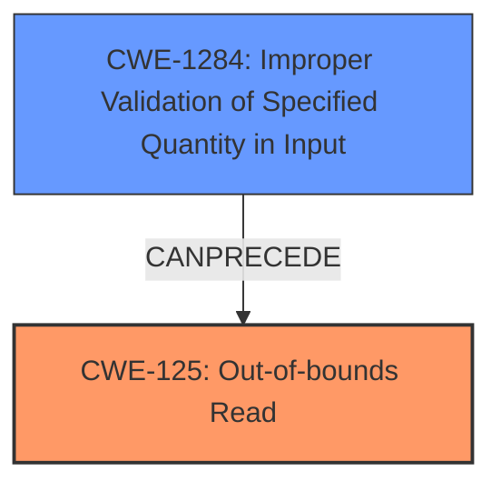

# Raw Analyzer Response for CVE-2021-30297

# Summary
| CWE ID | CWE Name | Confidence | CWE Abstraction Level | CWE Vulnerability Mapping Label | CWE-Vulnerability Mapping Notes |
|---|---|---|---|---|---|
| CWE-125 | Out-of-bounds Read | 0.9 | Base | Primary | Allowed |
| CWE-1284 | Improper Validation of Specified Quantity in Input | 0.7 | Base | Secondary | Allowed |

## Evidence and Confidence

*   **Confidence Score:** 0.8
*   **Evidence Strength:** MEDIUM

## Relationship Analysis
The primary CWE selected is CWE-125, which describes reading data past the end or before the beginning of an intended buffer. The vulnerability description explicitly mentions a possible **out-of-bounds read**. CWE-125 is a base level CWE, providing sufficient specificity.

CWE-1284, is a secondary weakness where the product receives input that is expected to specify a quantity, but it does not validate or incorrectly validates that the quantity has the required properties. This can lead to an out-of-bounds read if the quantity is used to determine the buffer size. CWE-1284 can precede CWE-125 in a vulnerability chain.

## Vulnerability Chain
The vulnerability chain starts with **improper validation of packet length** (CWE-1284) which leads to an **out of bound read** (CWE-125).

## Summary of Analysis
The vulnerability description clearly states "Possible **out of bound read due to improper validation of packet length** while handling data transfer in VR service".

CWE-125 (Out-of-bounds Read) aligns directly with the stated impact of the vulnerability. The description of CWE-125 states: "The product reads data past the end, or before the beginning, of the intended buffer." The vulnerability description uses almost identical wording.

CWE-1284 (Improper Validation of Specified Quantity in Input) addresses that the **improper validation of packet length**.

The selection of CWE-125 is based on the clear statement within the vulnerability description of a possible **out-of-bounds read**. It is a Base level CWE, providing a good level of specificity. The relationship diagram shows how this can be caused by CWE-1284.

# Relevant CWE Information:

## Vulnerability Description
Possible out of bound read due to **improper validation of packet length** while handling data transfer in VR service in Snapdragon Auto, Snapdragon Compute, Snapdragon Connectivity, Snapdragon Consumer IOT, Snapdragon Industrial IOT, Snapdragon Wearables

### Vulnerability Description Key Phrases
- **impact:** out of bound read
- **vector:** handling data transfer
- **product:** Snapdragon
- **component:** VR service