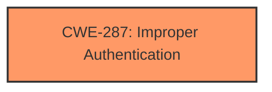

# Raw Analyzer Response for CVE-2021-30302

# Summary
| CWE ID | CWE Name | Confidence | CWE Abstraction Level | CWE Vulnerability Mapping Label | CWE-Vulnerability Mapping Notes |
|---|---|---|---|---|---|
| CWE-287 | Improper Authentication | 0.8 | Class | Discouraged | Primary CWE |

## Evidence and Confidence

*   **Confidence Score:** 0.8
*   **Evidence Strength:** HIGH

## Relationship Analysis
The primary relationship is that CWE-287 is a Class-level CWE, and therefore, mapping guidance suggests considering more specific child CWEs like CWE-1390 or CWE-306. However, based on the limited information provided, CWE-287 remains the most fitting.

## Vulnerability Chain
The chain involves an **improper authentication** weakness, leading to potential information disclosure. The root cause is the lack of proper verification of user identity, and the impact is unauthorized access to sensitive information.

## Summary of Analysis
The vulnerability description clearly states **"Improper authentication"** as the primary weakness. The impact is information disclosure. The description indicates that EAP WAPI EAPOL frames from unauthenticated users are not properly verified.

The Retriever Results list CWE-287, Improper Authentication, with a discouraged usage. The rationale indicates that it is a Class and might have Base-level children that would be more appropriate. The suggested alternatives are CWE-1390 (Weak Authentication) and CWE-306 (Missing Authentication for Critical Function).

Given the limited context, it's difficult to determine if authentication is simply weak (CWE-1390) or entirely missing for critical functions (CWE-306). The phrase **"Improper authentication"** suggests a flaw in the authentication process rather than a complete absence of it, but could mean that critical functions are missing Authentication. Without more details, CWE-287, Improper Authentication, is the most appropriate, despite being a Class-level CWE and discouraged.

Relevant CWE Information:

# Enhanced Context (25 CWEs)

## CWE-126: Buffer Over-read
**Abstraction Level**: Variant
**Similarity Score**: 0.420
**Source**: sparse
**Description**: The product reads from a buffer using buffer access mechanisms such as indexes or pointers that reference memory locations after the targeted buffer.

*Rationale for Not Selecting*: This CWE is not related to the **improper authentication** described in the vulnerability.

## CWE-1314: Missing Write Protection for Parametric Data Values
**Abstraction Level**: Base
**Similarity Score**: 0.383
**Source**: sparse
**Description**: The device does not write-protect the parametric data values for sensors that scale the sensor value, allowing untrusted software to manipulate the apparent result and potentially damage hardware or cause operational failure.

*Rationale for Not Selecting*: This CWE is specific to parametric data values and hardware sensors, which is not the focus of the vulnerability description.

## CWE-822: Untrusted Pointer Dereference
**Abstraction Level**: Base
**Similarity Score**: 0.340
**Source**: sparse
**Description**: The product obtains a value from an untrusted source, converts this value to a pointer, and dereferences the resulting pointer.

*Rationale for Not Selecting*: This CWE is related to pointer dereferencing, while the vulnerability description focuses on **improper authentication**.

## CWE-252: Unchecked Return Value
**Abstraction Level**: Base
**Similarity Score**: 0.326
**Source**: sparse
**Description**: The product does not check the return value from a method or function, which can prevent it from detecting unexpected states and conditions.

*Rationale for Not Selecting*: This CWE is about unchecked return values, not **improper authentication**.

## CWE-367: Time-of-check Time-of-use (TOCTOU) Race Condition
**Abstraction Level**: Base
**Similarity Score**: 0.322
**Source**: sparse
**Description**: The product checks the state of a resource before using that resource, but the resource's state can change between the check and the use in a way that invalidates the results of the check. This can cause the product to perform invalid actions when the resource is in an unexpected state.

*Rationale for Not Selecting*: This CWE describes a race condition, which is distinct from **improper authentication**.

## CWE-1285: Improper Validation of Specified Index, Position, or Offset in Input
**Abstraction Level**: Base
**Similarity Score**: 0.604
**Source**: dense
**Description**: The product receives input that is expected to specify an index, position, or offset into an indexable resource such as a buffer or file, but it does not validate or incorrectly validates that the specified index/position/offset has the required properties.

*Rationale for Not Selecting*: This CWE focuses on improper validation of indices or offsets, not authentication.

## CWE-781: Improper Address Validation in IOCTL with METHOD_NEITHER I/O Control Code
**Abstraction Level**: Variant
**Similarity Score**: 0.003
**Source**: graph
**Description**: The product defines an IOCTL that uses METHOD_NEITHER for I/O, but it does not validate or incorrectly validates the addresses that are provided.

*Rationale for Not Selecting*: This CWE is specific to IOCTLs and address validation, which does not align with the **improper authentication** described.

## CWE-415: Double Free
**Abstraction Level**: Variant
**Similarity Score**: 0.315
**Source**: sparse
**Description**: The product calls free() twice on the same memory address, potentially leading to modification of unexpected memory locations.

*Rationale for Not Selecting*: This CWE relates to memory management (double free), not authentication.

## CWE-823: Use of Out-of-range Pointer Offset
**Abstraction Level**: Base
**Similarity Score**: 0.313
**Source**: sparse
**Description**: The product performs pointer arithmetic on a valid pointer, but it uses an offset that can point outside of the intended range of valid memory locations for the resulting pointer.

*Rationale for Not Selecting*: This CWE relates to pointer offsets, not authentication.