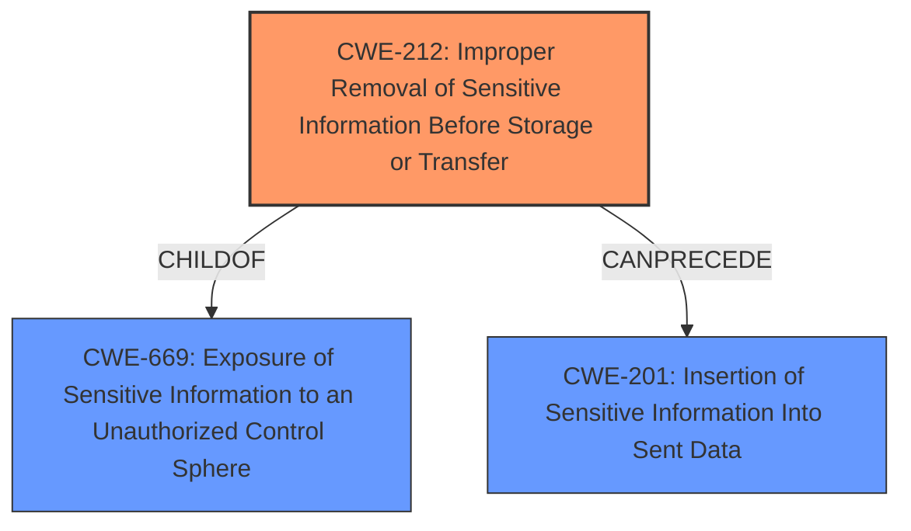

# Raw Analyzer Response for CVE-2021-3031

# Summary
| CWE ID | CWE Name | Confidence | CWE Abstraction Level | CWE Vulnerability Mapping Label | CWE-Vulnerability Mapping Notes |
|---|---|---|---|---|---|
| CWE-212 | Improper Removal of Sensitive Information Before Storage or Transfer | 1.0 | Base | Allowed | Primary CWE |

## Evidence and Confidence

*   **Confidence Score:** 1.0
*   **Evidence Strength:** HIGH

## Relationship Analysis
The primary CWE selected is CWE-212, which is a Base level CWE. It has relationships with CWE-669 (Exposure of Sensitive Information to an Unauthorized Control Sphere) as a child and CWE-201 (Insertion of Sensitive Information Into Sent Data) as a weakness that can follow. No other relationships influenced the decision.

## Vulnerability Chain
The vulnerability chain starts with the **failure to clear padding bytes** in Ethernet packets before the data frame is created. This leads to the inclusion of random, potentially sensitive information from the firewall's memory into the Ethernet packets, which can then be collected by an attacker on the same subnet, resulting in information exposure.

## Summary of Analysis
The initial analysis focused on the root cause, which is the **failure to clear padding bytes** before creating the data frame. The vulnerability description explicitly states this, and the CVE Reference Links Content Summary confirms it. This directly aligns with CWE-212 (Improper Removal of Sensitive Information Before Storage or Transfer), as the vulnerability involves the failure to remove sensitive information (in this case, residual data in memory) before transferring it in network packets. The retriever results also listed CWE-212 as the top match.

The provided evidence strongly supports the selection of CWE-212. The vulnerability description states, "Padding bytes in Ethernet packets on ... firewalls **are not cleared** before the data frame is created. This leaks a small amount of random information from the firewall memory into the Ethernet packets." The "CVE Reference Links Content Summary" section reinforces this by stating, "Padding bytes in Ethernet packets **are not cleared** before the data frame is created, leading to the leakage of random information from firewall memory."

CWE-212 is at the optimal level of specificity because it directly addresses the root cause of the vulnerability, which is the **improper removal of sensitive information before transfer**. The MITRE mapping guidance designates CWE-212 as "Allowed" and states that it is at the Base level of abstraction, which is preferred.

Other CWEs Considered but Not Used:

*   CWE-406 (Insufficient Control of Network Message Volume (Network Amplification)): While there's network traffic involved, the primary issue isn't about controlling the volume but rather the content of the packets.
*   CWE-347 (Improper Verification of Cryptographic Signature): This is irrelevant as the vulnerability does not involve cryptographic signatures.
*   CWE-532 (Insertion of Sensitive Information into Log File): This doesn't apply as the sensitive information is being leaked through network packets, not log files.
*   CWE-367 (Time-of-check Time-of-use (TOCTOU) Race Condition): Not applicable as there is no race condition involved.
*   CWE-401 (Missing Release of Memory after Effective Lifetime): While memory is involved, the core issue is not about failing to release memory but about failing to clear it before use in network packets.
*   CWE-201 (Insertion of Sensitive Information Into Sent Data): While related, CWE-212 is a more precise match as it focuses on the failure to *remove* the sensitive information before transfer, which is the root cause.