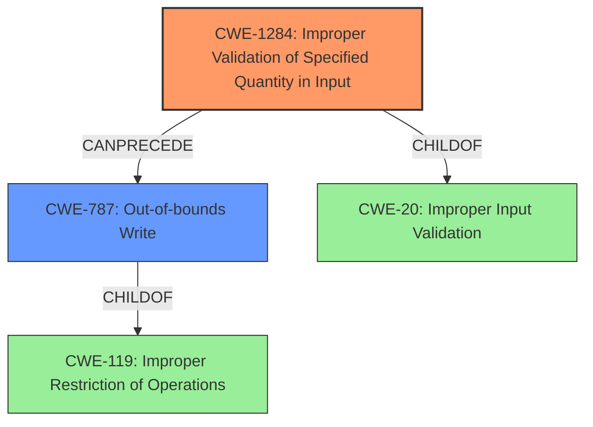

# Raw Analyzer Response for CVE-2021-30310

# Summary
| CWE ID    | CWE Name                                                               | Confidence | CWE Abstraction Level | CWE Vulnerability Mapping Label | CWE-Vulnerability Mapping Notes |
| --------- | ---------------------------------------------------------------------- | ---------- | --------------------- | ------------------------------- | ------------------------------- |
| CWE-1284  | Improper Validation of Specified Quantity in Input                     | 0.85       | Base                  | Primary                         | Allowed                       |
| CWE-787   | Out-of-bounds Write                                                      | 0.75       | Base                  | Secondary                       | Allowed                       |

## Evidence and Confidence

*   **Confidence Score:** 0.80
*   **Evidence Strength:** MEDIUM

## Relationship Analysis
The primary relationship impacting the CWE selection is the chain of events: **Improper validation of input** (CWE-1284) leading to a **buffer overflow** and ultimately an **out-of-bounds write** (CWE-787). CWE-1284 is a child of CWE-20 (Improper Input Validation) highlighting the nature of the root cause.
CWE-119 is a class level and parent of CWE-787, but using CWE-787 is more specific.

## Vulnerability Chain
The vulnerability chain starts with:
1.  **Improper validation of received CF-ACK and CF-Poll data frames** (CWE-1284)
2.  Which leads to a **buffer overflow**
3.  Resulting in an **out-of-bounds write** (CWE-787).

## Summary of Analysis
The initial assessment focused on identifying the root cause and the resulting weakness. The description explicitly mentions "**Improper validation of received CF-ACK and CF-Poll data frames**" as the root cause, which aligns with CWE-1284 (Improper Validation of Specified Quantity in Input). The description also mentions "**buffer overflow**," which is a consequence of the **improper validation** and leads to **out-of-bounds write** (CWE-787).

The graph relationships helped clarify the chain of events, with CWE-1284 preceding CWE-787. This reinforces the choice of CWE-1284 as the primary cause and CWE-787 as a secondary effect.

The selected CWEs are at the optimal level of specificity because they directly address the root cause (CWE-1284) and the immediate consequence (CWE-787) described in the vulnerability description.

Relevant CWE Information:

# Enhanced Context (25 CWEs)

## CWE-131: Incorrect Calculation of Buffer Size
**Abstraction Level**: Base
**Similarity Score**: 0.82
**Source**: dense

**Description**:
The product does not correctly calculate the size to be used when allocating a buffer, which could lead to a buffer overflow.
**NOT USED:** While related to buffer overflows, the description focuses on **incorrect calculation** whereas the provided description focuses on **improper validation**.

## CWE-823: Use of Out-of-range Pointer Offset
**Abstraction Level**: Base
**Similarity Score**: 0.81
**Source**: dense

**Description**:
The product performs pointer arithmetic on a valid pointer, but it uses an offset that can point outside of the intended range of valid memory locations for the resulting pointer.
**NOT USED:** This CWE is too specific. The root cause is the **improper validation** that could lead to using an out-of-range pointer offset.

## CWE-191: Integer Underflow (Wrap or Wraparound)
**Abstraction Level**: Base
**Similarity Score**: 0.80
**Source**: dense

**Description**:
The product subtracts one value from another, such that the result is less than the minimum allowable integer value, which produces a value that is not equal to the correct result.
**NOT USED:** This CWE is not relevant as it is an integer underflow issue, and the vulnerability description doesn't mention anything about it.

## CWE-805: Buffer Access with Incorrect Length Value
**Abstraction Level**: Base
**Similarity Score**: 0.79
**Source**: dense

**Description**:
The product uses a sequential operation to read or write a buffer, but it uses an incorrect length value that causes it to access memory that is outside of the bounds of the buffer.
**NOT USED:** While relevant to buffer overflows, it is less specific than CWE-1284, which directly addresses the **improper validation**.

## CWE-125: Out-of-bounds Read
**Abstraction Level**: Base
**Similarity Score**: 0.79
**Source**: dense

**Description**:
The product reads data past the end, or before the beginning, of the intended buffer.
**NOT USED:** The description explicitly mentions a **buffer overflow**, which implies an **out-of-bounds write**, not read.

## CWE-822: Untrusted Pointer Dereference
**Abstraction Level**: Base
**Similarity Score**: 0.79
**Source**: dense

**Description**:
The product obtains a value from an untrusted source, converts this value to a pointer, and dereferences the resulting pointer.
**NOT USED:** This CWE isn't appropriate because the description doesn't mention anything about untrusted source being converted to a pointer.

## CWE-667: Improper Locking
**Abstraction Level**: Class
**Similarity Score**: 0.79
**Source**: dense

**Description**:
The product does not properly acquire or release a lock on a resource, leading to unexpected resource state changes and behaviors.
**NOT USED:** This CWE is not relevant because the vulnerability description doesn't mention any locking issues.

## CWE-824: Access of Uninitialized Pointer
**Abstraction Level**: Base
**Similarity Score**: 0.79
**Source**: dense

**Description**:
The product accesses or uses a pointer that has not been initialized.
**NOT USED:** The description doesn't mention anything about uninitialized pointers.

## CWE-126: Buffer Over-read
**Abstraction Level**: Variant
**Similarity Score**: 0.79
**Source**: dense

**Description**:
The product reads from a buffer using buffer access mechanisms such as indexes or pointers that reference memory locations after the targeted buffer.
**NOT USED:** The description explicitly mentions a **buffer overflow**, implying an **out-of-bounds write**, not read.

## CWE-124: Buffer Underwrite ('Buffer Underflow')
**Abstraction Level**: Base
**Similarity Score**: 0.79
**Source**: dense

**Description**:
The product writes to a buffer using an index or pointer that references a memory location prior to the beginning of the buffer.
**NOT USED:** While related to buffer issues, the description doesn't specify an underwrite.

## CWE-190: Integer Overflow or Wraparound
**Abstraction Level**: Base
**Similarity Score**: 7121.98
**Source**: sparse

**Description**:
The product performs a calculation that can
         produce an integer overflow or wraparound when the logic
         assumes that the resulting value will always be larger than
         the original value. This occurs when an integer value is
         incremented to a value that is too large to store in the
         associated representation. When this occurs, the value may
         become a very small or negative number.
**NOT USED:** This CWE is not the primary issue, though integer overflow could lead to buffer overflow.

## CWE-1284: Improper Validation of Specified Quantity in Input
**Abstraction Level**: base
**Similarity Score**: 4.33
**Source**: graph

**Description**:
CWE-1284: Improper Validation of Specified Quantity in Input
**USED:** This CWE directly aligns with the **improper validation** mentioned in the description as the root cause.

## CWE-476: NULL Pointer Dereference
**Abstraction Level**: base
**Similarity Score**: 4.33
**Source**: graph

**Description**:
CWE-476: NULL Pointer Dereference
**NOT USED:** This CWE isn't relevant because the description doesn't mention anything about null pointer dereference.

## CWE-1314: Missing Write Protection for Parametric Data Values
**Abstraction Level