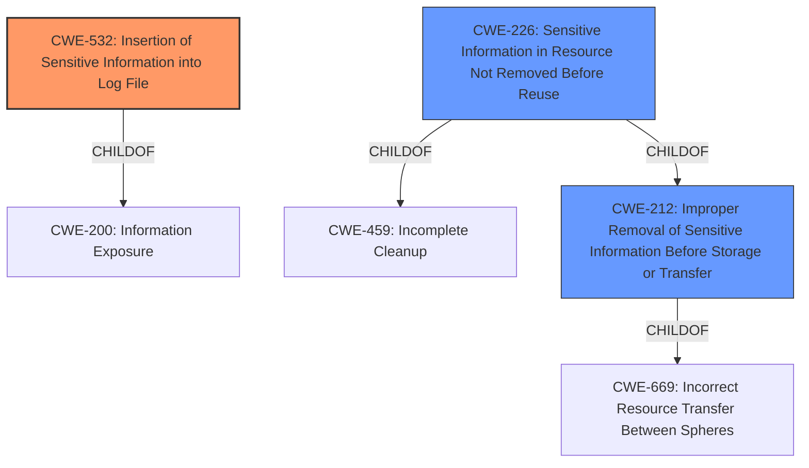

# Analysis for CVE-2021-3032

# Summary
| CWE ID | CWE Name | Confidence | CWE Abstraction Level | CWE Vulnerability Mapping Label | CWE-Vulnerability Mapping Notes |
|---|---|---|---|---|---|
| CWE-532 | Insertion of Sensitive Information into Log File | 1.0 | Base | Allowed | Primary CWE |
| CWE-212 | Improper Removal of Sensitive Information Before Storage or Transfer | 0.7 | Base | Allowed | Secondary Candidate |
| CWE-226 | Sensitive Information in Resource Not Removed Before Reuse | 0.6 | Base | Allowed | Secondary Candidate |

## Evidence and Confidence

*   **Confidence Score:** 0.9
*   **Evidence Strength:** HIGH

## Relationship Analysis
The primary CWE, CWE-532 (Insertion of Sensitive Information into Log File), is a base-level CWE that directly addresses the **root cause** of the vulnerability. The vulnerability description explicitly states that configuration secrets are being logged to a log file, which aligns perfectly with the definition of CWE-532.

CWE-212 (Improper Removal of Sensitive Information Before Storage or Transfer) and CWE-226 (Sensitive Information in Resource Not Removed Before Reuse) are related to the broader issue of sensitive information exposure, but they are less directly applicable. CWE-212 focuses on the **failure to remove sensitive information before storage or transfer**, while CWE-226 centers on **releasing resources without clearing sensitive information**. Although relevant, the core issue here is the direct logging of sensitive data, making CWE-532 the most precise and appropriate classification.

## Vulnerability Chain
The vulnerability chain is relatively straightforward:
1.  **Root Cause:** The application **incorrectly** inserts sensitive configuration data (usernames, passwords, private keys) into log files.
2.  **Weakness:** CWE-532: Insertion of Sensitive Information into Log File.
3.  **Impact:** Exposure of sensitive information, potentially leading to unauthorized access or system compromise.

## Summary of Analysis
The primary classification, CWE-532, is based on the clear evidence that the vulnerability involves the direct logging of sensitive information. The "**Root cause of vulnerability**: Configuration secrets for log forwarding server profiles ("http", "email", and "snmptrap" v3) are logged to the `logrcvr.log` system log."

The retriever results support this classification, with CWE-532 being the top combined result and having a high individual score. The MITRE mapping guidance for CWE-532 allows its use and confirms that it is at the preferred base level of abstraction.

CWE-212 and CWE-226 were considered because they relate to sensitive information handling, but they are less specific to the act of logging. Therefore, CWE-532 is the most accurate and specific representation of the **root cause** of the vulnerability. I am confident in this assessment due to the clear description and supporting evidence.

Relevant CWE Information:

# Enhanced Context (25 CWEs)

## CWE-532: Insertion of Sensitive Information into Log File
**Abstraction:** Base
**Status:** Incomplete

### Description
The product writes sensitive information to a log file.

### Extended Description
Not provided

### Alternative Terms
None

### Relationships
ChildOf -> CWE-538
ChildOf -> CWE-200

### Mapping Guidance
**Usage:** Allowed
**Rationale:** This CWE entry is at the Base level of abstraction, which is a preferred level of abstraction for mapping to the root causes of vulnerabilities.
**Comments:** Carefully read both the name and description to ensure that this mapping is an appropriate fit. Do not try to 'force' a mapping to a lower-level Base/Variant simply to comply with this preferred level of abstraction.
**Reasons:**
- Acceptable-Use

### Observed Examples
- **CVE-2017-9615:** verbose logging stores admin credentials in a world-readable log file
- **CVE-2018-1999036:** SSH password for private key stored in build log