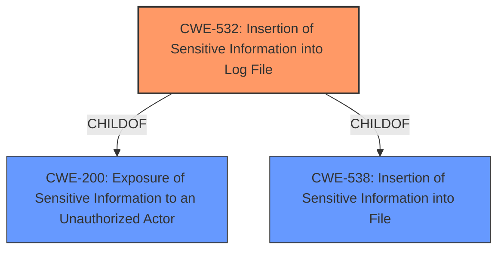

# Analysis Report for CVE-2021-3036

# Vulnerability Analysis Report: CVE-2021-3036

## Description


## Analysis (with Relationship Data)

# Summary
| CWE ID  | CWE Name                                            | Confidence | CWE Abstraction Level | CWE Vulnerability Mapping Label | CWE-Vulnerability Mapping Notes |
| :------- | :-------------------------------------------------- | :--------- | :---------------------- | :------------------------------ | :------------------------------ |
| CWE-532 | Insertion of Sensitive Information into Log File | 1          | Base                    | Primary CWE                     | Allowed                       |

## Evidence and Confidence

*   **Confidence Score:** 1
*   **Evidence Strength:** HIGH

## Relationship Analysis
The primary relationship that influenced the decision was the ChildOf relationship between CWE-532 and CWE-200 (Exposure of Sensitive Information to an Unauthorized Actor). CWE-532 is a specific case of CWE-200, where the exposure occurs through log files. There were no other significant chain or peer relationships that would have suggested alternative classifications. The abstraction level of CWE-532 is Base, which is the preferred level of specificity.



## Vulnerability Chain
The vulnerability chain starts with an **improper configuration** leading to **incorrect handling of PAN-OS XML API requests** with duplicate parameters. This results in the system logging sensitive information (username, password, API key) in cleartext to the web server logs, which is an **information exposure**.
  - **Root Cause:** **Improper Configuration**
  - **Weakness:** **Incorrect Handling of API Requests with Duplicate Parameters**
  - **Resulting Impact:** **Information Exposure** through logging of credentials.

## Summary of Analysis
The initial analysis and subsequent review confirm that CWE-532 is the most appropriate classification for this vulnerability. The assessment is heavily based on the provided evidence, particularly the **Vulnerability Description Key Phrases** and the **CVE Reference Links Content Summary**. The key phrase "information exposure" and the summary's statement that "administrator secrets (username, password, and API key) are logged in cleartext" directly align with the description of CWE-532. The graph relationships, especially the child-of relationship with CWE-200, reinforce the classification. CWE-532 is chosen for its optimal level of specificity, as it clearly describes the root cause of the vulnerability: the **insertion of sensitive information into log files**.

# Relevant CWE Information:

## CWE-532: Insertion of Sensitive Information into Log File
**Abstraction:** Base
**Status:** Incomplete

### Description
The product writes sensitive information to a log file.

### Extended Description
Not provided

### Alternative Terms
None

### Relationships
ChildOf -> CWE-538
ChildOf -> CWE-200

### Mapping Guidance
**Usage:** Allowed
**Rationale:** This CWE entry is at the Base level of abstraction, which is a preferred level of abstraction for mapping to the root causes of vulnerabilities.
**Comments:** Carefully read both the name and description to ensure that this mapping is an appropriate fit. Do not try to 'force' a mapping to a lower-level Base/Variant simply to comply with this preferred level of abstraction.
**Reasons:**
- Acceptable-Use

### Observed Examples
- **CVE-2017-9615:** verbose logging stores admin credentials in a world-readable log file
- **CVE-2018-1999036:** SSH password for private key stored in build log

**Justification for CWE-532:**
The vulnerability description clearly states that secrets in PAN-OS XML API requests are logged in cleartext to the web server logs. The **CVE Reference Links Content Summary** further confirms that the administrator's username, password, and API key are logged in cleartext. This directly matches the description of CWE-532: "The product writes sensitive information to a log file." The security implication is that an attacker who gains access to the web server logs can retrieve the cleartext administrator credentials, potentially leading to unauthorized access and control of the PAN-OS system. The mapping guidance for CWE-532 indicates that it is allowed and at the base level of abstraction, which aligns with the root cause of the vulnerability.

**CWEs Considered but Not Used:**

*   **CWE-916: Use of Password Hash With Insufficient Computational Effort**: This CWE was considered because the vulnerability involves passwords. However, the issue is not with the hashing algorithm but with the storage of the password in cleartext in the log file. Therefore, CWE-916 is not applicable.
*   **CWE-347: Improper Verification of Cryptographic Signature**: This CWE is related to cryptographic signatures, but the vulnerability does not involve signature verification. Therefore, it is not applicable.
*   **CWE-212: Improper Removal of Sensitive Information Before Storage or Transfer**: While sensitive information is involved, the core issue is not the removal of sensitive information before storage but the direct logging of sensitive information.
*   **CWE-256: Plaintext Storage of a Password**: This CWE is similar, but CWE-532 more accurately reflects the specific vulnerability of logging the plaintext password.


## CWE Relationship Analysis

Current CWEs represent these abstraction levels: .


### Vulnerability Chain Analysis

**Chain starting from CWE-916:**
- 916 (Use of Password Hash With Insufficient Computational Effort) - ROOT


**Chain starting from CWE-538:**
- 538 (Insertion of Sensitive Information into Externally-Accessible File or Directory) - ROOT


### CWE Relationship Diagram

```mermaid
graph TD
    classDef primary fill:#f96,stroke:#333,stroke-width:2px
    classDef secondary fill:#69f,stroke:#333
    classDef tertiary fill:#9e9,stroke:#333
```


*Report generated on 2025-04-01 18:43:59*
