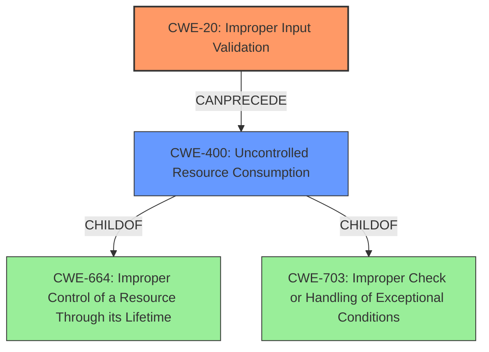

# Analysis for CVE-2021-3038

# Summary
| CWE ID | CWE Name | Confidence | CWE Abstraction Level | CWE Vulnerability Mapping Label | CWE-Vulnerability Mapping Notes |
|---|---|---|---|---|---|
| CWE-20 | Improper Input Validation | 0.9 | Class | Primary | Discouraged |
| CWE-400 | Uncontrolled Resource Consumption | 0.6 | Class | Secondary | Allowed-with-Review |

## Evidence and Confidence

*   **Confidence Score:** 0.9
*   **Evidence Strength:** HIGH

## Relationship Analysis
The primary CWE selected is CWE-20 **Improper Input Validation**. Although discouraged, it's a reasonable starting point due to the clear statement in the "CVE Reference Links Content Summary" that the vulnerability is due to a **lack of proper input validation**. CWE-20 is a Class-level CWE, and the retriever results pointed to more specific Base-level CWEs such as CWE-1284 **Improper Validation of Specified Quantity in Input**. However, the provided vulnerability description does not provide enough details to determine the type of input that **lacks proper validation**. Therefore, selecting CWE-20 as the primary weakness is appropriate with the available information.

CWE-400 **Uncontrolled Resource Consumption** is considered as a secondary weakness because a denial-of-service (DoS) vulnerability resulting in a blue screen can be caused by resource exhaustion, and the description says "specifically-crafted input to the GlobalProtect app that results in a Windows blue screen of death (BSOD) error". This creates a vulnerability chain where improper input validation leads to resource consumption and DoS. The relationships show that CWE-400 is a child of CWE-664 **Improper Control of a Resource Through its Lifetime** and CWE-703 **Improper Check or Handling of Exceptional Conditions**, suggesting a broader resource management issue.

## Vulnerability Chain
The vulnerability chain begins with **Improper Input Validation** (CWE-20). The GlobalProtect app **fails to properly validate crafted input**, leading to **Uncontrolled Resource Consumption** (CWE-400), ultimately resulting in a denial-of-service (DoS) via a Windows blue screen of death (BSOD).

## Summary of Analysis
The initial assessment identified CWE-20 as the primary weakness due to the **lack of proper input validation**. The detailed analysis confirmed that this **lack of validation** is the root cause, enabling the subsequent denial-of-service condition. The vulnerability description indicates that crafted input leads to a blue screen, suggesting resource exhaustion.

The graph relationships reinforced the decision to include CWE-400 as a secondary weakness, as the crafted input could lead to excessive resource consumption, contributing to the denial-of-service.

The selected CWEs are at the optimal level of specificity given the provided evidence. While more specific CWEs related to input validation exist, the information provided doesn't pinpoint the exact type of input or validation error, making CWE-20 the most appropriate choice.

The primary evidence is from the "CVE Reference Links Content Summary":
- **Root cause of vulnerability**: The vulnerability is due to a **lack of proper input validation** in the GlobalProtect app's Windows kernel driver, which can lead to an uncaught exception when processing specially crafted input.

Relevant CWE Information:

# Enhanced Context (25 CWEs)

## CWE-1289: Improper Validation of Unsafe Equivalence in Input
**Abstraction Level**: Base
**Similarity Score**: 0.78

This was considered as it relates to validating input against unsafe values. However, the description is not specific enough to indicate this type of **validation**.

## CWE-807: Reliance on Untrusted Inputs in a Security Decision
**Abstraction Level**: Base
**Similarity Score**: 0.77

This was considered, but the vulnerability description does not explicitly state that the GlobalProtect app relies on the untrusted input for a security decision.

## CWE-404: Improper Resource Shutdown or Release
**Abstraction Level**: Class
**Similarity Score**: 0.76

This was not considered because the vulnerability isn't directly related to the shutdown or release of resources, but rather the consumption of resources due to **improper input validation**.

## CWE-668: Exposure of Resource to Wrong Sphere
**Abstraction Level**: Class
**Similarity Score**: 0.76

This was not considered since the vulnerability does not involve exposing a resource to the wrong control sphere.

## CWE-184: Incomplete List of Disallowed Inputs
**Abstraction Level**: Base
**Similarity Score**: 0.76

This was not considered because the description did not provide sufficient information to indicate this type of **incomplete list** is present.

## CWE-183: Permissive List of Allowed Inputs
**Abstraction Level**: Base
**Similarity Score**: 0.75

This was not considered because the description did not provide sufficient information to indicate this type of **permissive list** is present.

## CWE-703: Improper Check or Handling of Exceptional Conditions
**Abstraction Level**: Pillar
**Similarity Score**: 0.75

This was not selected as it is too high level (Pillar).

## CWE-664: Improper Control of a Resource Through its Lifetime
**Abstraction Level**: Pillar
**Similarity Score**: 0.75

This was not selected as it is too high level (Pillar).

## CWE-754: Improper Check for Unusual or Exceptional Conditions
**Abstraction Level**: Class
**Similarity Score**: 0.75

This was not selected because there is no specific evidence related to unusual or exceptional conditions.

## CWE-345: Insufficient Verification of Data Authenticity
**Abstraction Level**: Class
**Similarity Score**: 0.75

This was not selected because the vulnerability does not involve verifying data authenticity.

## CWE-367: Time-of-check Time-of-use (TOCTOU) Race Condition
**Abstraction Level**: Base
**Similarity Score**: 6191.99

This was not selected because there is no evidence of a race condition.

## CWE-1284: Improper Validation of Specified Quantity in Input
**Abstraction Level**: Base
**Similarity Score**: 6163.98

This was considered, but the vulnerability description is not specific enough to determine whether the **lack of validation** is related to a specified quantity in the input.

## CWE-789: Memory Allocation with Excessive Size Value
**Abstraction Level**: Variant
**Similarity Score**: 5955.81

This was not selected because there is no evidence of excessive memory allocation.

## CWE-347: Improper Verification of Cryptographic Signature
**Abstraction Level**: Base
**Similarity Score**: 5931.20

This was not selected because the vulnerability does not involve cryptographic signatures.

## CWE-770: Allocation of Resources Without Limits or Throttling
**Abstraction Level**: Base
**Similarity Score**: 5898.18

This was not selected as the primary weakness because while resource allocation without limits could be a contributing factor to the blue screen, the root cause is the **lack of proper input validation**.

## CWE-41: Improper Resolution of Path Equivalence
**Abstraction Level**: base
**Similarity Score**: 5.03

This was not selected as there is no evidence of path manipulation.

## CWE-22: Improper Limitation of a Pathname to a Restricted Directory ('Path Traversal')
**Abstraction Level**: base
**Similarity Score**: 4.33

This was not selected as there is no evidence of path manipulation.

## CWE-73: External Control of File Name or Path
**Abstraction Level**: base
**Similarity Score**: 4.33

This was not selected as there is no evidence of path manipulation.

## CWE-190: Integer Overflow or Wraparound
**Abstraction Level**: base
**Similarity Score**: 4.33

This was not selected because there is no explicit information about integer overflow.

## CWE-787: Out-of-bounds Write
**Abstraction Level**: base
**Similarity Score**: 3.14

This was not selected because the description did not provide sufficient information to indicate this type of out-of-bounds write is present.

## CWE-1325: Improperly Controlled Sequential Memory Allocation
**Abstraction Level**: base
**Similarity Score**: 3