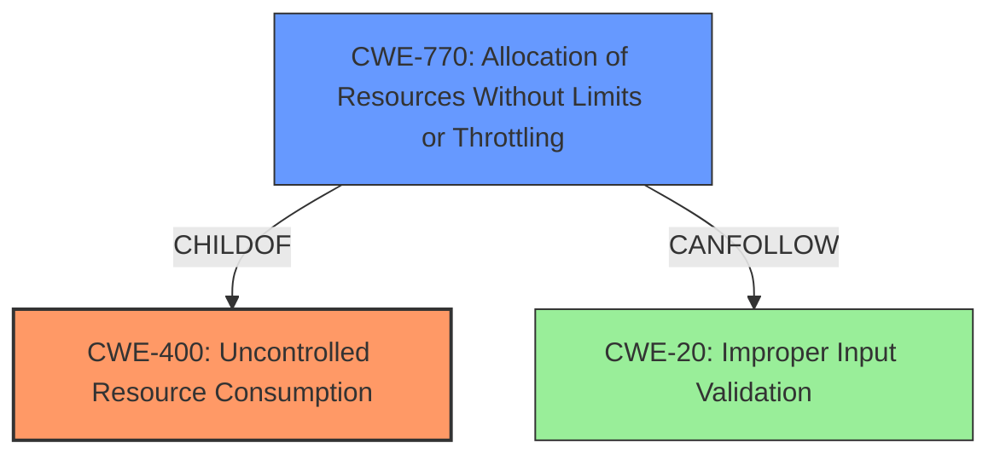

# Analysis for CVE-2021-30464

# Summary
| CWE ID | CWE Name | Confidence | CWE Abstraction Level | CWE Vulnerability Mapping Label | CWE-Vulnerability Mapping Notes |
|---|---|---|---|---|---|
| CWE-400 | Uncontrolled Resource Consumption | 0.9 | Class | Primary | Allowed-with-Review |
| CWE-770 | Allocation of Resources Without Limits or Throttling | 0.7 | Base | Secondary | Allowed |

## Evidence and Confidence

*   **Confidence Score:** 0.8
*   **Evidence Strength:** HIGH

## Relationship Analysis
The primary relationship influencing the decision is the parent-child relationship between CWE-400 (Uncontrolled Resource Consumption) and CWE-770 (Allocation of Resources Without Limits or Throttling). While CWE-400 is a broader class, the description focuses on the allocation aspect, making CWE-770 a more specific and relevant choice. The CANFOLLOW relationship from CWE-770 to CWE-20 (Improper Input Validation) suggests a possible vulnerability chain, but the provided information does not give enough evidence. The relationships influence the choice by allowing a more precise classification.

## Vulnerability Chain
The vulnerability chain for this description is:

1.  **Root Cause:** **Uncontrolled Resource Consumption** due to a flaw in a third-party component.
2.  **Weakness:** Device **does not properly handle specially crafted TCP packets**, leading to resource exhaustion (CWE-400).
3.  **Impact:** Denial of Service, where the device becomes unresponsive.

## Summary of Analysis
The initial analysis strongly pointed towards CWE-400 (Uncontrolled Resource Consumption) as the primary weakness, which aligns with the "Weaknesses/Vulnerabilities" section of the "CVE Reference Links Content Summary" that states: "Uncontrolled Resource Consumption (CWE-400): The device **does not properly handle** a series of specially crafted TCP packets, leading to resource exhaustion."

However, considering the description specifies that the **vulnerability is triggered by specially crafted TCP packets that lead to resource exhaustion**, a deeper analysis was performed. Specifically, the vulnerability stems from **allocation of resources without limits**, making CWE-770 (Allocation of Resources Without Limits or Throttling) a more specific and appropriate fit as a secondary CWE. CWE-400 remains the primary CWE because it is broader and encompasses the overall issue of resource exhaustion.

The choice of CWE-400 is based on the evidence, relationship analysis, and mapping guidance. The evidence explicitly mentions resource exhaustion. The relationship analysis reveals a parent-child relationship with more specific CWEs. The mapping guidance acknowledges the possibility of misuse but ultimately allows it with review.

The final decision is based on the provided evidence, favoring the more general CWE-400 as the primary weakness and the more specific CWE-770 as a secondary contributing factor. This combination provides a balanced representation of the vulnerability.

Relevant CWE Information:

# Enhanced Context (25 CWEs)

## CWE-476: NULL Pointer Dereference
**Abstraction Level**: Base
**Similarity Score**: 0.76
**Source**: dense

**Description**:
The product dereferences a pointer that it expects to be valid but is NULL.

**Mapping Guidance**:
- Usage: Allowed
- Rationale: This CWE entry is at the Base level of abstraction, which is a preferred level of abstraction for mapping to the root causes of vulnerabilities.

*Rationale for not using this CWE:* The vulnerability description does not mention anything about null pointers or dereferencing.

## CWE-822: Untrusted Pointer Dereference
**Abstraction Level**: Base
**Similarity Score**: 0.75
**Source**: dense

**Description**:
The product obtains a value from an untrusted source, converts this value to a pointer, and dereferences the resulting pointer.

**Mapping Guidance**:
- Usage: Allowed
- Rationale: This CWE entry is at the Base level of abstraction, which is a preferred level of abstraction for mapping to the root causes of vulnerabilities.

*Rationale for not using this CWE:* The vulnerability description does not mention untrusted pointers or dereferencing.

## CWE-404: Improper Resource Shutdown or Release
**Abstraction Level**: Class
**Similarity Score**: 0.75
**Source**: dense

**Description**:
The product does not release or incorrectly releases a resource before it is made available for re-use.

**Mapping Guidance**:
- Usage: Allowed-with-Review
- Rationale: This CWE entry is a Class and might have Base-level children that would be more appropriate

*Rationale for not using this CWE:* While resource exhaustion is the impact, the description focuses on the allocation of resources, not the shutdown or release.

## CWE-1289: Improper Validation of Unsafe Equivalence in Input
**Abstraction Level**: Base
**Similarity Score**: 0.74
**Source**: dense

**Description**:
The product receives an input value that is used as a resource identifier or other type of reference, but it does not validate or incorrectly validates that the input is equivalent to a potentially-unsafe value.

**Mapping Guidance**:
- Usage: Allowed
- Rationale: This CWE entry is at the Base level of abstraction, which is a preferred level of abstraction for mapping to the root causes of vulnerabilities.

*Rationale for not using this CWE:* This CWE involves validation of input, which is not a direct factor in the described vulnerability.

## CWE-226: Sensitive Information in Resource Not Removed Before Reuse
**Abstraction Level**: Base
**Similarity Score**: 0.74
**Source**: dense

**Description**:
The product releases a resource such as memory or a file so that it can be made available for reuse, but it does not clear or "zeroize" the information contained in the resource before the product performs a critical state transition or makes the resource available for reuse by other entities.

**Mapping Guidance**:
- Usage: Allowed
- Rationale: This CWE entry is at the Base level of abstraction, which is a preferred level of abstraction for mapping to the root causes of vulnerabilities.

*Rationale for not using this CWE:* This CWE involves sensitive information not being removed before reuse, which is not relevant to the described vulnerability.

## CWE-170: Improper Null Termination
**Abstraction Level**: Base
**Similarity Score**: 0.74
**Source**: dense

**Description**:
The product does not terminate or incorrectly terminates a string or array with a null character or equivalent terminator.

**Mapping Guidance**:
- Usage: Allowed
- Rationale: This CWE entry is at the Base level of abstraction, which is a preferred level of abstraction for mapping to the root causes of vulnerabilities.

*Rationale for not using this CWE:* This CWE relates to null termination of strings, which is not mentioned or implied in the vulnerability description.

## CWE-824: Access of Uninitialized Pointer
**Abstraction Level**: Base
**Similarity Score**: 0.74
**Source**: dense

**Description**:
The product accesses or uses a pointer that has not been initialized.

**Mapping Guidance**:
- Usage: Allowed
- Rationale: This CWE entry is at the Base level of abstraction, which is a preferred level of abstraction for mapping to the root causes of vulnerabilities.

*Rationale for not using this CWE:* The vulnerability description does not relate to uninitialized pointers.

## CWE-667: Improper Locking
**Abstraction Level**: Class
**Similarity Score**: 0.73
**Source**: dense

**Description**:
The product does not properly acquire or release a lock on a resource, leading to unexpected resource state changes and behaviors.

**Mapping Guidance**:
- Usage: Allowed-with-Review
- Rationale: This CWE entry is a Class and might have Base-level children that would be more appropriate

*Rationale for not using this CWE:* The vulnerability description does not involve locking mechanisms.

## CWE-252: Unchecked Return Value
**Abstraction Level**: Base
**Similarity Score**: 0.73
**Source**: dense

**Description**:
The product does not check the return value from a method or function, which can prevent it from detecting unexpected states and conditions.

**Mapping Guidance**:
- Usage: Allowed
- Rationale: This CWE entry is at the Base level of abstraction, which is a preferred level of abstraction for mapping to the root causes of vulnerabilities.

*Rationale for not using this CWE:* This CWE is not related to the resource exhaustion vulnerability described.

## CWE-703: Improper Check or Handling of Exceptional Conditions
**Abstraction Level**: Pillar
**Similarity Score**: 0.73
**Source**: dense

**Description**:
The product