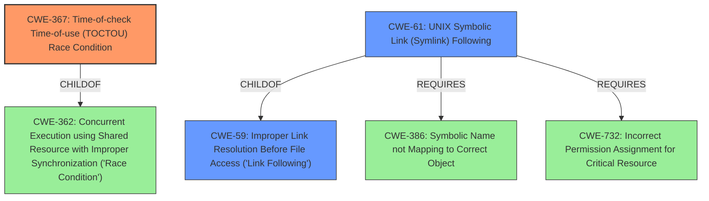

# Analysis Report for CVE-2021-30465

# Vulnerability Analysis Report: CVE-2021-30465

## Description


## Analysis (with Relationship Data)

# Summary
| CWE ID | CWE Name | Confidence | CWE Abstraction Level | CWE Vulnerability Mapping Label | CWE-Vulnerability Mapping Notes |
|---|---|---|---|---|---|
| CWE-367 | Time-of-check Time-of-use (TOCTOU) Race Condition | 0.9 | Base | Allowed | Primary CWE |
| CWE-59 | Improper Link Resolution Before File Access ('Link Following') | 0.7 | Base | Allowed | Secondary Candidate |
| CWE-61 | UNIX Symbolic Link (Symlink) Following | 0.6 | Compound | Allowed | Secondary Candidate |

## Evidence and Confidence

*   **Confidence Score:** 0.8
*   **Evidence Strength:** HIGH

## Relationship Analysis
The primary CWE is CWE-367, which describes a Time-of-check Time-of-use (TOCTOU) Race Condition. This relates to CWE-362, Concurrent Execution using Shared Resource with Improper Synchronization ('Race Condition'), as CWE-367 is a child of CWE-362. CWE-59, Improper Link Resolution Before File Access ('Link Following'), is also relevant because the vulnerability involves a symlink-exchange attack. CWE-61, UNIX Symbolic Link (Symlink) Following, is a compound CWE related to symlink vulnerabilities, requiring several conditions to be met, including conditions related to CWE-386, Symbolic Name not Mapping to Correct Object, and CWE-732, Incorrect Permission Assignment for Critical Resource.



## Vulnerability Chain
The vulnerability chain starts with a **Time-of-check Time-of-use (TOCTOU) flaw** (CWE-367). This allows for a **symlink-exchange attack**, leading to mounting outside the container rootfs. The attacker needs to be able to create multiple containers with a specific mount configuration. The end result is a Container Filesystem Breakout, potentially leading to container escape and access to the host filesystem.

## Summary of Analysis
The primary weakness is a **TOCTTOU race condition** (CWE-367), which is the root cause of the **symlink-exchange attack**. The "CVE Reference Links Content Summary" explicitly states: "Root cause of vulnerability: Time-of-check-to-time-of-use (TOCTTOU) flaw where the target of a mount can be swapped with a symlink after path sanitization, leading to mounting outside the container rootfs." This confirms the TOCTOU flaw as the primary driver.

CWE-59 is relevant because the vulnerability involves a **symlink-exchange attack**. CWE-61 is also considered because it directly relates to UNIX symbolic links and how they can be exploited. However, CWE-61 is a compound CWE, and while it is related, CWE-367 more accurately describes the root cause.

The selection of CWE-367 as the primary CWE is based on the explicit statement of the root cause in the CVE description, and the hierarchical relationships with other CWEs considered. The CWEs are at the optimal level of specificity because they directly reflect the technical details of the vulnerability.

Relevant CWE Information:

# Enhanced Context (25 CWEs)
The following CWEs were identified as potentially relevant to this vulnerability:

## CWE-59: Improper Link Resolution Before File Access ('Link Following')
**Abstraction Level**: Base
**Similarity Score**: 0.76
**Source**: dense

**Description**:
The product attempts to access a file based on the filename, but it does not properly prevent that filename from identifying a link or shortcut that resolves to an unintended resource.

**Mapping Guidance**:
- Usage: Allowed
- Rationale: This CWE entry is at the Base level of abstraction, which is a preferred level of abstraction for mapping to the root causes of vulnerabilities.

## CWE-367: Time-of-check Time-of-use (TOCTOU) Race Condition
**Abstraction Level**: Base
**Similarity Score**: 7007.81
**Source**: sparse

**Description**:
The product checks the state of a resource before using that resource, but the resource's state can change between the check and the use in a way that invalidates the results of the check. This can cause the product to perform invalid actions when the resource is in an unexpected state.

**Mapping Guidance**:
- Usage: Allowed
- Rationale: This CWE entry is at the Base level of abstraction, which is a preferred level of abstraction for mapping to the root causes of vulnerabilities.

## CWE-61: UNIX Symbolic Link (Symlink) Following
**Abstraction Level**: Compound
**Similarity Score**: 7003.10
**Source**: sparse

**Description**:
The product, when opening a file or directory, does not sufficiently account for when the file is a symbolic link that resolves to a target outside of the intended control sphere. This could allow an attacker to cause the product to operate on unauthorized files.

**Mapping Guidance**:
- Usage: Allowed
- Rationale: This is a well-known Composite of multiple weaknesses that must all occur simultaneously, although it is attack-oriented in nature.

## CWE-22: Improper Limitation of a Pathname to a Restricted Directory ('Path Traversal')
**Abstraction Level**: Base
**Similarity Score**: 6999.62
**Source**: sparse

**Description**:
The product uses external input to construct a pathname that is intended to identify a file or directory that is located underneath a restricted parent directory, but the product does not properly neutralize special elements within the pathname that can cause the pathname to resolve to a location that is outside of the restricted directory.

## CWE-73: External Control of File Name or Path
**Abstraction Level**: Base
**Similarity Score**: 7474.74
**Source**: dense

**Description**:
The product allows user input to control or influence paths or file names that are used in filesystem operations.

### CWE Considerations:

*   **CWE-59:** The application **fails to prevent a filename from resolving to an unintended resource** via a link.
*   **CWE-367:** The **TOCTOU race condition** allows an attacker to manipulate the target of a mount between the time of check and the time of use.
*   **CWE-61:** The application **does not sufficiently account for symbolic links** resolving to targets outside the intended control sphere.
*   **CWE-22 and CWE-23**: While directory traversal is mentioned in the vulnerability description, these CWEs are not the primary root cause. The issue is more about the race condition and symlink exchange than about direct path traversal.
*   **CWE-73:** The application allows the container configuration to influence the mount points, which are then exploited by the race condition.

### Final Conclusion:

Based on the analysis, the following CWEs are selected:

*   **CWE-367** (Primary): This is the root cause of the vulnerability, as the TOCTTOU flaw enables the **symlink-exchange attack**.
*   **CWE-59** (Secondary): The vulnerability involves a **symlink-exchange attack**, making this CWE relevant.
*   **CWE-61** (Secondary): Because this involves UNIX symbolic links, this CWE is also relevant, though less direct than CWE-367.


## CWE Relationship Analysis

Current CWEs represent these abstraction levels: .


### Vulnerability Chain Analysis

**Chain starting from CWE-732:**
- 732 (Incorrect Permission Assignment for Critical Resource) - ROOT


**Chain starting from CWE-386:**
- 386 (Symbolic Name not Mapping to Correct Object) - ROOT


### CWE Relationship Diagram

```mermaid
graph TD
    classDef primary fill:#f96,stroke:#333,stroke-width:2px
    classDef secondary fill:#69f,stroke:#333
    classDef tertiary fill:#9e9,stroke:#333
```


*Report generated on 2025-04-01 17:54:20*
