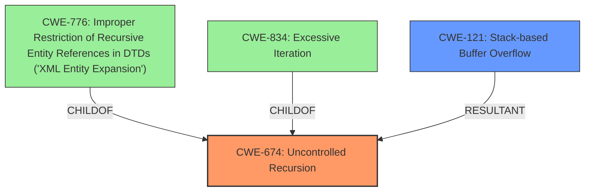

# Analysis Report for CVE-2021-30471

# Vulnerability Analysis Report: CVE-2021-30471

## Description


## Analysis (with Relationship Data)

# Summary
| CWE ID  | CWE Name                       | Confidence | CWE Abstraction Level | CWE Vulnerability Mapping Label | CWE-Vulnerability Mapping Notes |
| ------- | ------------------------------ | ---------- | --------------------- | ------------------------------- | ------------------------------- |
| CWE-674 | Uncontrolled Recursion         | 1          | Class                 | Primary CWE                     | Allowed-with-Review             |
| CWE-121 | Stack-based Buffer Overflow | 0.8          | Variant               | Secondary CWE                 | Allowed                         |

## Evidence and Confidence

*   **Confidence Score:** 0.9
*   **Evidence Strength:** HIGH

## Relationship Analysis
The primary CWE selected is CWE-674 (Uncontrolled Recursion), a Class-level CWE. Although Class-level CWEs typically require further refinement, the evidence directly supports uncontrolled recursion as the root cause.

CWE-674 is the parent of CWE-776 (Improper Restriction of Recursive Entity References in DTDs ('XML Entity Expansion')), which could be relevant if the recursion occurred while processing XML data with DTDs. However, the description doesn't specify XML processing.

CWE-674 is also related to CWE-834 (Excessive Iteration), but recursion is a specific form of iteration, making CWE-674 more precise.

CWE-121 (Stack-based Buffer Overflow) is included as a secondary CWE because the uncontrolled recursion leads to stack overflow, and stack-based buffer overflows are a common consequence of stack exhaustion.



## Vulnerability Chain
The vulnerability chain starts with an **uncontrolled recursive call** (CWE-674). This **uncontrolled recursion** then leads to stack exhaustion, manifesting as a stack-based buffer overflow (CWE-121), ultimately causing a denial-of-service (crash).

## Summary of Analysis
The initial analysis focused on identifying the root cause of the vulnerability based on the provided description. The description explicitly states "**uncontrolled recursive call** in PdfNamesTreeAddToDictionary function in src/podofo/doc/PdfNamesTree.cpp can lead to a stack overflow". The "CVE Reference Links Content Summary" section reinforces this by stating: "The vulnerability stems from an **uncontrolled recursive call** within the `PdfNamesTree::AddToDictionary` function" and "The core issue is a lack of proper control over recursion".

Given the explicit mention of "**uncontrolled recursive call**", CWE-674 (Uncontrolled Recursion) was identified as the primary candidate. The description of CWE-674, "The product does not properly control the amount of recursion that takes place, consuming excessive resources, such as allocated memory or the program stack," aligns directly with the vulnerability description.

Although CWE-674 is a Class-level CWE, the detailed analysis and explicit evidence justify its selection. The impact, a stack overflow, is represented by CWE-121 (Stack-based Buffer Overflow) as a secondary CWE.

The graph relationships confirm that while other CWEs like CWE-776 (Improper Restriction of Recursive Entity References in DTDs ('XML Entity Expansion')) might be related, they do not accurately represent the core weakness described in the vulnerability.

Relevant CWE Information:

**CWE-674: Uncontrolled Recursion**
*   **Description**: The product does not properly control the amount of recursion that takes place, consuming excessive resources, such as allocated memory or the program stack.
*   **Evidence**: "**uncontrolled recursive call** in PdfNamesTreeAddToDictionary function in src/podofo/doc/PdfNamesTree.cpp can lead to a stack overflow."

**CWE-121: Stack-based Buffer Overflow**
*   **Description**: A stack-based buffer overflow condition is a condition where the buffer being overwritten is allocated on the stack (i.e., is a local variable or, rarely, a parameter to a function).
*   **Evidence**: "can lead to a stack overflow"

CWE-789 (Memory Allocation with Excessive Size Value), CWE-1325 (Improperly Controlled Sequential Memory Allocation), CWE-131 (Incorrect Calculation of Buffer Size), CWE-125 (Out-of-bounds Read), CWE-404 (Improper Resource Shutdown or Release), CWE-191 (Integer Underflow (Wrap or Wraparound)), CWE-190 (Integer Overflow or Wraparound), CWE-667 (Improper Locking), CWE-835 (Loop with Unreachable Exit Condition ('Infinite Loop')), CWE-170 (Improper Null Termination), CWE-1322 (Use of Blocking Code in Single-threaded, Non-blocking Context), CWE-1284 (Improper Validation of Specified Quantity in Input), CWE-476 (NULL Pointer Dereference), CWE-681 (Incorrect Conversion between Numeric Types), CWE-463 (Deletion of Data Structure Sentinel), CWE-770 (Allocation of Resources Without Limits or Throttling), and CWE-195 (Signed to Unsigned Conversion Error) were all considered, but they did not align as closely with the provided evidence as CWE-674 and CWE-121. These alternatives lacked direct support within the vulnerability description, which focused specifically on uncontrolled recursion leading to a stack overflow.


## CWE Relationship Analysis

Current CWEs represent these abstraction levels: .


### Vulnerability Chain Analysis

**Chain starting from CWE-463:**
- 463 (Deletion of Data Structure Sentinel) - ROOT


**Chain starting from CWE-404:**
- 404 (Improper Resource Shutdown or Release) - ROOT


### CWE Relationship Diagram

```mermaid
graph TD
    classDef primary fill:#f96,stroke:#333,stroke-width:2px
    classDef secondary fill:#69f,stroke:#333
    classDef tertiary fill:#9e9,stroke:#333
```


*Report generated on 2025-04-02 17:44:54*
