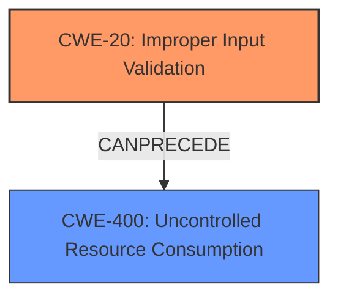

# Enhanced Analysis for CVE-2021-3048

# Summary
| CWE ID | CWE Name | Confidence | CWE Abstraction Level | CWE Vulnerability Mapping Label | CWE-Vulnerability Mapping Notes |
|---|---|---|---|---|---|
| CWE-20 | Improper Input Validation | 1.0 | Base | Primary | Allowed |
| CWE-400 | Uncontrolled Resource Consumption | 0.7 | Base | Secondary | Allowed |

## Evidence and Confidence

*   **Confidence Score:** 0.85
*   **Evidence Strength:** HIGH

## Relationship Analysis
The primary CWE, CWE-20 (Improper Input Validation), is a base-level CWE. It relates to the vulnerability's root cause: **invalid URL entries** not being properly handled. CWE-400 (Uncontrolled Resource Consumption) is included as a secondary CWE because the **invalid URL entries** lead to the devsrvr daemon becoming unresponsive and potentially causing a denial of service (DoS) when the firewall restarts, thus consuming resources. The relationship between CWE-20 and CWE-400 isn't strictly hierarchical but rather a consequence of the initial **improper input validation**.



## Vulnerability Chain
The vulnerability chain starts with **improper input validation** (CWE-20) of the **invalid URL entries** in the EDL. This leads to the Device Server daemon (devsrvr) becoming unresponsive. The unresponsiveness causes commits to fail and prevents configuration changes. Finally, if the firewall restarts, it results in a denial-of-service (DoS) condition, consuming resources (CWE-400) and stopping traffic processing.

## Summary of Analysis
The initial analysis focused on the **root cause** and impact as described in the vulnerability description and CVE reference links. The key phrase "invalid URL entries in External Dynamic List" strongly suggests an input validation issue. The description clearly states that **invalid URL entries** cause the Device Server daemon to stop responding. The CVE Reference Links Content Summary explicitly mentions "Improper Input Validation (CWE-20) of URLs in EDLs."

The retriever results listed several CWEs, but the descriptions and relationships helped narrow down the selection. While CWE-367 (Time-of-check Time-of-use (TOCTOU) Race Condition) had a high score, it didn't accurately describe the vulnerability's nature. Similarly, CWE-347 (Improper Verification of Cryptographic Signature) and CWE-532 (Insertion of Sensitive Information into Log File) were not relevant based on the vulnerability description.

CWE-20 (Improper Input Validation) aligns directly with the **root cause** identified in the CVE description. The description states that the **invalid URL entries** are the cause of the issue. This maps directly to the definition of CWE-20, where the product does not validate or incorrectly validates input.

CWE-400 (Uncontrolled Resource Consumption) is a secondary weakness, as the **improper input validation** leads to the devsrvr daemon becoming unresponsive and potentially causing a denial of service (DoS), consuming resources.

The decision to include CWE-20 as the primary weakness and CWE-400 as secondary is based on the evidence from the vulnerability description and CVE reference links, as well as the relationships between the CWEs.

Relevant CWE Information:

# Enhanced Context (25 CWEs)

## CWE-20: Improper Input Validation
**Abstraction Level**: Base
**Description**: The product does not validate or incorrectly validates input.
**Impact**: System crash, data corruption, or arbitrary code execution.
**Relationship**: CWE-20 is a child of CWE-697 (Incorrect Behavior Order) and a parent of numerous more specific input validation flaws.

## CWE-400: Uncontrolled Resource Consumption
**Abstraction Level**: Base
**Description**: The software does not properly control the allocation and usage of system resources.
**Impact**: Denial of service or reduced system performance.
**Relationship**: CWE-400 is a child of CWE-770 (Allocation of Resources Without Limits) and can be related to other resource management issues.

## CWE-367: Time-of-check Time-of-use (TOCTOU) Race Condition
Not selected as it does not accurately describe the vulnerability's nature. The vulnerability isn't about a race condition between checking and using a resource, but about **invalid input** leading to a system failure.

## CWE-347: Improper Verification of Cryptographic Signature
Not selected as the vulnerability does not involve cryptographic signatures.

## CWE-532: Insertion of Sensitive Information into Log File
Not selected as the vulnerability description does not indicate logging of sensitive information.


## CWE Relationship Analysis

Current CWEs represent these abstraction levels: .


### Vulnerability Chain Analysis

**Chain starting from CWE-770:**
- 770 (Allocation of Resources Without Limits or Throttling) - ROOT


**Chain starting from CWE-367:**
- 367 (Time-of-check Time-of-use (TOCTOU) Race Condition) - ROOT


### CWE Relationship Diagram

```mermaid
graph TD
    classDef primary fill:#f96,stroke:#333,stroke-width:2px
    classDef secondary fill:#69f,stroke:#333
    classDef tertiary fill:#9e9,stroke:#333
```