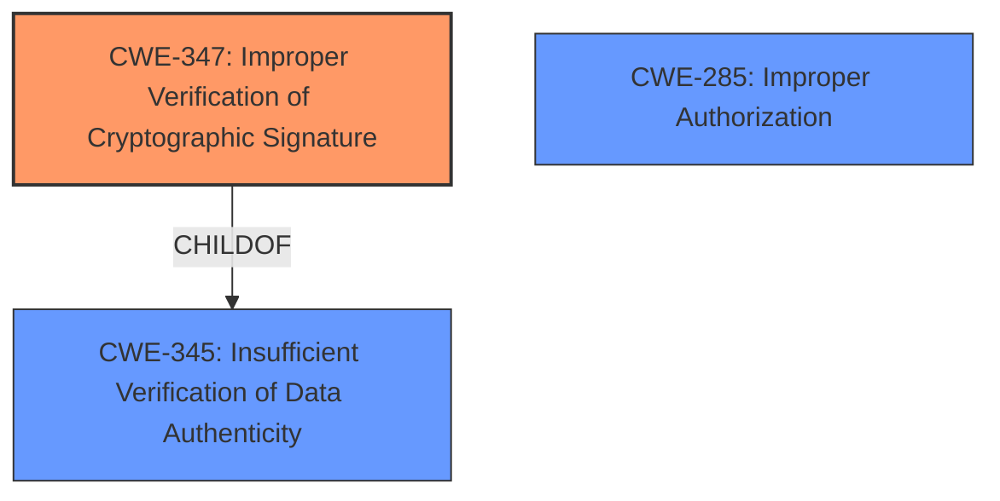

# Analysis for CVE-2021-3051

# Summary
| CWE ID | CWE Name | Confidence | CWE Abstraction Level | CWE Vulnerability Mapping Label | CWE-Vulnerability Mapping Notes |
|---|---|---|---|---|---|
| CWE-347 | Improper Verification of Cryptographic Signature | 1.0 | Base | Allowed | Primary CWE |
| CWE-285 | Improper Authorization | 0.5 | Class | Discouraged | Secondary Candidate |

## Evidence and Confidence

*   **Confidence Score:** 0.8
*   **Evidence Strength:** HIGH

## Relationship Analysis
The primary CWE, CWE-347, is a base-level weakness directly addressing the **improper verification of cryptographic signatures**. It is a child of CWE-345 (Insufficient Verification of Data Authenticity), which is a more general class. CWE-285 is a Class level weakness, and is related to authorization issues which are a potential consequence of the cryptographic signature failure, but not the core **root cause**.

## Vulnerability Chain
The vulnerability chain starts with the **improper verification of the cryptographic signature** (CWE-347), which leads to the ability to bypass authentication and potentially perform unauthorized actions.
  - **Root Cause:** CWE-347: Improper Verification of Cryptographic Signature
  - **Impact:** Access protected resources and perform unauthorized actions

## Summary of Analysis
The initial analysis and criticism focused on identifying the most accurate CWE to represent the **root cause** of the vulnerability. The vulnerability description and the CVE reference links content summary clearly point to an **improper verification of cryptographic signatures** in the SAML authentication of Cortex XSOAR.

The evidence supporting this decision is primarily found in:
- **Vulnerability Description Key Phrases:** "**improper verification of cryptographic signature**"
- **CVE Reference Links Content Summary:** "Root cause of vulnerability: **Improper verification of cryptographic signatures** in Cortex XSOAR SAML authentication." and "The system fails to properly verify cryptographic signatures in SAML authentication, allowing an attacker to bypass authentication."

CWE-347 (Improper Verification of Cryptographic Signature) is the most specific and relevant CWE, as it directly addresses the identified **root cause**. The retriever results also list CWE-347 as the top candidate.

Other CWEs were considered but ultimately deemed less suitable:
- CWE-285 (Improper Authorization) was considered because the vulnerability allows an attacker to perform unauthorized actions. However, this is a consequence of the **improper signature verification**, not the **root cause** itself.
- CWE-303 (Incorrect Implementation of Authentication Algorithm) was also considered, but the core issue is not an incorrect implementation of the entire authentication algorithm, but rather a failure in verifying the cryptographic signature.

The selection of CWE-347 is at the optimal level of specificity because it is a Base-level CWE that accurately represents the identified weakness.

Relevant CWE Information:

# Enhanced Context (25 CWEs)

## CWE-347: Improper Verification of Cryptographic Signature
**Abstraction:** Base
**Similarity Score**: 5269.27
**Source**: sparse

**Description**:
The product does not verify, or incorrectly verifies, the cryptographic signature for data.

**Mapping Guidance**:
- Usage: Allowed
- Rationale: This CWE entry is at the Base level of abstraction, which is a preferred level of abstraction for mapping to the root causes of vulnerabilities.

## CWE-285: Improper Authorization
**Abstraction:** Class
**Similarity Score**: 5067.18
**Source**: sparse

**Description**:
The product does not perform or incorrectly performs an authorization check when an actor attempts to access a resource or perform an action.

**Mapping Guidance**:
- Usage: Discouraged
- Rationale: CWE-285 is high-level and lower-level CWEs can frequently be used instead. It is a level-1 Class (i.e., a child of a Pillar).