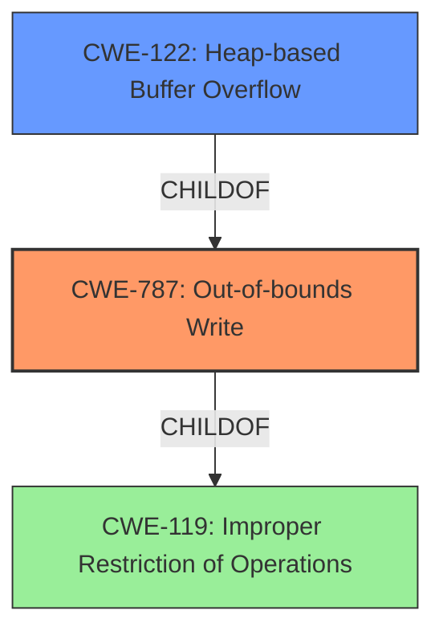

# Enhanced Analysis for CVE-2021-30516

# Summary
| CWE ID | CWE Name | Confidence | CWE Abstraction Level | CWE Vulnerability Mapping Label | CWE-Vulnerability Mapping Notes |
|---|---|---|---|---|---|
| CWE-787 | Out-of-bounds Write | 1.00 | Base | Allowed | Primary CWE |
| CWE-122 | Heap-based Buffer Overflow | 0.75 | Variant | Allowed | Secondary Candidate |
| CWE-119 | Improper Restriction of Operations within the Bounds of a Memory Buffer | 0.50 | Class | Discouraged | Secondary Candidate |

## Evidence and Confidence

*   **Confidence Score:** 0.90
*   **Evidence Strength:** HIGH

## Relationship Analysis
The primary CWE, CWE-787 (**Out-of-bounds Write**), is a base-level CWE. CWE-122 (**Heap-based Buffer Overflow**) is a variant of CWE-787, which is more specific because the **buffer overflow** occurs on the heap. CWE-119 (**Improper Restriction of Operations within the Bounds of a Memory Buffer**) is a class-level CWE, which is too general.



## Vulnerability Chain
The vulnerability chain starts with the **heap buffer overflow**, which leads to heap corruption. The root cause is the **improper** handling of the buffer, leading to an **out-of-bounds write**.

## Summary of Analysis
The initial analysis strongly points to a **heap buffer overflow**, which is confirmed by the provided evidence. The vulnerability description explicitly mentions "**Heap buffer overflow**" and that the attacker can "potentially exploit heap corruption." The CVE Reference Links Content Summary states that "A heap buffer overflow flaw was found in the History component of the Chromium browser."

The retriever results suggest CWE-119 (**Improper Restriction of Operations within the Bounds of a Memory Buffer**), CWE-190 (**Integer Overflow or Wraparound**), CWE-416 (**Use After Free**), CWE-122 (**Heap-based Buffer Overflow**), CWE-843 (**Access of Resource Using Incompatible Type ('Type Confusion')**), CWE-366 (**Race Condition within a Thread**), CWE-123 (**Write-what-where Condition**), CWE-193 (**Off-by-one Error**), CWE-415 (**Double Free**), and CWE-125 (**Out-of-bounds Read**).

CWE-787 (**Out-of-bounds Write**) is the most accurate because the core issue is writing outside the bounds of the allocated buffer on the heap. CWE-122 (**Heap-based Buffer Overflow**) is a reasonable secondary mapping because it is a variant of CWE-787 and specifies the location of the **buffer overflow** on the heap. CWE-119 (**Improper Restriction of Operations within the Bounds of a Memory Buffer**) is too general, as the description points to a more specific **out-of-bounds write**.

Relevant CWE Information:

# Enhanced Context (25 CWEs)

## CWE-191: Integer Underflow (Wrap or Wraparound)
**Abstraction Level**: Base
**Similarity Score**: 0.77

## CWE-805: Buffer Access with Incorrect Length Value
**Abstraction Level**: Base
**Similarity Score**: 0.77

## CWE-131: Incorrect Calculation of Buffer Size
**Abstraction Level**: Base
**Similarity Score**: 0.76

## CWE-126: Buffer Over-read
**Abstraction Level**: Variant
**Similarity Score**: 0.76

## CWE-823: Use of Out-of-range Pointer Offset
**Abstraction Level**: Base
**Similarity Score**: 0.76

## CWE-125: Out-of-bounds Read
**Abstraction Level**: Base
**Similarity Score**: 0.76

## CWE-124: Buffer Underwrite ('Buffer Underflow')
**Abstraction Level**: Base
**Similarity Score**: 0.75

## CWE-366: Race Condition within a Thread
**Abstraction Level**: Base
**Similarity Score**: 0.75

## CWE-127: Buffer Under-read
**Abstraction Level**: Variant
**Similarity Score**: 0.75

## CWE-193: Off-by-one Error
**Abstraction Level**: Base
**Similarity Score**: 0.75

## CWE-190: Integer Overflow or Wraparound
**Abstraction Level**: Base
**Similarity Score**: 6221.98

## CWE-125: Out-of-bounds Read
**Abstraction Level**: Base
**Similarity Score**: 5938.88

## CWE-193: Off-by-one Error
**Abstraction Level**: Base
**Similarity Score**: 5780.46

## CWE-119: Improper Restriction of Operations within the Bounds of a Memory Buffer
**Abstraction Level**: Class
**Similarity Score**: 5689.67

## CWE-415: Double Free
**Abstraction Level**: Variant
**Similarity Score**: 5634.94

## CWE-123: Write-what-where Condition
**Abstraction Level**: base
**Similarity Score**: 5.03

## CWE-416: Use After Free
**Abstraction Level**: variant
**Similarity Score**: 4.53

## CWE-787: Out-of-bounds Write
**Abstraction Level**: base
**Similarity Score**: 4.33

## CWE-825: Expired Pointer Dereference
**Abstraction Level**: base
**Similarity Score**: 4.33

## CWE-120: Buffer Copy without Checking Size of Input ('Classic Buffer Overflow')
**Abstraction Level**: base
**Similarity Score**: 4.33

## CWE-130: Improper Handling of Length Parameter Inconsistency
**Abstraction Level**: base
**Similarity Score**: 4.33

## CWE-190: Integer Overflow or Wraparound
**Abstraction Level**: base
**Similarity Score**: 4.33

## CWE-1341: Multiple Releases of Same Resource or Handle
**Abstraction Level**: base
**Similarity Score**: 4.33

## CWE-170: Improper Null Termination
**Abstraction Level**: base
**Similarity Score**: 4.33

## CWE-1284: Improper Validation of Specified Quantity in Input
**Abstraction Level**: base
**Similarity Score**: 4.33

CWE-190 (**Integer Overflow or Wraparound**), CWE-125 (**Out-of-bounds Read**), CWE-193 (**Off-by-one Error**), CWE-415 (**Double Free**), CWE-123 (**Write-what-where Condition**), CWE-416 (**Use After Free**), CWE-825 (**Expired Pointer Dereference**), CWE-120 (**Buffer Copy without Checking Size of Input ('Classic Buffer Overflow')**), CWE-130 (**Improper Handling of Length Parameter Inconsistency**), CWE-1341 (**Multiple Releases of Same Resource or Handle**), CWE-170 (**Improper Null Termination**), and CWE-1284 (**Improper Validation of Specified Quantity in Input**) do not fit the vulnerability description, as they describe different root causes or conditions.


## CWE Relationship Analysis

Current CWEs represent these abstraction levels: .


### Vulnerability Chain Analysis

**Chain starting from CWE-787:**
- 787 (Out-of-bounds Write) - ROOT


**Chain starting from CWE-123:**
- 123 (Write-what-where Condition) - ROOT


### CWE Relationship Diagram

```mermaid
graph TD
    classDef primary fill:#f96,stroke:#333,stroke-width:2px
    classDef secondary fill:#69f,stroke:#333
    classDef tertiary fill:#9e9,stroke:#333
```