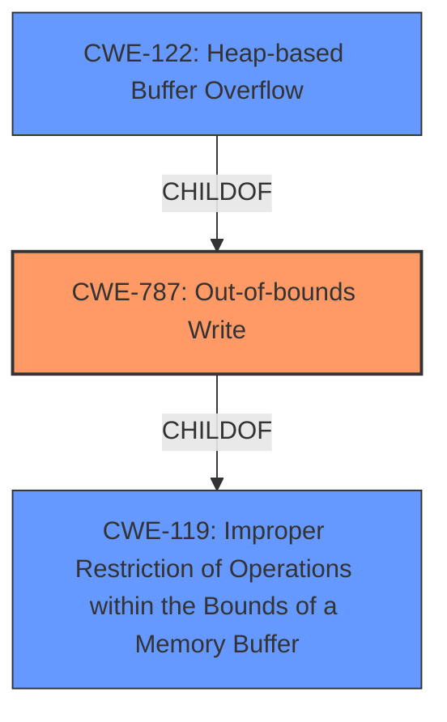

# Enhanced Analysis for CVE-2021-30518

# Summary
| CWE ID  | CWE Name  | Confidence | CWE Abstraction Level | CWE Vulnerability Mapping Label | CWE-Vulnerability Mapping Notes |
|---|---|---|---|---|---|
| CWE-787 | Out-of-bounds Write | 1.0 | Base | Allowed | Primary CWE |
| CWE-122 | Heap-based Buffer Overflow | 0.8 | Variant | Allowed | Secondary Candidate |
| CWE-119 | Improper Restriction of Operations within the Bounds of a Memory Buffer | 0.6 | Class | Discouraged | Secondary Candidate |

## Evidence and Confidence

*   **Confidence Score:** 0.9
*   **Evidence Strength:** HIGH

## Relationship Analysis
The primary relationship influencing the decision is the parent-child relationship where CWE-787 (Out-of-bounds Write) is a base CWE and a child of CWE-119 (Improper Restriction of Operations within the Bounds of a Memory Buffer). Also, CWE-122 (Heap-based Buffer Overflow) is a variant of CWE-787, further specifying the location of the buffer. The selection favors the most specific base CWE, CWE-787, but acknowledges the relevance of the variant CWE-122.



## Vulnerability Chain
The vulnerability chain starts with a **heap buffer overflow** due to a crafted HTML page, leading to heap corruption.
  - **Root Cause:** **Heap buffer overflow** (CWE-787)
  - **Impact:** Heap corruption

## Summary of Analysis
The analysis is based on the provided evidence, which includes the vulnerability description and the CVE reference links content summary. The key phrase "Heap buffer overflow" from the vulnerability description directly supports the selection of CWE-787 as the primary CWE. The CVE Reference Links Content Summary also confirms the **root_cause** and **vulnerability** is a "**Heap buffer overflow**". The graph relationships show that CWE-787 is a child of CWE-119, which is a more general class of vulnerability. Since the provided information is specific to a heap buffer overflow, CWE-787 is the more appropriate choice.

CWE-122 (Heap-based Buffer Overflow) was considered but not chosen as the primary CWE because CWE-787 more directly captures the **out-of-bounds write** condition, while CWE-122 describes the location (heap) of the overflow, which is secondary to the actual weakness.

CWE-119 (Improper Restriction of Operations within the Bounds of a Memory Buffer) was considered but not chosen because it's a high-level class, and the description clearly indicates an **out-of-bounds write**, making CWE-787 a better fit. The mapping guidance for CWE-119 discourages its use when more specific CWEs are available.

CWE-190 (Integer Overflow or Wraparound), CWE-843 (Access of Resource Using Incompatible Type ('Type Confusion')), CWE-416 (Use After Free), CWE-126 (Buffer Over-read), CWE-120 (Buffer Copy without Checking Size of Input ('Classic Buffer Overflow')), CWE-366 (Race Condition within a Thread), CWE-193 (Off-by-one Error), and CWE-415 (Double Free) were considered but deemed less relevant as they do not directly address the **heap buffer overflow** condition described in the vulnerability.

The selected CWEs are at the optimal level of specificity because they accurately represent the **root cause** of the vulnerability based on the available evidence.


## CWE Relationship Analysis

Current CWEs represent these abstraction levels: .


### Vulnerability Chain Analysis

**Chain starting from CWE-787:**
- 787 (Out-of-bounds Write) - ROOT


**Chain starting from CWE-415:**
- 415 (Double Free) - ROOT


### CWE Relationship Diagram

```mermaid
graph TD
    classDef primary fill:#f96,stroke:#333,stroke-width:2px
    classDef secondary fill:#69f,stroke:#333
    classDef tertiary fill:#9e9,stroke:#333
```