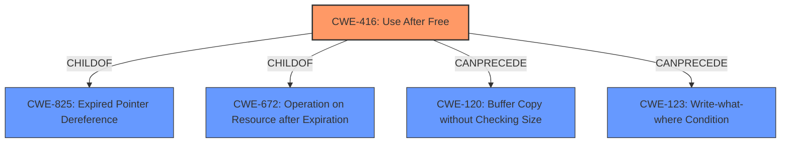

# Enhanced Analysis for CVE-2021-30519

# Summary
| CWE ID | CWE Name | Confidence | CWE Abstraction Level | CWE Vulnerability Mapping Label | CWE-Vulnerability Mapping Notes |
|---|---|---|---|---|---|
| CWE-416 | Use After Free | 1.0 | Variant | Primary | Allowed |

## Evidence and Confidence

*   **Confidence Score:** 1.0
*   **Evidence Strength:** HIGH

## Relationship Analysis
The primary relationship influencing the CWE selection is the hierarchical structure. CWE-416 "Use After Free" is a Variant of CWE-825 "Expired Pointer Dereference" and CWE-672 "Operation on Resource after Expiration". Given the specific nature of the vulnerability description explicitly mentioning "**use after free**", selecting the Variant CWE-416 provides a more precise classification than its parent Classes or Bases. There is a CANPRECEDE relationship between CWE-416 and CWE-120 and CWE-123.



## Vulnerability Chain
The vulnerability chain starts with a "**use after free**" condition (CWE-416), leading to potential heap corruption. The attacker exploits this by crafting a malicious HTML page.

## Summary of Analysis
The analysis is primarily based on the explicit mention of "**use after free**" in both the vulnerability description and the CVE Reference Links Content Summary. The vulnerability description states: "**Use after free** in Payments in Google Chrome prior to 90.0.4430.212 allowed an attacker who convinced a user to install a malicious payments app to potentially exploit heap corruption via a crafted HTML page." The CVE Reference Links Content Summary confirms this by stating: "The vulnerability has a **root_cause** of '**Use after free** flaw'," and "A remote attacker could potentially execute arbitrary code by exploiting the **use-after-free** vulnerability." Given this direct evidence, CWE-416 is the most appropriate and specific classification. The retriever results also list CWE-416 as the top combined result. The relationship analysis supports selecting the Variant CWE-416 over its parent Classes because the vulnerability description directly indicates a use-after-free condition.

Relevant CWE Information:

# Enhanced Context (25 CWEs)
The following CWEs were identified as potentially relevant to this vulnerability:

## CWE-366: Race Condition within a Thread
**Abstraction Level**: Base
**Similarity Score**: 0.77
**Source**: dense

**Description**:
If two threads of execution use a resource simultaneously, there exists the possibility that resources may be used while invalid, in turn making the state of execution undefined.

**Mapping Guidance**:
- Usage: Allowed
- Rationale: This CWE entry is at the Base level of abstraction, which is a preferred level of abstraction for mapping to the root causes of vulnerabilities.

## Analysis
CWE-366 was considered, but the vulnerability description does not indicate a race condition. It focuses on the "**use after free**" condition, not concurrent access. Therefore, CWE-366 is not selected.

## CWE-226: Sensitive Information in Resource Not Removed Before Reuse
**Abstraction Level**: Base
**Similarity Score**: 0.75
**Source**: dense

**Description**:
The product releases a resource such as memory or a file so that it can be made available for reuse, but it does not clear or "zeroize" the information contained in the resource before the product performs a critical state transition or makes the resource available for reuse by other entities.

**Mapping Guidance**:
- Usage: Allowed
- Rationale: This CWE entry is at the Base level of abstraction, which is a preferred level of abstraction for mapping to the root causes of vulnerabilities.

## Analysis
CWE-226 was considered, but there is no indication that sensitive information is involved. The vulnerability focuses on memory being reused after it has been freed, not on the presence of sensitive data. Therefore, CWE-226 is not selected.

## CWE-667: Improper Locking
**Abstraction Level**: Class
**Similarity Score**: 0.75
**Source**: dense

**Description**:
The product does not properly acquire or release a lock on a resource, leading to unexpected resource state changes and behaviors.

**Mapping Guidance**:
- Usage: Allowed-with-Review
- Rationale: This CWE entry is a Class and might have Base-level children that would be more appropriate

## Analysis
CWE-667 was considered, but the vulnerability description does not mention any locking issues. The focus is solely on the "**use after free**" condition. Therefore, CWE-667 is not selected.

## CWE-404: Improper Resource Shutdown or Release
**Abstraction Level**: Class
**Similarity Score**: 0.75
**Source**: dense

**Description**:
The product does not release or incorrectly releases a resource before it is made available for re-use.

**Mapping Guidance**:
- Usage: Allowed-with-Review
- Rationale: This CWE entry is a Class and might have Base-level children that would be more appropriate

## Analysis
CWE-404 was considered, but the vulnerability description specifies that the resource has already been freed, leading to a "**use after free**". CWE-404 is about the resource not being released correctly initially. Therefore, CWE-404 is not selected.

## CWE-415: Double Free
**Abstraction Level**: Variant
**Similarity Score**: 0.75
**Source**: dense

**Description**:
The product calls free() twice on the same memory address, potentially leading to modification of unexpected memory locations.

**Mapping Guidance**:
- Usage: Allowed
- Rationale: This CWE entry is at the Variant level of abstraction, which is a preferred level of abstraction for mapping to the root causes of vulnerabilities.

## Analysis
CWE-415 was considered, but the vulnerability description focuses on the use of memory after it has been freed, not on freeing the same memory twice. Therefore, CWE-415 is not selected.

## CWE-252: Unchecked Return Value
**Abstraction Level**: Base
**Similarity Score**: 0.75
**Source**: dense

**Description**:
The product does not check the return value from a method or function, which can prevent it from detecting unexpected states and conditions.

**Mapping Guidance**:
- Usage: Allowed
- Rationale: This CWE entry is at the Base level of abstraction, which is a preferred level of abstraction for mapping to the root causes of vulnerabilities.

## Analysis
CWE-252 was considered, but the vulnerability description does not involve unchecked return values. The issue is the "**use after free**" condition. Therefore, CWE-252 is not selected.

## CWE-362: Concurrent Execution using Shared Resource with Improper Synchronization ('Race Condition')
**Abstraction Level**: Class
**Similarity Score**: 0.74
**Source**: dense

**Description**:
The product contains a concurrent code sequence that requires temporary, exclusive access to a shared resource, but a timing window exists in which the shared resource can be modified by another code sequence operating concurrently.

**Mapping Guidance**:
- Usage: Allowed-with-Review
- Rationale: This CWE entry is a Class and might have Base-level children that would be more appropriate

## Analysis
CWE-362 was considered, but the vulnerability description does not indicate a race condition. It focuses on the "**use after free**" condition. Therefore, CWE-362 is not selected.

## CWE-1289: Improper Validation of Unsafe Equivalence in Input
**Abstraction Level**: Base
**Similarity Score**: 0.74
**Source**: dense

**Description**:
The product receives an input value that is used as a resource identifier or other type of reference, but it does not validate or incorrectly validates that the input is equivalent to a potentially-unsafe value.

**Mapping Guidance**:
- Usage: Allowed
- Rationale: This CWE entry is at the Base level of abstraction, which is a preferred level of abstraction for mapping to the root causes of vulnerabilities.

## Analysis
CWE-1289 was considered, but there is no mention about validating unsafe equivalence of input. The vulnerability is about the "**use after


## CWE Relationship Analysis

Current CWEs represent these abstraction levels: .


### Vulnerability Chain Analysis

**Chain starting from CWE-667:**
- 667 (Improper Locking) - ROOT


**Chain starting from CWE-415:**
- 415 (Double Free) - ROOT


### CWE Relationship Diagram

```mermaid
graph TD
    classDef primary fill:#f96,stroke:#333,stroke-width:2px
    classDef secondary fill:#69f,stroke:#333
    classDef tertiary fill:#9e9,stroke:#333
```