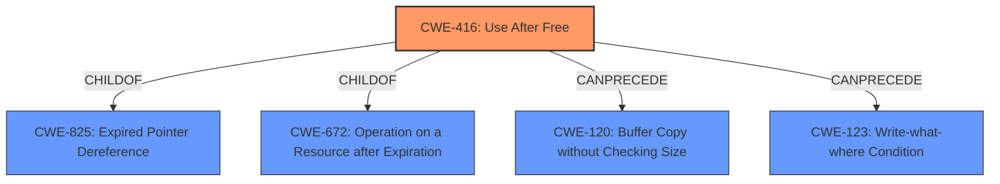

# Raw Analyzer Response for CVE-2021-30522

# Summary
| CWE ID | CWE Name | Confidence | CWE Abstraction Level | CWE Vulnerability Mapping Label | CWE-Vulnerability Mapping Notes |
|---|---|---|---|---|---|
| CWE-416 | Use After Free | 1.0 | Variant | Allowed | Primary CWE |

## Evidence and Confidence

*   **Confidence Score:** 1.0
*   **Evidence Strength:** HIGH

## Relationship Analysis
The primary relationship influencing the CWE selection is the direct match of "Use After Free" in both the vulnerability description and CWE-416. While other CWEs like CWE-415 (Double Free) and CWE-366 (Race Condition within a Thread) were considered, they did not directly align with the provided root cause. CWE-416 is a variant-level CWE, providing a specific classification for this vulnerability.

## Vulnerability Chain
The vulnerability chain starts with a **Use after free** condition in the WebAudio component of Google Chrome. This **weakness** leads to heap corruption. A remote attacker can trigger this vulnerability by crafting a malicious HTML page. The sequence is:

1.  **Use after free (CWE-416)**: AudioNode object is freed prematurely.
2.  Heap corruption (Impact): Freed memory is accessed, leading to potential arbitrary code execution.

## Summary of Analysis
The analysis strongly supports the selection of CWE-416 as the primary CWE. The vulnerability description explicitly states "**Use after free**" as the root cause, which directly corresponds to CWE-416. The "CVE Reference Links Content Summary" confirms the root cause is a "Use-after-free error" and that "the audio rendering thread might still be referencing an already freed AudioNode object". This aligns perfectly with the description of CWE-416: "The product reuses or references memory after it has been freed."

The selection of CWE-416 is based on direct evidence from the vulnerability description. The "Vulnerability Description Key Phrases" section also confirms "**Use after free**" as the root cause. This clear and explicit evidence results in a high confidence score of 1.0.

Other CWEs were considered but ultimately rejected:

*   CWE-415 (Double Free): While related to memory management issues, the vulnerability description specifically mentions "Use after free," not a double free.
*   CWE-366 (Race Condition within a Thread): Although race conditions can sometimes lead to use-after-free vulnerabilities, there is no explicit mention of a race condition in the vulnerability description.
*   CWE-787 (Out-of-bounds Write): While heap corruption could potentially lead to out-of-bounds writes, the primary **weakness** is the use of freed memory, making CWE-416 a more accurate classification.

The final selection of CWE-416 is at the optimal level of specificity. It is a variant-level CWE that directly addresses the root cause of the vulnerability as described in the provided information.

Relevant CWE Information:

# Enhanced Context (25 CWEs)
The following CWEs were identified as potentially relevant to this vulnerability:

## CWE-404: Improper Resource Shutdown or Release
**Abstraction Level**: Class
**Similarity Score**: 0.82
**Source**: dense

**Description**:
The product does not release or incorrectly releases a resource before it is made available for re-use.

**Mapping Guidance**:
- Usage: Allowed-with-Review
- Rationale: This CWE entry is a Class and might have Base-level children that would be more appropriate

## CWE-226: Sensitive Information in Resource Not Removed Before Reuse
**Abstraction Level**: Base
**Similarity Score**: 0.79
**Source**: dense

**Description**:
The product releases a resource such as memory or a file so that it can be made available for reuse, but it does not clear or "zeroize" the information contained in the resource before the product performs a critical state transition or makes the resource available for reuse by other entities.

**Mapping Guidance**:
- Usage: Allowed
- Rationale: This CWE entry is at the Base level of abstraction, which is a preferred level of abstraction for mapping to the root causes of vulnerabilities.

## CWE-366: Race Condition within a Thread
**Abstraction Level**: Base
**Similarity Score**: 0.79
**Source**: dense

**Description**:
If two threads of execution use a resource simultaneously, there exists the possibility that resources may be used while invalid, in turn making the state of execution undefined.

**Mapping Guidance**:
- Usage: Allowed
- Rationale: This CWE entry is at the Base level of abstraction, which is a preferred level of abstraction for mapping to the root causes of vulnerabilities.

## CWE-667: Improper Locking
**Abstraction Level**: Class
**Similarity Score**: 0.78
**Source**: dense

**Description**:
The product does not properly acquire or release a lock on a resource, leading to unexpected resource state changes and behaviors.

**Mapping Guidance**:
- Usage: Allowed-with-Review
- Rationale: This CWE entry is a Class and might have Base-level children that would be more appropriate

## CWE-662: Improper Synchronization
**Abstraction Level**: Class
**Similarity Score**: 0.76
**Source**: dense

**Description**:
The product utilizes multiple threads or processes to allow temporary access to a shared resource that can only be exclusive to one process at a time, but it does not properly synchronize these actions, which might cause simultaneous accesses of this resource by multiple threads or processes.

**Mapping Guidance**:
- Usage: Discouraged
- Rationale: This CWE entry is a level-1 Class (i.e., a child of a Pillar). It might have lower-level children that would be more appropriate

## CWE-362: Concurrent Execution using Shared Resource with Improper Synchronization ('Race Condition')
**Abstraction Level**: Class
**Similarity Score**: 0.76
**Source**: dense

**Description**:
The product contains a concurrent code sequence that requires temporary, exclusive access to a shared resource, but a timing window exists in which the shared resource can be modified by another code sequence operating concurrently.

**Mapping Guidance**:
- Usage: Allowed-with-Review
- Rationale: This CWE entry is a Class and might have Base-level children that would be more appropriate

## CWE-772: Missing Release of Resource after Effective Lifetime
**Abstraction Level**: Base
**Similarity Score**: 0.76
**Source**: dense

**Description**:
The product does not release a resource after its effective lifetime has ended, i.e., after the resource is no longer needed.

**Mapping Guidance**:
- Usage: Allowed
- Rationale: This CWE entry is at the Base level of abstraction, which is a preferred level of abstraction for mapping to the root causes of vulnerabilities.

## CWE-911: Improper Update of Reference Count
**Abstraction Level**: Base
**Similarity Score**: 0.75
**Source**: dense

**Description**:
The product uses a reference count to manage a resource, but it does not update or incorrectly updates the reference count.

**Mapping Guidance**:
- Usage: Allowed
- Rationale: This CWE entry is at the Base level of abstraction, which is a preferred level of abstraction for mapping to the root causes of vulnerabilities.

## CWE-664: Improper Control of a Resource Through its Lifetime
**Abstraction Level**: Pillar
**Similarity Score**: 0.75
**Source**: dense

**Description**:
The product does not maintain or incorrectly maintains control over a resource throughout its lifetime of creation, use, and release.

**Mapping Guidance**:
- Usage: Discouraged
- Rationale: This CWE entry is high-level when lower-level children are available.

## CWE-367: Time-of-check Time-of-use (TOCTOU) Race Condition
**Abstraction Level**: Base
**Similarity Score**: 0.75
**Source**: dense

**Description**:
The product checks the state of a resource before using that resource, but the resource's state can change between the check and the use in a way that invalidates the results of the check. This can cause the product to perform invalid actions when the resource is in