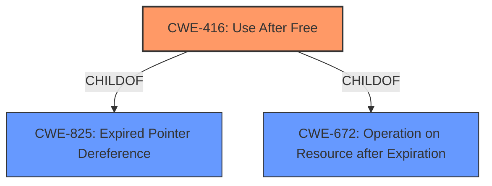

# Raw Analyzer Response for CVE-2021-30525

# Summary
| CWE ID | CWE Name | Confidence | CWE Abstraction Level | CWE Vulnerability Mapping Label | CWE-Vulnerability Mapping Notes |
|---|---|---|---|---|---|
| CWE-416 | Use After Free | 1.0 | Variant | Allowed | Primary CWE |

## Evidence and Confidence

*   **Confidence Score:** 1.0
*   **Evidence Strength:** HIGH

## Relationship Analysis
The primary CWE is CWE-416 (**Use After Free**), which is a Variant-level CWE. It has parent-child relationships to CWE-825 (**Expired Pointer Dereference**) and CWE-672 (**Operation on Resource after Expiration** or Release). The vulnerability description explicitly mentions "**use after free**" as the **rootcause**, so mapping directly to CWE-416 is appropriate and specific.

## Vulnerability Chain
The vulnerability chain starts with a "**use after free**" condition (CWE-416) in the TabGroups component, leading to heap corruption. The attacker exploits this by crafting a malicious HTML page.

## Summary of Analysis
The vulnerability description explicitly states "**use after free**" as the **rootcause**. The "CVE Reference Links Content Summary" confirms this by stating "A **use-after-free** vulnerability exists in the TabGroups component of the Chromium browser" and "Weaknesses/vulnerabilities present: **Use-after-free**".

The primary CWE match from similar CVE descriptions is CWE-416, further supporting this choice. The Retriever Results also list CWE-416 as the top combined result.

CWE-416 is a Variant-level CWE, which is the preferred level of abstraction for mapping to the root causes of vulnerabilities, and the mapping guidance is ALLOWED.

Therefore, the most accurate classification for this vulnerability is CWE-416 (**Use After Free**).

CWEs considered but not used:

*   CWE-366 (**Race Condition within a Thread**): While race conditions can sometimes lead to use-after-free vulnerabilities, there is no mention of a race condition in the provided vulnerability description. Therefore, this CWE is not appropriate.
*   CWE-843 (**Access of Resource Using Incompatible Type ('Type Confusion')**): This CWE is not applicable as the vulnerability is a use-after-free, not type confusion.
*   CWE-415 (**Double Free**): This CWE is not applicable as the vulnerability is a use-after-free, not a double free.
*   CWE-122 (**Heap-based Buffer Overflow**): While heap corruption is mentioned as an impact, the root cause is the use-after-free, not a buffer overflow.
*   CWE-356 (**Product UI does not Warn User of Unsafe Actions**): This is not relevant to the vulnerability.
*   CWE-123 (**Write-what-where Condition**): This CWE is a potential impact of a use-after-free, but not the root cause.
*   CWE-362 (**Concurrent Execution using Shared Resource with Improper Synchronization ('Race Condition')**): While race conditions can sometimes lead to use-after-free vulnerabilities, there is no mention of a race condition in the provided vulnerability description. Therefore, this CWE is not appropriate.
*   CWE-451 (**User Interface (UI) Misrepresentation of Critical Information**): This is not relevant to the vulnerability.
*   CWE-404 (**Improper Resource Shutdown or Release**): This is not a general resource leak, but a specific use-after-free.