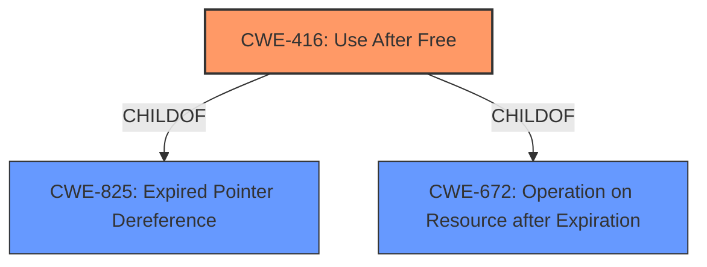

# Analysis Report for CVE-2021-30527

# Vulnerability Analysis Report: CVE-2021-30527

## Description


## Analysis (with Relationship Data)

# Summary
| CWE ID | CWE Name | Confidence | CWE Abstraction Level | CWE Vulnerability Mapping Label | CWE-Vulnerability Mapping Notes |
|---|---|---|---|---|---|
| CWE-416 | Use After Free | 1.0 | Variant | Allowed | Primary CWE |

## Evidence and Confidence

*   **Confidence Score:** 1.0
*   **Evidence Strength:** HIGH

## Relationship Analysis
The primary relationship is that CWE-416 [Use After Free] is a variant. This indicates that it is a specific type of memory corruption issue, which aligns well with the vulnerability description. CWE-416 is child of CWE-825 and CWE-672.



## Vulnerability Chain
The vulnerability chain starts with the **use after free**, leading to heap corruption.

## Summary of Analysis
The analysis is based on the provided evidence, which includes the vulnerability description and CVE reference.

The key phrase "**use after free**" is directly mentioned in the vulnerability description and the CVE reference summary, indicating that the memory is being reused after it has been freed. The impact is described as "heap corruption," further suggesting a memory management issue.

The retriever results also highlight CWE-416 [Use After Free] as the top candidate.

The relationship analysis confirms that CWE-416 is a variant.

```
## Vulnerability Description Key Phrases
- **rootcause:** **use after free**
```

```
 "Weaknesses": [
      "Use after free"
    ],
```

Based on this evidence, CWE-416 [Use After Free] is the most appropriate CWE for this vulnerability. It accurately reflects the root cause, impact, and attack vector described in the provided information.

Relevant CWE Information:

# Enhanced Context (25 CWEs)
The following CWEs were identified as potentially relevant to this vulnerability:

## CWE-665: Improper Initialization
**Abstraction Level**: Class
**Similarity Score**: 0.75
**Source**: dense

**Description**:
The product does not initialize or incorrectly initializes a resource, which might leave the resource in an unexpected state when it is accessed or used.

**Why not selected**: This CWE describes improper initialization, but the vulnerability is caused by a **use after free** condition

## CWE-226: Sensitive Information in Resource Not Removed Before Reuse
**Abstraction Level**: Base
**Similarity Score**: 0.75
**Source**: dense

**Description**:
The product releases a resource such as memory or a file so that it can be made available for reuse, but it does not clear or "zeroize" the information contained in the resource before the product performs a critical state transition or makes the resource available for reuse by other entities.

**Why not selected**: This CWE is not about memory management (**use after free**), it's about sensitive information remaining in the memory before reuse.

## CWE-404: Improper Resource Shutdown or Release
**Abstraction Level**: Class
**Similarity Score**: 0.75
**Source**: dense

**Description**:
The product does not release or incorrectly releases a resource before it is made available for re-use.

**Why not selected**: This CWE is about releasing resources, but the vulnerability is caused by a **use after free** condition

## CWE-1419: Incorrect Initialization of Resource
**Abstraction Level**: Class
**Similarity Score**: 0.74
**Source**: dense

**Description**:
The product attempts to initialize a resource but does not correctly do so, which might leave the resource in an unexpected, incorrect, or insecure state when it is accessed.

**Why not selected**: This CWE describes improper initialization, but the vulnerability is caused by a **use after free** condition

## CWE-667: Improper Locking
**Abstraction Level**: Class
**Similarity Score**: 0.74
**Source**: dense

**Description**:
The product does not properly acquire or release a lock on a resource, leading to unexpected resource state changes and behaviors.

**Why not selected**: This CWE describes improper locking of the resource, the vulnerability is caused by a **use after free** condition

## CWE-366: Race Condition within a Thread
**Abstraction Level**: Base
**Similarity Score**: 0.74
**Source**: dense

**Description**:
If two threads of execution use a resource simultaneously, there exists the possibility that resources may be used while invalid, in turn making the state of execution undefined.

**Why not selected**: While a race condition *could* lead to a use-after-free, the description explicitly states the vulnerability is a use-after-free.

## CWE-909: Missing Initialization of Resource
**Abstraction Level**: Class
**Similarity Score**: 0.73
**Source**: dense

**Description**:
The product does not initialize a critical resource.

**Why not selected**: This CWE describes missing initialization, but the vulnerability is caused by a **use after free** condition

## CWE-662: Improper Synchronization
**Abstraction Level**: Class
**Similarity Score**: 0.73
**Source**: dense

**Description**:
The product utilizes multiple threads or processes to allow temporary access to a shared resource that can only be exclusive to one process at a time, but it does not properly synchronize these actions, which might cause simultaneous accesses of this resource by multiple threads or processes.

**Why not selected**: This CWE describes synchronization issues, but the vulnerability is caused by a **use after free** condition

## CWE-664: Improper Control of a Resource Through its Lifetime
**Abstraction Level**: Pillar
**Similarity Score**: 0.73
**Source**: dense

**Description**:
The product does not maintain or incorrectly maintains control over a resource throughout its lifetime of creation, use, and release.

**Why not selected**: This CWE is too general and high-level. The vulnerability is caused by a **use after free** condition

## CWE-457: Use of Uninitialized Variable
**Abstraction Level**: Variant
**Similarity Score**: 0.73
**Source**: dense

**Description**:
The code uses a variable that has not been initialized, leading to unpredictable or unintended results.

**Why not selected**: The vulnerability is caused by a **use after free** condition and not a use of an uninitialized variable

## CWE-451: User Interface (UI) Misrepresentation of Critical Information
**Abstraction Level**: Class
**Similarity Score**: 6014.89
**Source**: sparse

**Description**:
The user interface (UI) does not properly represent critical information to the user, allowing the information - or its source - to be obscured or spoofed. This is often a component in phishing attacks.

**Why not selected**: This CWE is about UI misrepresentation, but the vulnerability is caused by a **use after free** condition

## CWE-362: Concurrent Execution using Shared Resource with Improper Synchronization ('Race Condition')
**Abstraction Level**: Class
**Similarity Score**: 5681.29
**Source**: sparse

**Description**:
The product contains a concurrent code sequence that requires temporary, exclusive access to a shared resource, but a timing window exists in which the shared resource can be modified by another code sequence operating concurrently.

**Why not selected**: This CWE describes synchronization issues, but the vulnerability is caused by a **use after free** condition

## CWE-415: Double Free
**Abstraction Level**: Variant
**Similarity Score**: 5663.01
**Source**: sparse

**Description**:
The product calls free() twice on the same memory address, potentially leading to modification of unexpected memory locations.

**Why not selected**: The vulnerability is caused by a **use after free** condition and not a double free condition

## CWE-364: Signal Handler Race Condition
**Abstraction Level**: Base
**Similarity Score**: 5609.55
**Source**: sparse

**Description**:
The product uses a signal handler that introduces a race condition.

**Why not selected**: This CWE is specific to signal handlers, but the vulnerability is caused by a **use after free** condition

## CWE-367: Time-of-check Time-of-use (TOCTOU) Race Condition
**Abstraction Level**: Base
**Similarity Score**: 5490.51
**Source**: sparse

**Description**:
The product checks the state of a resource before using that resource, but the resource's state can change between the check and the use in a way that invalidates the results of the check. This can cause the product to perform invalid actions when the resource is in an unexpected state.

**Why not selected**: This CWE describes


## CWE Relationship Analysis

Current CWEs represent these abstraction levels: .


### Vulnerability Chain Analysis

**Chain starting from CWE-667:**
- 667 (Improper Locking) - ROOT


**Chain starting from CWE-662:**
- 662 (Improper Synchronization) - ROOT


### CWE Relationship Diagram

```mermaid
graph TD
    classDef primary fill:#f96,stroke:#333,stroke-width:2px
    classDef secondary fill:#69f,stroke:#333
    classDef tertiary fill:#9e9,stroke:#333
```


*Report generated on 2025-04-02 07:33:38*
