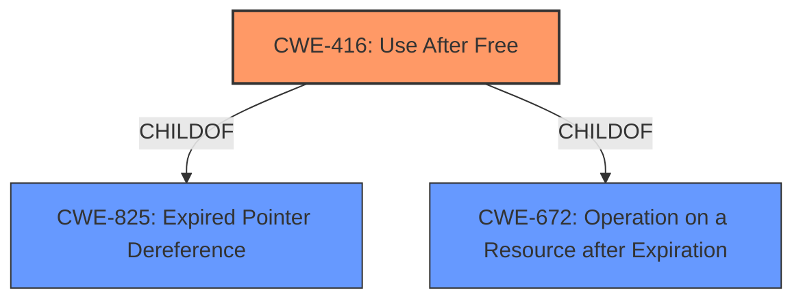

# Analysis Report for CVE-2021-30528

# Vulnerability Analysis Report: CVE-2021-30528

## Description


## Analysis (with Relationship Data)

# Summary
| CWE ID | CWE Name | Confidence | CWE Abstraction Level | CWE Vulnerability Mapping Label | CWE-Vulnerability Mapping Notes |
|---|---|---|---|---|---|
| CWE-416 | Use After Free | 1.0 | Variant | Allowed | Primary CWE |

## Evidence and Confidence

*   **Confidence Score:** 1.0
*   **Evidence Strength:** HIGH

## Relationship Analysis
The primary relationship that influenced the decision was the ChildOf relationship between CWE-416 and its parents, as well as its ability to precede other memory corruption issues. Specifically, the vulnerability is a **use after free**, which can lead to other memory corruption issues if not properly handled. CWE-416 is a Variant, which is a preferred level of abstraction.



## Vulnerability Chain
The vulnerability chain starts with the **use after free** (**CWE-416**), which allows a remote attacker to potentially exploit heap corruption.

## Summary of Analysis
The primary **rootcause** of this vulnerability is the **use after free**. The vulnerability description and the CVE reference links content summary both explicitly mention "Use after free" as the root cause. The retriever results also list CWE-416 as the top candidate. The description of CWE-416 perfectly matches the vulnerability. The confidence in this assessment is high (1.0) because the evidence directly points to this weakness.

The vulnerability description includes the following key phrases:
- **rootcause:** **use after free**
- **impact:** heap corruption

The CVE Reference Links Content Summary includes:
- **Root cause**: "An **use after free** flaw was found in the WebAuthentication component of the Chromium browser."
- **Weaknesses**: ["Use after free"]

Given the explicit mention of "**use after free**" as the **rootcause** and weakness, and the high confidence in the mapping, CWE-416 is the most appropriate choice.

Other CWEs Considered:

*   CWE-366, CWE-362, CWE-367: These CWEs relate to race conditions, which are not explicitly mentioned in the vulnerability description. Although use-after-free can be caused by race conditions, there isn't sufficient information to confirm that in this instance.
*   CWE-122: Heap-based buffer overflows can result from use-after-free, but is not the direct **rootcause**.
*   CWE-843: Access of Resource Using Incompatible Type ('Type Confusion') - While memory corruption is the impact, type confusion is not mentioned as the **rootcause**.
*   CWE-415: Double Free - The vulnerability is a use-after-free, not a double free.
*   CWE-1021: Improper Restriction of Rendered UI Layers or Frames - This vulnerability relates to clickjacking and UI redress attacks, which are not related to the vulnerability description.
*   CWE-123: Write-what-where Condition - This is a potential impact of the **use after free**, but is not the **rootcause**.


## CWE Relationship Analysis

Current CWEs represent these abstraction levels: .


### Vulnerability Chain Analysis

**Chain starting from CWE-415:**
- 415 (Double Free) - ROOT


**Chain starting from CWE-843:**
- 843 (Access of Resource Using Incompatible Type ('Type Confusion')) - ROOT


### CWE Relationship Diagram

```mermaid
graph TD
    classDef primary fill:#f96,stroke:#333,stroke-width:2px
    classDef secondary fill:#69f,stroke:#333
    classDef tertiary fill:#9e9,stroke:#333
```


*Report generated on 2025-04-02 05:09:21*
