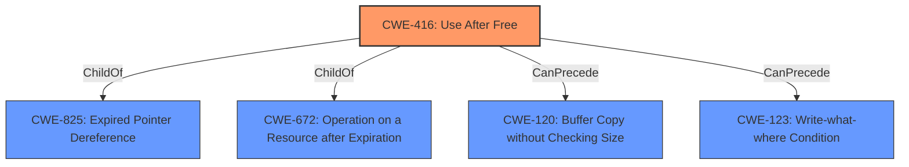

# Analysis Report for CVE-2021-30529

# Vulnerability Analysis Report: CVE-2021-30529

## Description


## Analysis (with Relationship Data)

# Summary
| CWE ID | CWE Name | Confidence | CWE Abstraction Level | CWE Vulnerability Mapping Label | CWE-Vulnerability Mapping Notes |
|---|---|---|---|---|---|
| CWE-416 | Use After Free | 1.0 | Variant | Allowed | Primary CWE |

## Evidence and Confidence

*   **Confidence Score:** 1.0
*   **Evidence Strength:** HIGH

## Relationship Analysis
The primary relationship to consider is the parent-child relationship where CWE-416 is a variant. The Retriever Results did not have strong secondary matches.


## Vulnerability Chain
The vulnerability chain starts with the **use after free** condition (CWE-416), leading to heap corruption. The attacker exploits this via a crafted HTML page.

## Summary of Analysis
The primary weakness identified in the vulnerability description is **use after free**. The CVE Reference Links Content Summary confirms this as the root cause.

The vulnerability description clearly states: "**rootcause:** **use after free**" and the CVE Reference Links Content Summary confirms: "Root cause of vulnerability: Use after free". This provides strong evidence for selecting CWE-416.

CWE-416 (Use After Free) is a Variant level CWE, which is the preferred level of abstraction. The mapping guidance for CWE-416 states "This CWE entry is at the Variant level of abstraction, which is a preferred level of abstraction for mapping to the root causes of vulnerabilities."

Based on the evidence and the CWE specifications, CWE-416 is the most appropriate CWE for this vulnerability.

Other CWEs considered but not used:

*   CWE-366 (Race Condition within a Thread): While race conditions can sometimes lead to use-after-free vulnerabilities, the description does not explicitly mention a race condition. Therefore, it is not the primary weakness.
*   CWE-122 (Heap-based Buffer Overflow): The description mentions heap corruption, but the root cause is the **use after free**, not a buffer overflow directly.
*   CWE-843 (Access of Resource Using Incompatible Type ('Type Confusion')): There is no mention of type confusion in the vulnerability description.
*   CWE-415 (Double Free): The vulnerability description specifies a **use after free**, not a double free.
*   CWE-356 (Product UI does not Warn User of Unsafe Actions): This CWE is related to UI issues, which are not the root cause of this vulnerability.
*   CWE-123 (Write-what-where Condition): This is a potential consequence of the **use after free**, but not the root cause itself.
*   CWE-362 (Concurrent Execution using Shared Resource with Improper Synchronization ('Race Condition'))
*   CWE-451 (User Interface (UI) Misrepresentation of Critical Information)
*   CWE-404 (Improper Resource Shutdown or Release)


## CWE Relationship Analysis

Current CWEs represent these abstraction levels: .


### Vulnerability Chain Analysis

**Chain starting from CWE-415:**
- 415 (Double Free) - ROOT


**Chain starting from CWE-123:**
- 123 (Write-what-where Condition) - ROOT


### CWE Relationship Diagram

```mermaid
graph TD
    classDef primary fill:#f96,stroke:#333,stroke-width:2px
    classDef secondary fill:#69f,stroke:#333
    classDef tertiary fill:#9e9,stroke:#333
```


*Report generated on 2025-04-01 19:32:04*
