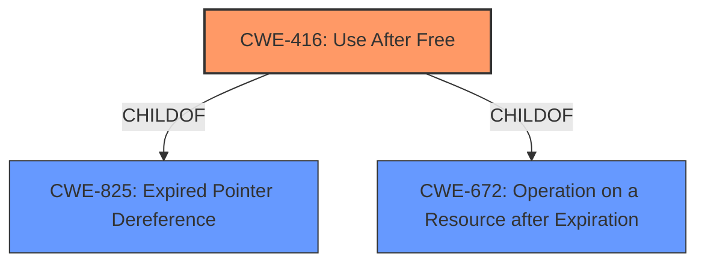

# Analysis Report for CVE-2021-30543

# Vulnerability Analysis Report: CVE-2021-30543

## Description


## Analysis (with Relationship Data)

# Summary
| CWE ID | CWE Name | Confidence | CWE Abstraction Level | CWE Vulnerability Mapping Label | CWE-Vulnerability Mapping Notes |
|---|---|---|---|---|---|
| CWE-416 | Use After Free | 1.0 | Variant | Primary | Allowed |

## Evidence and Confidence

*   **Confidence Score:** 1.0
*   **Evidence Strength:** HIGH

## Relationship Analysis
The primary CWE identified is CWE-416, which is a Variant level weakness. It is related to CWE-825 (Expired Pointer Dereference), CWE-672 (Operation on a Resource after Expiration). The relationship analysis confirms that CWE-416 is the most specific and appropriate choice, fitting the description of reusing memory after it has been freed.



## Vulnerability Chain
The vulnerability chain starts with the **use after free** condition (CWE-416), which leads to heap corruption. The attacker leverages a crafted HTML page, indicating a client-side attack vector.

## Summary of Analysis
The initial analysis strongly suggests CWE-416 as the primary weakness, supported by both the vulnerability description and the "CVE Reference Links Content Summary," which explicitly mentions a "**Use-after-free vulnerability**" in the Tab Strip component of Chromium. The "Vulnerability Description Key Phrases" also identifies the **rootcause** as "**Use after free**".

The retriever results also list CWE-416 as the top combined result, reinforcing this choice. The relationship analysis confirms that CWE-416 is a Variant-level weakness, providing a specific classification. The final decision is confidently based on the available evidence, making CWE-416 the optimal choice.

Relevant CWE Information:

# Enhanced Context (25 CWEs)

## CWE-404: Improper Resource Shutdown or Release
**Abstraction Level**: Class
**Similarity Score**: 0.81
**Source**: dense

This CWE was considered but not selected because the vulnerability is specifically a **use-after-free**, not a general failure to release resources.

## CWE-226: Sensitive Information in Resource Not Removed Before Reuse
**Abstraction Level**: Base
**Similarity Score**: 0.78
**Source**: dense

This CWE was considered but not selected because the vulnerability is specifically a **use-after-free**, and doesn't involve sensitive information.

## CWE-366: Race Condition within a Thread
**Abstraction Level**: Base
**Similarity Score**: 0.77
**Source**: dense

This CWE was considered but not selected because the primary issue is the **use-after-free**, not a race condition, even though concurrency might be involved in triggering the vulnerability.

## CWE-772: Missing Release of Resource after Effective Lifetime
**Abstraction Level**: Base
**Similarity Score**: 0.75
**Source**: dense

This CWE was considered but not selected because the issue is not simply a missing release, but rather the **use** of a resource after it has already been freed.

## CWE-667: Improper Locking
**Abstraction Level**: Class
**Similarity Score**: 0.75
**Source**: dense

This CWE was considered but not selected because there's no specific mention of locking issues in the description.

## CWE-362: Concurrent Execution using Shared Resource with Improper Synchronization ('Race Condition')
**Abstraction Level**: Class
**Similarity Score**: 0.74
**Source**: dense

This CWE was considered but not selected because the primary issue is the **use-after-free**, not a race condition, even though concurrency might be involved in triggering the vulnerability.

## CWE-664: Improper Control of a Resource Through its Lifetime
**Abstraction Level**: Pillar
**Similarity Score**: 0.74
**Source**: dense

This CWE was considered but not selected because it's a high-level category, and CWE-416 provides a more specific description of the vulnerability.

## CWE-662: Improper Synchronization
**Abstraction Level**: Class
**Similarity Score**: 0.74
**Source**: dense

This CWE was considered but not selected because there's no specific mention of synchronization issues in the description.

## CWE-826: Premature Release of Resource During Expected Lifetime
**Abstraction Level**: Base
**Similarity Score**: 0.73
**Source**: dense

This CWE was considered but not selected because the issue is not a premature release, but rather the **use** of a resource after it has already been freed.

## CWE-416: Use After Free
**Abstraction Level**: Variant
**Similarity Score**: 0.73
**Source**: dense

This is the selected CWE, as it accurately describes the vulnerability where memory is reused or referenced after it has been freed.

## CWE-451: User Interface (UI) Misrepresentation of Critical Information
**Abstraction Level**: Class
**Similarity Score**: 6246.52
**Source**: sparse

This CWE was considered but not selected because the vulnerability doesn't involve misrepresentation of information in the user interface.

## CWE-362: Concurrent Execution using Shared Resource with Improper Synchronization ('Race Condition')
**Abstraction Level**: Class
**Similarity Score**: 5921.91
**Source**: sparse

This CWE was considered but not selected because the primary issue is the **use-after-free**, not a race condition, even though concurrency might be involved in triggering the vulnerability.

## CWE-415: Double Free
**Abstraction Level**: Variant
**Similarity Score**: 5836.54
**Source**: sparse

This CWE was considered but not selected because the vulnerability is a **use-after-free**, not a double free.

## CWE-364: Signal Handler Race Condition
**Abstraction Level**: Base
**Similarity Score**: 5689.97
**Source**: sparse

This CWE was considered but not selected because the vulnerability doesn't involve signal handlers or race conditions within them.

## CWE-667: Improper Locking
**Abstraction Level**: Class
**Similarity Score**: 5670.91
**Source**: sparse

This CWE was considered but not selected because there's no specific mention of locking issues in the description.

## CWE-123: Write-what-where Condition
**Abstraction Level**: base
**Similarity Score**: 5.03
**Source**: graph

This CWE was considered but not selected because, while heap corruption can lead to arbitrary writes, the root cause is the **use-after-free** condition.

## CWE-415: Double Free
**Abstraction Level**: variant
**Similarity Score**: 4.53
**Source**: graph

This CWE was considered but not selected because the vulnerability is a **use-after-free**, not a double free.

## CWE-364: Signal Handler Race Condition
**Abstraction Level**: base
**Similarity Score**: 4.33
**Source**: graph

This CWE was considered but not selected because the vulnerability doesn't involve signal handlers or race conditions within them.

## CWE-120: Buffer Copy without Checking Size of Input ('Classic Buffer Overflow')
**Abstraction Level**: base
**Similarity Score**: 4.33
**Source**: graph

This CWE was considered but not selected because the vulnerability is a **use-after-free**, not a buffer overflow.

## CWE-825: Expired Pointer Dereference
**Abstraction Level**: base
**Similarity Score**: 4.33
**Source**: graph

This CWE was considered as a parent of CWE-416. However, CWE-416 is more descriptive of the actual vulnerability.

## CWE-476: NULL Pointer Dereference
**Abstraction Level**: base
**Similarity Score**: 4.33
**Source**: graph

This CWE was considered but not selected because the vulnerability is a **use-after-free**, not a null pointer dereference.

## CWE-252: Unchecked Return Value
**Abstraction Level**: base
**Similarity Score**: 4.33
**Source**: graph

This CWE was considered but not selected because the vulnerability doesn't involve unchecked return values.

## CWE-787: Out-of-bounds Write
**Abstraction Level**: base
**Similarity Score**: 4.33
**Source**: graph

This CWE was considered but not selected because the primary issue is the **use-after-free**, which can lead to out-of-bounds writes as a consequence.

## CWE-170: Improper Null Termination
**Abstraction Level**: base
**Similarity Score**: 4.33
**Source**: graph

This CWE was considered


## CWE Relationship Analysis

Current CWEs represent these abstraction levels: .


### Vulnerability Chain Analysis

**Chain starting from CWE-787:**
- 787 (Out-of-bounds Write) - ROOT


**Chain starting from CWE-123:**
- 123 (Write-what-where Condition) - ROOT


### CWE Relationship Diagram

```mermaid
graph TD
    classDef primary fill:#f96,stroke:#333,stroke-width:2px
    classDef secondary fill:#69f,stroke:#333
    classDef tertiary fill:#9e9,stroke:#333
```


*Report generated on 2025-04-02 05:45:02*
