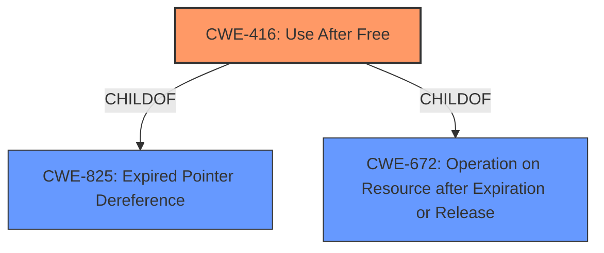

# Analysis Report for CVE-2021-30545

# Vulnerability Analysis Report: CVE-2021-30545

## Description


## Analysis (with Relationship Data)

# Summary
| CWE ID | CWE Name | Confidence | CWE Abstraction Level | CWE Vulnerability Mapping Label | CWE-Vulnerability Mapping Notes |
|---|---|---|---|---|---|
| CWE-416 | Use After Free | 1.0 | Variant | Allowed | Primary CWE |

## Evidence and Confidence

*   **Confidence Score:** 1.0
*   **Evidence Strength:** HIGH

## Relationship Analysis
The primary relationship that influenced the decision was the direct match of "**Use after free**" in the vulnerability description to **CWE-416** (Use After Free). **CWE-416** is a variant of **CWE-825** (Expired Pointer Dereference) and **CWE-672** (Operation on Resource after Expiration or Release). Since the vulnerability description explicitly states "Use after free", the variant **CWE-416** is the most specific and appropriate choice.



## Vulnerability Chain
The vulnerability chain is straightforward:
  1. **Root Cause:** **Use after free** (**CWE-416**)
  2. **Impact:** Heap corruption

## Summary of Analysis
The analysis is primarily based on the explicit mention of "**Use after free**" in the vulnerability description and CVE Reference Links Content Summary. The primary CWE match from similar CVE descriptions confirms that **CWE-416** is the best fit.

> Vulnerability Description Key Phrases:
> - **rootcause:** **Use after free**
> CVE Reference Links Content Summary:
>   "root_cause": "Use after free in the Extensions component of Chromium browser."

The graph relationships confirm that **CWE-416** is a specific variant of a more general class of weaknesses. The selection of **CWE-416** is at the optimal level of specificity as it directly reflects the root cause described in the vulnerability.

Relevant CWE Information:

# Enhanced Context (25 CWEs)
The following CWEs were identified as potentially relevant to this vulnerability:

## CWE-366: Race Condition within a Thread
**Abstraction Level**: Base
**Similarity Score**: 0.79
**Source**: dense
**Description**: If two threads of execution use a resource simultaneously, there exists the possibility that resources may be used while invalid, in turn making the state of execution undefined.
**Mapping Guidance**: Usage: Allowed

*Reason for not selecting*: While race conditions can sometimes lead to use-after-free vulnerabilities, there is no explicit mention of a race condition in the provided vulnerability description. Therefore, this CWE is not applicable.

## CWE-404: Improper Resource Shutdown or Release
**Abstraction Level**: Class
**Similarity Score**: 0.79
**Source**: dense
**Description**: The product does not release or incorrectly releases a resource before it is made available for re-use.
**Mapping Guidance**: Usage: Allowed-with-Review

*Reason for not selecting*: This CWE is too general and doesn't capture the specific "use after free" condition.

## CWE-911: Improper Update of Reference Count
**Abstraction Level**: Base
**Similarity Score**: 0.79
**Source**: dense
**Description**: The product uses a reference count to manage a resource, but it does not update or incorrectly updates the reference count.
**Mapping Guidance**: Usage: Allowed

*Reason for not selecting*: While an improper reference count could lead to a use-after-free, the vulnerability description doesn't mention reference counting.

## CWE-226: Sensitive Information in Resource Not Removed Before Reuse
**Abstraction Level**: Base
**Similarity Score**: 0.78
**Source**: dense
**Description**: The product releases a resource such as memory or a file so that it can be made available for reuse, but it does not clear or "zeroize" the information contained in the resource before the product performs a critical state transition or makes the resource available for reuse by other entities.
**Mapping Guidance**: Usage: Allowed

*Reason for not selecting*: This CWE focuses on sensitive information, which is not mentioned in the vulnerability description.

## CWE-667: Improper Locking
**Abstraction Level**: Class
**Similarity Score**: 0.78
**Source**: dense
**Description**: The product does not properly acquire or release a lock on a resource, leading to unexpected resource state changes and behaviors.
**Mapping Guidance**: Usage: Allowed-with-Review

*Reason for not selecting*: Improper locking could potentially contribute to the vulnerability, but the description doesn't explicitly mention locking issues.

## CWE-362: Concurrent Execution using Shared Resource with Improper Synchronization ('Race Condition')
**Abstraction Level**: Class
**Similarity Score**: 0.76
**Source**: dense
**Description**: The product contains a concurrent code sequence that requires temporary, exclusive access to a shared resource, but a timing window exists in which the shared resource can be modified by another code sequence operating concurrently.
**Mapping Guidance**: Usage: Allowed-with-Review

*Reason for not selecting*: See CWE-366.

## CWE-662: Improper Synchronization
**Abstraction Level**: Class
**Similarity Score**: 0.76
**Source**: dense
**Description**: The product utilizes multiple threads or processes to allow temporary access to a shared resource that can only be exclusive to one process at a time, but it does not properly synchronize these actions, which might cause simultaneous accesses of this resource by multiple threads or processes.
**Mapping Guidance**: Usage: Discouraged

*Reason for not selecting*: This is a higher-level class and less specific than CWE-416.

## CWE-1289: Improper Validation of Unsafe Equivalence in Input
**Abstraction Level**: Base
**Similarity Score**: 0.76
**Source**: dense
**Description**: The product receives an input value that is used as a resource identifier or other type of reference, but it does not validate or incorrectly validates that the input is equivalent to a potentially-unsafe value.
**Mapping Guidance**: Usage: Allowed

*Reason for not selecting*: This CWE is unrelated to the "use after free" condition.

## CWE-131: Incorrect Calculation of Buffer Size
**Abstraction Level**: Base
**Similarity Score**: 0.75
**Source**: dense
**Description**: The product does not correctly calculate the size to be used when allocating a buffer, which could lead to a buffer overflow.
**Mapping Guidance**: Usage: Allowed

*Reason for not selecting*: While an incorrect buffer size could lead to memory corruption, it is not the primary cause described.

## CWE-665: Improper Initialization
**Abstraction Level**: Class
**Similarity Score**: 0.75
**Source**: dense
**Description**: The product does not initialize or incorrectly initializes a resource, which might leave the resource in an unexpected state when it is accessed or used.
**Mapping Guidance**: Usage: Discouraged

*Reason for not selecting*: This is a higher-level class and does not directly relate to the specific vulnerability.

## CWE-415: Double Free
**Abstraction Level**: Variant
**Similarity Score**: 5479.59
**Source**: sparse
**Description**: The product calls free() twice on the same memory address, potentially leading to modification of unexpected memory locations.
**Mapping Guidance**: Usage: Allowed

*Reason for not selecting*: Though related, double free is distinct from Use-After-Free. The vulnerability description explicitly refers to Use-After-Free.

## CWE-367: Time-of-check Time-of-use (TOCTOU) Race Condition
**Abstraction Level**: Base
**Similarity Score**: 5291.85
**Source**: sparse
**Description**: The product checks the state of a resource before using that resource, but the resource's state can change between the check and the use in a way that invalidates the results of the check. This can cause the product to perform invalid actions when the resource is in an unexpected state.
**Mapping Guidance**: Usage: Allowed

*Reason for not selecting*: The vulnerability description does not describe the specific conditions related to a TOCTOU race condition.

## CWE-123: Write-what-where Condition
**Abstraction Level**: base
**Similarity Score**: 5.03
**Source**: graph
**Description**: CWE-123: Write-what-where Condition
**Mapping Guidance**: Usage: Allowed

*Reason for not selecting*: This CWE describes a general condition where an attacker can write arbitrary values, which is a consequence but not the root cause.

## CWE-120: Buffer Copy without Checking Size of Input ('Classic Buffer Overflow')
**Abstraction Level**: base
**Similarity Score**: 4.3


## CWE Relationship Analysis

Current CWEs represent these abstraction levels: .


### Vulnerability Chain Analysis

**Chain starting from CWE-667:**
- 667 (Improper Locking) - ROOT


**Chain starting from CWE-662:**
- 662 (Improper Synchronization) - ROOT


### CWE Relationship Diagram

```mermaid
graph TD
    classDef primary fill:#f96,stroke:#333,stroke-width:2px
    classDef secondary fill:#69f,stroke:#333
    classDef tertiary fill:#9e9,stroke:#333
```


*Report generated on 2025-04-01 23:06:14*
