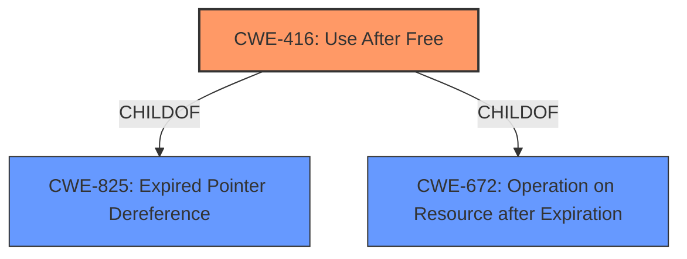

# Raw Analyzer Response for CVE-2021-30546

# Summary
| CWE ID | CWE Name | Confidence | CWE Abstraction Level | CWE Vulnerability Mapping Label | CWE-Vulnerability Mapping Notes |
|---|---|---|---|---|---|
| CWE-416 | Use After Free | 1.0 | Variant | Allowed | Primary CWE |

## Evidence and Confidence

*   **Confidence Score:** 1.0
*   **Evidence Strength:** HIGH

## Relationship Analysis
The primary relationship that influenced the decision was the direct match of the vulnerability description to the CWE-416 definition. CWE-416 is a variant of CWE-825 (Expired Pointer Dereference) and CWE-672 (Operation on Resource after Expiration). While other CWEs like CWE-366, CWE-843, and CWE-415 were considered, they did not directly align with the root cause described in the vulnerability.

## Vulnerability Chain
The vulnerability chain starts with the **use after free** (CWE-416), which leads to heap corruption.

## Summary of Analysis
The analysis is based on the provided evidence which clearly states a **use after free** condition.

> Vulnerability Description Key Phrases
> - **rootcause:** **use after free**

> CVE Reference Links Content Summary
> "The vulnerability is a **use-after-free** error within the Autofill component."

The selection of CWE-416 is at the optimal level of specificity because the vulnerability description explicitly mentions a "use after free" condition. The retriever results also list CWE-416 as the top candidate, reinforcing this choice.

Relevant CWE Information:

# Enhanced Context (25 CWEs)

## CWE-416: Use After Free
**Abstraction:** Variant
**Status:** Stable

### Description
The product reuses or references memory after it has been freed. At some point afterward, the memory may be allocated again and saved in another pointer, while the original pointer references a location somewhere within the new allocation. Any operations using the original pointer are no longer valid because the memory "belongs" to the code that operates on the new pointer.

### Extended Description
Not provided

### Alternative Terms
Dangling pointer: a pointer that no longer points to valid memory, often after it has been freed
UAF: commonly used acronym for Use After Free
Use-After-Free

### Relationships
ChildOf -> CWE-825
ChildOf -> CWE-672
ChildOf -> CWE-672
ChildOf -> CWE-672
CanPrecede -> CWE-120
CanPrecede -> CWE-123

### Mapping Guidance
**Usage:** Allowed
**Rationale:** This CWE entry is at the Variant level of abstraction, which is a preferred level of abstraction for mapping to the root causes of vulnerabilities.
**Comments:** Carefully read both the name and description to ensure that this mapping is an appropriate fit. Do not try to 'force' a mapping to a lower-level Base/Variant simply to comply with this preferred level of abstraction.
**Reasons:**
- Acceptable-Use

### Observed Examples
- **CVE-2022-20141:** Chain: an operating system kernel has insufficent resource locking (CWE-413) leading to a use after free (CWE-416).
- **CVE-2022-2621:** Chain: two threads in a web browser use the same resource (CWE-366), but one of those threads can destroy the resource before the other has completed (CWE-416).
- **CVE-2021-0920:** Chain: mobile platform race condition (CWE-362) leading to use-after-free (CWE-416), as exploited in the wild per CISA KEV.

**Other CWEs Considered and Rejected:**

*   **CWE-366 Race Condition within a Thread:** While race conditions can lead to use-after-free vulnerabilities, the description does not explicitly mention a race condition.
*   **CWE-843 Access of Resource Using Incompatible Type ('Type Confusion'):** The description does not indicate that the vulnerability involves accessing a resource using an incompatible type.
*   **CWE-415 Double Free:** The vulnerability is a use-after-free, not a double free.
*   **CWE-122 Heap-based Buffer Overflow:** The primary issue is not a buffer overflow, but rather the use of memory after it has been freed.
*   **CWE-1021 Improper Restriction of Rendered UI Layers or Frames:** This CWE is not applicable as the vulnerability is not related to UI rendering restrictions.
*   **CWE-123 Write-what-where Condition:** While heap corruption can lead to a write-what-where condition, the root cause is the use-after-free.
*   **CWE-362 Concurrent Execution using Shared Resource with Improper Synchronization ('Race Condition'):** Similar to CWE-366, the description does not explicitly mention a race condition.
*   **CWE-911 Improper Update of Reference Count:** The description does not indicate an issue with reference counting.
*   **CWE-404 Improper Resource Shutdown or Release:** The issue is not about improper shutdown or release, but rather using memory after it has been released.