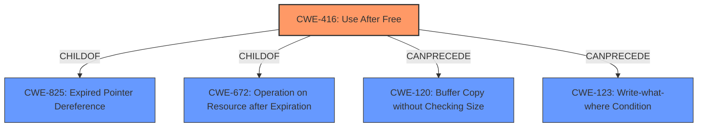

# Analysis for CVE-2021-30548

# Summary
| CWE ID | CWE Name | Confidence | CWE Abstraction Level | CWE Vulnerability Mapping Label | CWE-Vulnerability Mapping Notes |
|---|---|---|---|---|---|
| CWE-416 | Use After Free | 1.0 | Variant | Allowed | Primary CWE |

## Evidence and Confidence

*   **Confidence Score:** 1.0
*   **Evidence Strength:** HIGH

## Relationship Analysis
The primary identified CWE is CWE-416 (**Use After Free**), which is a variant-level weakness. It is related to other CWEs through hierarchical and chain relationships. Specifically, it's a child of CWE-825 (**Expired Pointer Dereference**) and CWE-672 (**Operation on Resource after Expiration**). It can also be a result of memory corruption and can precede other issues such as buffer overflows (CWE-120) or write-what-where conditions (CWE-123).

## Vulnerability Chain
The vulnerability chain starts with the **Use After Free** condition (CWE-416) in the Loader component of Google Chrome. The exploitation of this condition can lead to heap corruption, potentially allowing a remote attacker to execute arbitrary code or cause a denial-of-service.
  - Root Cause: CWE-416 (**Use After Free**)
  - Impact: Heap corruption, potential arbitrary code execution, denial of service

## Summary of Analysis
The analysis indicates a clear **Use After Free** vulnerability (CWE-416) based on the provided description, key phrases, and CVE reference summary. The vulnerability occurs in the Loader component of Google Chrome and can lead to heap corruption. The CWE-416 is a variant-level weakness, which aligns with the specific nature of the vulnerability. The evidence is strong, and the confidence in the mapping is high.

The vulnerability description explicitly mentions "**Use after free**" as the root cause. The CVE Reference Links Content Summary confirms this, stating: "rootCause: **Use-after-free** in Loader" and "weaknesses: [\"Use-After-Free\"]".

The retriever results also strongly support CWE-416 as the primary candidate, with the highest score.

Other CWEs considered but not used:

*   CWE-787 (**Out-of-bounds Write**): While heap corruption can sometimes lead to out-of-bounds write, the primary weakness is the **Use After Free**.
*   CWE-362 (**Concurrent Execution using Shared Resource with Improper Synchronization ('Race Condition')**): A race condition isn't explicitly mentioned or implied in the provided vulnerability description, so it is not an appropriate mapping.
*   CWE-415 (**Double Free**): While related to memory management issues, the vulnerability is specifically a **Use After Free**, not a double free.
*   CWE-123 (**Write-what-where Condition**): This is more of a consequence of exploiting a **Use After Free** rather than the root cause.
*   CWE-366 (**Race Condition within a Thread**): Similar to CWE-362, there's no explicit mention of a race condition in the vulnerability description.
*   CWE-843 (**Access of Resource Using Incompatible Type ('Type Confusion')**): There's no evidence suggesting type confusion is involved in this vulnerability.

The selection of CWE-416 as the primary CWE is based on the clear evidence of a **Use After Free** condition, making it the most specific and accurate representation of the vulnerability.

Relevant CWE Information:

# Enhanced Context (25 CWEs)
The following CWEs were identified as potentially relevant to this vulnerability:

## CWE-404: Improper Resource Shutdown or Release
**Abstraction Level**: Class
**Similarity Score**: 0.82
**Source**: dense

**Description**:
The product does not release or incorrectly releases a resource before it is made available for re-use.

**Mapping Guidance**:
- Usage: Allowed-with-Review
- Rationale: This CWE entry is a Class and might have Base-level children that would be more appropriate

## CWE-226: Sensitive Information in Resource Not Removed Before Reuse
**Abstraction Level**: Base
**Similarity Score**: 0.79
**Source**: dense

**Description**:
The product releases a resource such as memory or a file so that it can be made available for reuse, but it does not clear or "zeroize" the information contained in the resource before the product performs a critical state transition or makes the resource available for reuse by other entities.

**Mapping Guidance**:
- Usage: Allowed
- Rationale: This CWE entry is at the Base level of abstraction, which is a preferred level of abstraction for mapping to the root causes of vulnerabilities.

## CWE-366: Race Condition within a Thread
**Abstraction Level**: Base
**Similarity Score**: 0.79
**Source**: dense

**Description**:
If two threads of execution use a resource simultaneously, there exists the possibility that resources may be used while invalid, in turn making the state of execution undefined.

**Mapping Guidance**:
- Usage: Allowed
- Rationale: This CWE entry is at the Base level of abstraction, which is a preferred level of abstraction for mapping to the root causes of vulnerabilities.

## CWE-667: Improper Locking
**Abstraction Level**: Class
**Similarity Score**: 0.78
**Source**: dense

**Description**:
The product does not properly acquire or release a lock on a resource, leading to unexpected resource state changes and behaviors.

**Mapping Guidance**:
- Usage: Allowed-with-Review
- Rationale: This CWE entry is a Class and might have Base-level children that would be more appropriate

## CWE-662: Improper Synchronization
**Abstraction Level**: Class
**Similarity Score**: 0.76
**Source**: dense

**Description**:
The product utilizes multiple threads or processes to allow temporary access to a shared resource that can only be exclusive to one process at a time, but it does not properly synchronize these actions, which might cause simultaneous accesses of this resource by multiple threads or processes.

**Mapping Guidance**:
- Usage: Discouraged
- Rationale: This CWE entry is a level-1 Class (i.e., a child of a Pillar). It might have lower-level children that would be more appropriate

## CWE-362: Concurrent Execution using Shared Resource with Improper Synchronization ('Race Condition')
**Abstraction Level**: Class
**Similarity Score**: 0.76
**Source**: dense

**Description**:
The product contains a concurrent code sequence that requires temporary, exclusive access to a shared resource, but a timing window exists in which the shared resource can be modified by another code sequence operating concurrently.

**Mapping Guidance**:
- Usage: Allowed-with-Review
- Rationale: This CWE entry is a Class and might have Base-level children that would be more appropriate

## CWE-772: Missing Release of Resource after Effective Lifetime
**Abstraction Level**: Base
**Similarity Score**: 0.76
**Source**: dense

**Description**:
The product does not release a resource after its effective lifetime has ended, i.e., after the resource is no longer needed.

**Mapping Guidance**:
- Usage: Allowed
- Rationale: This CWE entry is at the Base level of abstraction, which is a preferred level of abstraction for mapping to the root causes of vulnerabilities.

## CWE-911: Improper Update of Reference Count
**Abstraction Level**: Base
**Similarity Score**: 0.75
**Source**: dense

**Description**:
The product uses a reference count to manage a resource, but it does not update or incorrectly updates the reference count.

**Mapping Guidance**:
- Usage: Allowed
- Rationale: This CWE entry is at the Base level of abstraction, which is a preferred level of abstraction for mapping to the root causes of vulnerabilities.

## CWE-664: Improper Control of a Resource Through its Lifetime
**Abstraction Level**: Pillar
**Similarity Score**: 0.75
**Source**: dense

**Description**:
The product does not maintain or incorrectly maintains control over a resource throughout its lifetime of creation, use, and release.

**Mapping Guidance**:
- Usage: Discouraged
- Rationale: This CWE entry