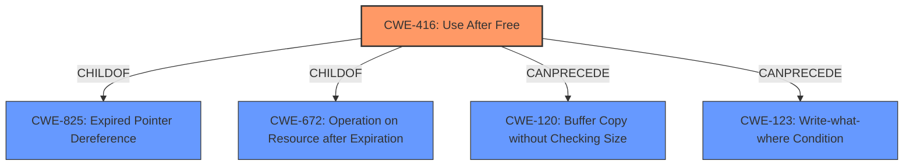

# Enhanced Analysis for CVE-2021-30552

# Summary
| CWE ID | CWE Name | Confidence | CWE Abstraction Level | CWE Vulnerability Mapping Label | CWE-Vulnerability Mapping Notes |
|---|---|---|---|---|---|
| CWE-416 | Use After Free | 1.0 | Variant | Allowed | Primary CWE |

## Evidence and Confidence

*   **Confidence Score:** 1.0
*   **Evidence Strength:** HIGH

## Relationship Analysis
The primary relationship that influenced my decision was the ChildOf relationship between CWE-416 and its parents, particularly CWE-825 (Expired Pointer Dereference) and CWE-672 (Operation on Resource after Expiration). However, CWE-416 is more specific and directly describes the vulnerability. There is also a CanPrecede relationship to CWE-120 and CWE-123.



## Vulnerability Chain
The chain of events is as follows:
1.  The **root cause** is a **Use after free**.
2.  The impact is heap corruption, which can lead to arbitrary code execution.

## Summary of Analysis
The vulnerability description clearly states "**Use after free**" as the root cause. The "CVE Reference Links Content Summary" confirms this by stating, "The root cause is a use-after-free vulnerability within the Extensions component of the Chromium browser. This means that memory that has been freed is accessed, leading to unpredictable behavior."

CWE-416 perfectly matches this description. It is a Variant-level CWE, which is the preferred level of abstraction. The description of CWE-416, "The product reuses or references memory after it has been freed," aligns directly with the vulnerability.

The Retriever Results also support this, with CWE-416 being the top result.

CWE-787 was considered since it was a top CWE, but the **rootcause** is not an out-of-bounds write, but a **use-after-free**.

Relevant CWE Information:

# Enhanced Context (25 CWEs)

## CWE-366: Race Condition within a Thread
**Abstraction Level**: Base
**Similarity Score**: 0.77
**Source**: dense
**Description**: If two threads of execution use a resource simultaneously, there exists the possibility that resources may be used while invalid, in turn making the state of execution undefined.
**Mapping Guidance**: Usage: Allowed

## CWE-226: Sensitive Information in Resource Not Removed Before Reuse
**Abstraction Level**: Base
**Similarity Score**: 0.76
**Source**: dense
**Description**: The product releases a resource such as memory or a file so that it can be made available for reuse, but it does not clear or "zeroize" the information contained in the resource before the product performs a critical state transition or makes the resource available for reuse by other entities.
**Mapping Guidance**: Usage: Allowed

## CWE-667: Improper Locking
**Abstraction Level**: Class
**Similarity Score**: 0.75
**Source**: dense
**Description**: The product does not properly acquire or release a lock on a resource, leading to unexpected resource state changes and behaviors.
**Mapping Guidance**: Usage: Allowed-with-Review

## CWE-404: Improper Resource Shutdown or Release
**Abstraction Level**: Class
**Similarity Score**: 0.75
**Source**: dense
**Description**: The product does not release or incorrectly releases a resource before it is made available for re-use.
**Mapping Guidance**: Usage: Allowed-with-Review

## CWE-1289: Improper Validation of Unsafe Equivalence in Input
**Abstraction Level**: Base
**Similarity Score**: 0.74
**Source**: dense
**Description**: The product receives an input value that is used as a resource identifier or other type of reference, but it does not validate or incorrectly validates that the input is equivalent to a potentially-unsafe value.
**Mapping Guidance**: Usage: Allowed

## CWE-362: Concurrent Execution using Shared Resource with Improper Synchronization ('Race Condition')
**Abstraction Level**: Class
**Similarity Score**: 0.73
**Source**: dense
**Description**: The product contains a concurrent code sequence that requires temporary, exclusive access to a shared resource, but a timing window exists in which the shared resource can be modified by another code sequence operating concurrently.
**Mapping Guidance**: Usage: Allowed-with-Review

## CWE-451: User Interface (UI) Misrepresentation of Critical Information
**Abstraction Level**: Class
**Similarity Score**: 0.73
**Source**: dense
**Description**: The user interface (UI) does not properly represent critical information to the user, allowing the information - or its source - to be obscured or spoofed. This is often a component in phishing attacks.
**Mapping Guidance**: Usage: Allowed-with-Review

## CWE-843: Access of Resource Using Incompatible Type ('Type Confusion')
**Abstraction Level**: Base
**Similarity Score**: 0.73
**Source**: dense
**Description**: The product allocates or initializes a resource such as a pointer, object, or variable using one type, but it later accesses that resource using a type that is incompatible with the original type.
**Mapping Guidance**: Usage: Allowed

## CWE-367: Time-of-check Time-of-use (TOCTOU) Race Condition
**Abstraction Level**: Base
**Similarity Score**: 0.73
**Source**: dense
**Description**: The product checks the state of a resource before using that resource, but the resource's state can change between the check and the use in a way that invalidates the results of the check. This can cause the product to perform invalid actions when the resource is in an unexpected state.
**Mapping Guidance**: Usage: Allowed

## CWE-356: Product UI does not Warn User of Unsafe Actions
**Abstraction Level**: Base
**Similarity Score**: 0.73
**Source**: dense
**Description**: The product's user interface does not warn the user before undertaking an unsafe action on behalf of that user. This makes it easier for attackers to trick users into inflicting damage to their system.
**Mapping Guidance**: Usage: Allowed

## CWE-451: User Interface (UI) Misrepresentation of Critical Information
**Abstraction Level**: Class
**Similarity Score**: 6359.90
**Source**: sparse
**Description**: The user interface (UI) does not properly represent critical information to the user, allowing the information - or its source - to be obscured or spoofed. This is often a component in phishing attacks.
**Mapping Guidance**: Usage: Allowed-with-Review

## CWE-362: Concurrent Execution using Shared Resource with Improper Synchronization ('Race Condition')
**Abstraction Level**: Class
**Similarity Score**: 6036.95
**Source**: sparse
**Description**: The product contains a concurrent code sequence that requires temporary, exclusive access to a shared resource, but a timing window exists in which the shared resource can be modified by another code sequence operating concurrently.
**Mapping Guidance**: Usage: Allowed-with-Review

## CWE-415: Double Free
**Abstraction Level**: Variant
**Similarity Score**: 5979.03
**Source**: sparse
**Description**: The product calls free() twice on the same memory address, potentially leading to modification of unexpected memory locations.
**Mapping Guidance**: Usage: Allowed

## CWE-364: Signal Handler Race Condition
**Abstraction Level**: Base
**Similarity Score**: 5937.71
**Source**: sparse
**Description**: The product uses a signal handler that introduces a race condition.
**Mapping Guidance**: Usage: Allowed

## CWE-367: Time-of-check Time-of-use (TOCTOU) Race Condition
**Abstraction Level**: Base
**Similarity Score**: 5833.03
**Source**: sparse
**Description**: The product checks the state of a resource before using that resource, but the resource's state can change between the check and the use in a way that invalidates the results of the check. This can cause the product to perform invalid actions when the resource is in an unexpected state.
**Mapping Guidance**: Usage: Allowed

## CWE-123:


## CWE Relationship Analysis

Current CWEs represent these abstraction levels: .


### Vulnerability Chain Analysis

**Chain starting from CWE-667:**
- 667 (Improper Locking) - ROOT


**Chain starting from CWE-787:**
- 787 (Out-of-bounds Write) - ROOT


### CWE Relationship Diagram

```mermaid
graph TD
    classDef primary fill:#f96,stroke:#333,stroke-width:2px
    classDef secondary fill:#69f,stroke:#333
    classDef tertiary fill:#9e9,stroke:#333
```