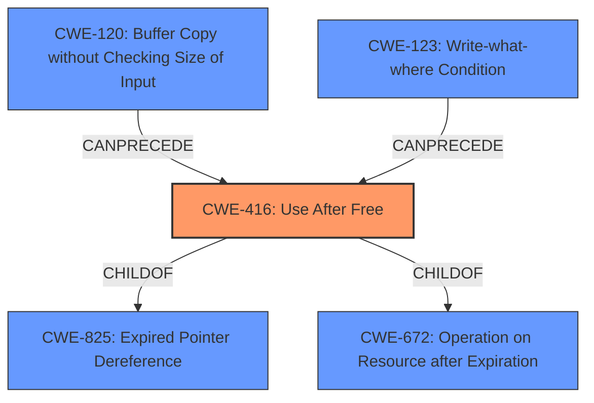

# Analysis Report for CVE-2021-30555

# Vulnerability Analysis Report: CVE-2021-30555

## Description


## Analysis (with Relationship Data)

# Summary
| CWE ID | CWE Name | Confidence | CWE Abstraction Level | CWE Vulnerability Mapping Label | CWE-Vulnerability Mapping Notes |
|---|---|---|---|---|---|
| CWE-416 | Use After Free | 1.0 | Variant | Allowed | Primary CWE |

## Evidence and Confidence

*   **Confidence Score:** 1.0
*   **Evidence Strength:** HIGH

## Relationship Analysis
The primary CWE is CWE-416, which is a Variant. It is a child of CWE-825 (Expired Pointer Dereference) and CWE-672 (Operation on Resource after Expiration). CWE-416 can be preceded by CWE-120 (Buffer Copy without Checking Size of Input) and CWE-123 (Write-what-where Condition). The hierarchical relationships and the clear indication of "use after free" in the description and reference links strongly support the selection of CWE-416.



## Vulnerability Chain
The vulnerability chain starts with a **use after free** condition which leads to **heap corruption**. The attacker exploits this via a crafted HTML page and user gesture within the Sharing component of Google Chrome.

## Summary of Analysis
The vulnerability description clearly states a "**use after free**" condition. The "CVE Reference Links Content Summary" section confirms this with the statement: "Root cause: Use after free in the Sharing component of Chromium" and "Weaknesses: Use after free". The "Vulnerability Description Key Phrases" also lists "**use after free**" as the rootcause.

The Retriever Results also lists CWE-416 as the top combined result.

Given the clear and consistent evidence, CWE-416 is the most appropriate and specific CWE. The use of a Variant level CWE is justified because the evidence directly supports this level of detail.

Other CWEs Considered but Not Used:

*   CWE-366 (Race Condition within a Thread): While concurrency issues can sometimes lead to use-after-free, there's no specific mention of a race condition in the provided vulnerability description or reference links.
*   CWE-843 (Access of Resource Using Incompatible Type ('Type Confusion')): Type confusion is not explicitly mentioned in the description.
*   CWE-122 (Heap-based Buffer Overflow): The description mentions **heap corruption**, but the root cause is a **use after free**, not a buffer overflow.
*   CWE-415 (Double Free): Double free is not mentioned, the root cause is **use after free**.
*   CWE-1021 (Improper Restriction of Rendered UI Layers or Frames): The vulnerability doesn't directly involve UI misrepresentation. The crafted HTML page is used to trigger the use-after-free, not to trick the user via the UI.
*   CWE-123 (Write-what-where Condition): While use-after-free can lead to arbitrary writes, it is a consequence, not the primary weakness.
*   CWE-362 (Concurrent Execution using Shared Resource with Improper Synchronization ('Race Condition')): As with CWE-366, there is no explicit evidence of a race condition.
*   CWE-451 (User Interface (UI) Misrepresentation of Critical Information): The vulnerability is not directly related to misrepresentation within the UI, but rather the exploitation of a memory management error.
*   CWE-404 (Improper Resource Shutdown or Release): Improper resource shutdown or release might be related, but the core issue is the use of freed memory, not the failure to release it.


## CWE Relationship Analysis

Current CWEs represent these abstraction levels: .


### Vulnerability Chain Analysis

**Chain starting from CWE-415:**
- 415 (Double Free) - ROOT


**Chain starting from CWE-123:**
- 123 (Write-what-where Condition) - ROOT


### CWE Relationship Diagram

```mermaid
graph TD
    classDef primary fill:#f96,stroke:#333,stroke-width:2px
    classDef secondary fill:#69f,stroke:#333
    classDef tertiary fill:#9e9,stroke:#333
```


*Report generated on 2025-04-02 05:12:20*
