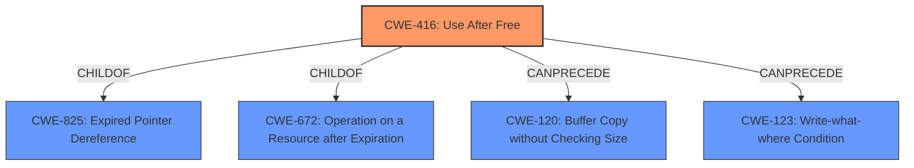

# Analysis for CVE-2021-30556

# Summary
| CWE ID | CWE Name | Confidence | CWE Abstraction Level | CWE Vulnerability Mapping Label | CWE-Vulnerability Mapping Notes |
|---|---|---|---|---|---|
| CWE-416 | Use After Free | 1.0 | Variant | Allowed | Primary CWE |

## Evidence and Confidence

*   **Confidence Score:** 1.0
*   **Evidence Strength:** HIGH

## Relationship Analysis
The primary relationship that influenced the decision was the direct match of the vulnerability description to CWE-416. Other CWEs were considered, such as those related to race conditions, but they did not directly describe the root cause of the vulnerability.

## Vulnerability Chain
The vulnerability chain consists of a **use-after-free** condition leading to heap corruption.
  - Root cause: **Use After Free** (CWE-416)
  - Impact: Heap corruption

## Summary of Analysis
The initial analysis, based on the vulnerability description and key phrases, strongly pointed to CWE-416 (**Use After Free**).

The vulnerability description states "**Use after free** in WebAudio in Google Chrome prior to 91.0.4472.114 allowed a remote attacker to potentially exploit heap corruption via a crafted HTML page." The key phrase also identifies "**Use after free**" as the root cause. The "CVE Reference Links Content Summary" confirms that the root_cause is "Use after free" and the weaknesses are "[ "Use after free" ]".

The retriever results listed CWE-416 as the top candidate with a score of 0.338. The Complete CWE Specifications for CWE-416 describes the issue as "The product reuses or references memory after it has been freed." This aligns perfectly with the vulnerability description.

CWE-366 (Race Condition within a Thread), CWE-843 (Access of Resource Using Incompatible Type ('Type Confusion')), CWE-415 (Double Free), and CWE-122 (Heap-based Buffer Overflow) were considered but ultimately deemed less accurate. The primary weakness is the **use-after-free** condition, and the heap corruption is a consequence of this condition, not the primary cause.

The selection of CWE-416 is at the optimal level of specificity, as it directly addresses the root cause of the vulnerability.

Relevant CWE Information:

# Enhanced Context (25 CWEs)

## CWE-404: Improper Resource Shutdown or Release
**Abstraction Level**: Class
**Similarity Score**: 0.82
**Source**: dense

**Description**:
The product does not release or incorrectly releases a resource before it is made available for re-use.

**Mapping Guidance**:
- Usage: Allowed-with-Review
- Rationale: This CWE entry is a Class and might have Base-level children that would be more appropriate

This CWE was considered, but use-after-free is a specific type of resource management issue, whereas this is a more general Improper Resource Shutdown or Release.

## CWE-226: Sensitive Information in Resource Not Removed Before Reuse
**Abstraction Level**: Base
**Similarity Score**: 0.79
**Source**: dense

**Description**:
The product releases a resource such as memory or a file so that it can be made available for reuse, but it does not clear or "zeroize" the information contained in the resource before the product performs a critical state transition or makes the resource available for reuse by other entities.

**Mapping Guidance**:
- Usage: Allowed
- Rationale: This CWE entry is at the Base level of abstraction, which is a preferred level of abstraction for mapping to the root causes of vulnerabilities.

This CWE was considered, but the vulnerability is about using freed memory, not about sensitive data remaining in memory after it is freed.

## CWE-366: Race Condition within a Thread
**Abstraction Level**: Base
**Similarity Score**: 0.79
**Source**: dense

**Description**:
If two threads of execution use a resource simultaneously, there exists the possibility that resources may be used while invalid, in turn making the state of execution undefined.

**Mapping Guidance**:
- Usage: Allowed
- Rationale: This CWE entry is at the Base level of abstraction, which is a preferred level of abstraction for mapping to the root causes of vulnerabilities.

This CWE was considered as a secondary cause, but there is no direct evidence of a race condition. It may be a contributing factor, but it is not explicit in the vulnerability description.

## CWE-667: Improper Locking
**Abstraction Level**: Class
**Similarity Score**: 0.78
**Source**: dense

**Description**:
The product does not properly acquire or release a lock on a resource, leading to unexpected resource state changes and behaviors.

**Mapping Guidance**:
- Usage: Allowed-with-Review
- Rationale: This CWE entry is a Class and might have Base-level children that would be more appropriate

This CWE was considered as a secondary cause, but there is no direct evidence of improper locking. It may be a contributing factor, but it is not explicit in the vulnerability description.

## CWE-662: Improper Synchronization
**Abstraction Level**: Class
**Similarity Score**: 0.76
**Source**: dense

**Description**:
The product utilizes multiple threads or processes to allow temporary access to a shared resource that can only be exclusive to one process at a time, but it does not properly synchronize these actions, which might cause simultaneous accesses of this resource by multiple threads or processes.

**Mapping Guidance**:
- Usage: Discouraged
- Rationale: This CWE entry is a level-1 Class (i.e., a child of a Pillar). It might have lower-level children that would be more appropriate

This CWE was considered as a secondary cause, but there is no direct evidence of improper synchronization. It may be a contributing factor, but it is not explicit in the vulnerability description.

## CWE-362: Concurrent Execution using Shared Resource with Improper Synchronization ('Race Condition')
**Abstraction Level**: Class
**Similarity Score**: 0.76
**Source**: dense

**Description**:
The product contains a concurrent code sequence that requires temporary, exclusive access to a shared resource, but a timing window exists in which the shared resource can be modified by another code sequence operating concurrently.

**Mapping Guidance**:
- Usage: Allowed-with-Review
- Rationale: This CWE entry is a Class and might have Base-level children that would be more appropriate

This CWE was considered as a secondary cause, but there is no direct evidence of a race condition. It may be a contributing factor, but it is not explicit in the vulnerability description.

## CWE-772: Missing Release of Resource after Effective Lifetime
**Abstraction Level**: Base
**Similarity Score**: 0.76
**Source**: dense

**Description**:
The product does not release a resource after its effective lifetime has ended, i.e., after the resource is no longer needed.

**Mapping Guidance**:
- Usage: Allowed
- Rationale: This CWE entry is at the Base level of abstraction, which is a preferred level of abstraction for mapping to the root causes of vulnerabilities.

This CWE was considered, but the issue is not just missing the release, but using it after it has been released.

## CWE-911: Improper Update of Reference Count
**Abstraction Level**: Base
**Similarity Score**: 0.76
**Source**: dense

**Description**:
The product uses a reference count to manage a resource, but it does not update or incorrectly updates the reference count.

**Mapping Guidance**:
- Usage: Allowed
- Rationale: This CWE entry is at the Base level of abstraction, which is a preferred level of abstraction for mapping to the root causes of vulnerabilities.

This CWE was considered as a secondary cause, but there is no direct evidence of improper updates to reference count. It may be a contributing factor, but it is not explicit in the vulnerability description.

## CWE-664: Improper Control of a Resource Through its Lifetime
**Abstraction Level**: Pillar
**Similarity Score**: 0.75
**Source**: dense

**Description**:
The product does not maintain or incorrectly maintains control over a resource throughout its lifetime of creation, use, and release.

**Mapping Guidance**:
- Usage: Discouraged
- Rationale: This CWE entry