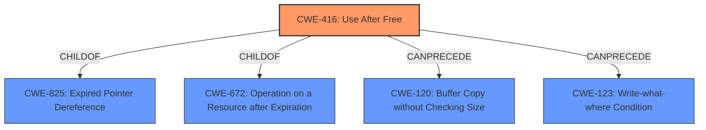

# Analysis for CVE-2021-30562

# Summary
| CWE ID | CWE Name | Confidence | CWE Abstraction Level | CWE Vulnerability Mapping Label | CWE-Vulnerability Mapping Notes |
|---|---|---|---|---|---|
| CWE-416 | Use After Free | 1.0 | Variant | Allowed | Primary CWE |

## Evidence and Confidence

*   **Confidence Score:** 1.0
*   **Evidence Strength:** HIGH

## Relationship Analysis
The primary relationship influencing the decision is the direct match of the **root cause** "Use after free" in the vulnerability description. Other related CWEs like CWE-123 (Write-what-where Condition), CWE-415 (Double Free), and CWE-787 (Out-of-bounds Write) are connected through chain relationships (CANPRECEDE, CANFOLLOW) or hierarchical relationships (CHILDOF, PARENTOF). However, the description directly indicates a **use-after-free**, making CWE-416 the most accurate and specific classification. The abstraction level of CWE-416 is Variant, which is a preferred level of abstraction.

## Vulnerability Chain
The vulnerability chain starts with a coding error that leads to memory being freed while still in use.
  - **Root Cause:** **Use-after-free** (CWE-416)
  - **Impact:** Heap corruption, potentially leading to arbitrary code execution.

## Summary of Analysis
The analysis is strongly based on the provided evidence, especially the **Vulnerability Description Key Phrases** section that clearly identifies the **root cause** as "**Use after free**". The **CVE Reference Links Content Summary** confirms this by stating, "Root cause of vulnerability: Use-after-free in WebSerial" and "The vulnerability is a use-after-free, which occurs when a program attempts to access memory after it has been freed."

The Retriever Results also supports this by identifying CWE-416 as the top combined result.

The graph relationships and chain patterns further emphasize the potential consequences of a **use-after-free** vulnerability, such as heap corruption and arbitrary code execution. However, the focus remains on the initial weakness.

The selection of CWE-416 is at the optimal level of specificity because it directly addresses the root cause as a **use-after-free** condition. While other CWEs might be related as potential consequences or prerequisites, CWE-416 accurately captures the core vulnerability.

Relevant CWE Information:

# Enhanced Context (25 CWEs)

## CWE-404: Improper Resource Shutdown or Release
**Abstraction Level**: Class
**Similarity Score**: 0.82
**Source**: dense

**Description**:
The product does not release or incorrectly releases a resource before it is made available for re-use.

**Mapping Guidance**:
- Usage: Allowed-with-Review
- Rationale: This CWE entry is a Class and might have Base-level children that would be more appropriate

*This CWE was considered but is not as specific as CWE-416. A use-after-free implies an improper release, but CWE-416 directly identifies the specific type of improper release.*

## CWE-226: Sensitive Information in Resource Not Removed Before Reuse
**Abstraction Level**: Base
**Similarity Score**: 0.79
**Source**: dense

**Description**:
The product releases a resource such as memory or a file so that it can be made available for reuse, but it does not clear or "zeroize" the information contained in the resource before the product performs a critical state transition or makes the resource available for reuse by other entities.

**Mapping Guidance**:
- Usage: Allowed
- Rationale: This CWE entry is at the Base level of abstraction, which is a preferred level of abstraction for mapping to the root causes of vulnerabilities.

*This CWE was considered but doesn't fit the vulnerability description since it does not talk about sensitive information reuse, it is a generic **use-after-free**.*

## CWE-366: Race Condition within a Thread
**Abstraction Level**: Base
**Similarity Score**: 0.79
**Source**: dense

**Description**:
If two threads of execution use a resource simultaneously, there exists the possibility that resources may be used while invalid, in turn making the state of execution undefined.

**Mapping Guidance**:
- Usage: Allowed
- Rationale: This CWE entry is at the Base level of abstraction, which is a preferred level of abstraction for mapping to the root causes of vulnerabilities.

*This CWE was considered since race conditions can lead to use-after-free, but there's no direct evidence of a race condition in the description.*

## CWE-667: Improper Locking
**Abstraction Level**: Class
**Similarity Score**: 0.78
**Source**: dense

**Description**:
The product does not properly acquire or release a lock on a resource, leading to unexpected resource state changes and behaviors.

**Mapping Guidance**:
- Usage: Allowed-with-Review
- Rationale: This CWE entry is a Class and might have Base-level children that would be more appropriate

*This CWE was considered as improper locking can lead to use-after-free, but there's no direct evidence of improper locking in the description.*

## CWE-662: Improper Synchronization
**Abstraction Level**: Class
**Similarity Score**: 0.77
**Source**: dense

**Description**:
The product utilizes multiple threads or processes to allow temporary access to a shared resource that can only be exclusive to one process at a time, but it does not properly synchronize these actions, which might cause simultaneous accesses of this resource by multiple threads or processes.

**Mapping Guidance**:
- Usage: Discouraged
- Rationale: This CWE entry is a level-1 Class (i.e., a child of a Pillar). It might have lower-level children that would be more appropriate

*This CWE was considered as improper synchronization can lead to use-after-free, but there's no direct evidence of improper synchronization in the description.*

## CWE-362: Concurrent Execution using Shared Resource with Improper Synchronization ('Race Condition')
**Abstraction Level**: Class
**Similarity Score**: 0.76
**Source**: dense

**Description**:
The product contains a concurrent code sequence that requires temporary, exclusive access to a shared resource, but a timing window exists in which the shared resource can be modified by another code sequence operating concurrently.

**Mapping Guidance**:
- Usage: Allowed-with-Review
- Rationale: This CWE entry is a Class and might have Base-level children that would be more appropriate

*This CWE was considered as concurrent execution can lead to use-after-free, but there's no direct evidence of concurrent execution in the description.*

## CWE-772: Missing Release of Resource after Effective Lifetime
**Abstraction Level**: Base
**Similarity Score**: 0.76
**Source**: dense

**Description**:
The product does not release a resource after its effective lifetime has ended, i.e., after the resource is no longer needed.

**Mapping Guidance**:
- Usage: Allowed
- Rationale: This CWE entry is at the Base level of abstraction, which is a preferred level of abstraction for mapping to the root causes of vulnerabilities.

*This CWE was considered but is not as specific as CWE-416. While a use-after-free could be caused by missing release, the description explicitly mentions use after free, making CWE-416 a better fit.*

## CWE-911: Improper Update of Reference Count
**Abstraction Level**: Base
**Similarity Score**: 0.76
**Source**: dense

**Description**:
The product uses a reference count to manage a resource, but it does not update or incorrectly updates the reference count.

**Mapping Guidance**:
- Usage: Allowed
- Rationale: This CWE entry is at the Base level of abstraction, which is a preferred level of abstraction for mapping to the root causes of vulnerabilities.

*This CWE was considered as improper updating of reference count can lead to use-after-free, but there's no direct evidence of this in the description.*

## CWE-664: Improper Control of a Resource Through its Lifetime
**Abstraction Level**: Pillar
**Similarity Score**: 0.75
**Source**: dense

**Description**:
The product does not maintain or incorrectly maintains control over a