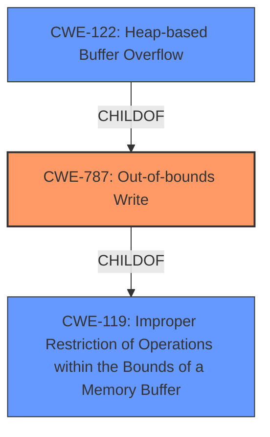

# Raw Analyzer Response for CVE-2021-30564

# Summary
| CWE ID  | CWE Name  | Confidence | CWE Abstraction Level | CWE Vulnerability Mapping Label | CWE-Vulnerability Mapping Notes |
|--------------|-----------------------------------------------------------------------------------|-------------------|--------------------------|-----------------------------------|---------------------------------------------------------------------------------------------------------------------------------------------------|
| CWE-787 | Out-of-bounds Write | 1 | Base | Allowed | Primary CWE. This is a heap buffer overflow allowing a remote attacker to potentially exploit heap corruption via a crafted HTML page. |
| CWE-122 | Heap-based Buffer Overflow | 0.7 | Variant | Allowed | Secondary CWE. The vulnerability is specifically a heap-based buffer overflow. |
| CWE-119 | Improper Restriction of Operations within the Bounds of a Memory Buffer | 0.5 | Class | Discouraged | Secondary CWE. Considered because it is a more general case of memory buffer errors. |

## Evidence and Confidence

*   **Confidence Score:** 0.8
*   **Evidence Strength:** HIGH

## Relationship Analysis
The primary CWE is CWE-787, which is a base level CWE describing an out-of-bounds write. The secondary CWE, CWE-122, is a variant that specifies that the out-of-bounds write occurs on the heap. CWE-119 is a class-level CWE and parent of both CWE-787 and CWE-122, representing a more general case of improper buffer operation restrictions. The relationships that influenced the selection are the parent-child relationships between CWE-119, CWE-787, and CWE-122.

## Vulnerability Chain
The vulnerability chain starts with the **heap buffer overflow** which is **CWE-787**, and results in the potential to exploit heap corruption, and potential for arbitrary code execution or denial of service.

## Summary of Analysis
The initial analysis identified the **heap buffer overflow** as the primary weakness. The vulnerability description states "**Heap buffer overflow** in WebXR in Google Chrome prior to 91.0.4472.164 allowed a remote attacker to potentially exploit heap corruption via a crafted HTML page." The phrase "**Heap buffer overflow**" is a key indicator. The CVE Reference Links Content Summary confirms this root cause: "root_cause": "Heap buffer overflow in WebXR."

The selection of CWE-787 is based on the vulnerability description and CVE details, indicating a **heap buffer overflow** leading to potential heap corruption. The mapping guidance for CWE-787 allows its usage at the Base level of abstraction. The relationship analysis shows that CWE-787 is a child of CWE-119, but CWE-787 is more specific to the type of **out-of-bounds write**.

CWE-122 (Heap-based Buffer Overflow) was considered because the vulnerability is specifically described as a "heap buffer overflow". This is a variant of CWE-787.

CWE-119 (Improper Restriction of Operations within the Bounds of a Memory Buffer) was considered but ultimately classified as secondary because it is a more general class of vulnerability. The mapping guidance for CWE-119 discourages its use when more specific CWEs are available, like CWE-787.

The selected CWEs are at the optimal level of specificity because they accurately represent the **heap buffer overflow** condition (CWE-787) and the location of the overflow (heap, CWE-122).

Relevant CWE Information:

# Enhanced Context (25 CWEs)

## CWE-131: Incorrect Calculation of Buffer Size
Not selected because the root cause is not related to buffer size calculation, but rather an out-of-bounds write.

## CWE-191: Integer Underflow (Wrap or Wraparound)
Not selected because the root cause is not related to integer underflow.

## CWE-193: Off-by-one Error
Not selected because the root cause is not related to an off-by-one error.

## CWE-366: Race Condition within a Thread
Not selected because there's no evidence to support a race condition.

## CWE-197: Numeric Truncation Error
Not selected because the root cause is not related to numeric truncation.

## CWE-124: Buffer Underwrite ('Buffer Underflow')
Not selected because the vulnerability is an overflow (write past the end), not an underflow (write before the beginning).

## CWE-667: Improper Locking
Not selected because there's no evidence to support improper locking.

## CWE-805: Buffer Access with Incorrect Length Value
Not selected because the description doesn't point to an incorrect length value being used to access the buffer.

## CWE-404: Improper Resource Shutdown or Release
Not selected because the root cause is not related to resource shutdown or release.

## CWE-226: Sensitive Information in Resource Not Removed Before Reuse
Not selected because the root cause is not related to sensitive information reuse.

## CWE-190: Integer Overflow or Wraparound
Not selected because the root cause is not related to integer overflow.

## CWE-125: Out-of-bounds Read
Not selected because the vulnerability is related to an out-of-bounds write.

## CWE-415: Double Free
Not selected because the root cause is not related to a double free.

## CWE-123: Write-what-where Condition
Not selected because the description doesn't suggest the attacker has control of where they can write in memory.

## CWE-170: Improper Null Termination
Not selected because the root cause is not related to null termination.

## CWE-120: Buffer Copy without Checking Size of Input ('Classic Buffer Overflow')
Not selected because the root cause is not explicitly related to a buffer copy operation.

## CWE-416: Use After Free
Not selected because the root cause is not related to use-after-free.

## CWE-195: Signed to Unsigned Conversion Error
Not selected because the root cause is not related to signed to unsigned conversion.

## CWE-825: Expired Pointer Dereference
Not selected because the root cause is not related to pointer dereference.

## CWE-1341: Multiple Releases of Same Resource or Handle
Not selected because the root cause is not related to multiple releases of the same resource.

## CWE-1284: Improper Validation of Specified Quantity in Input
Not selected because the root cause is not related to improper validation of specified quantity in input.