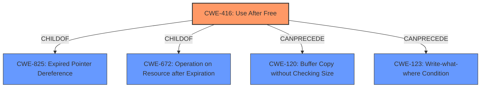

# Analysis for CVE-2021-30572

# Summary
| CWE ID | CWE Name | Confidence | CWE Abstraction Level | CWE Vulnerability Mapping Label | CWE-Vulnerability Mapping Notes |
|---|---|---|---|---|---|
| CWE-416 | Use After Free | 1.0 | Variant | Allowed | Primary CWE |

## Evidence and Confidence

*   **Confidence Score:** 1.0
*   **Evidence Strength:** HIGH

## Relationship Analysis
The analysis focused on identifying the most specific CWE to represent the **use-after-free** vulnerability. CWE-416 is a Variant-level CWE, making it a precise match. The parent CWEs (CWE-825, CWE-672) are less specific. The CANPRECEDE relationships to CWE-120 and CWE-123 suggest potential exploitation paths after the **use-after-free** condition, but the primary focus remains on the root cause.

## Vulnerability Chain
The vulnerability chain starts with a **use-after-free** condition (CWE-416) in the Autofill component of Google Chrome. This can potentially lead to heap corruption and arbitrary code execution.

## Summary of Analysis
The vulnerability description clearly states a **"Use after free"** in the Autofill component of Google Chrome. The CVE Reference Links Content Summary also confirms the **root cause of vulnerability** is **Use-after-free** in the Autofill component of Google Chrome. The primary weakness is **Use-after-free**. The impact of exploitation includes arbitrary code execution and potential information disclosure. Given this clear evidence, CWE-416 is the most appropriate CWE. The Retriever Results also list CWE-416 as the top match.

CWE-366, CWE-843, CWE-122, CWE-415, CWE-1021, CWE-123, CWE-362, and CWE-911 were considered, but they don't directly describe the **use-after-free** condition. CWE-416's description precisely matches the vulnerability description.