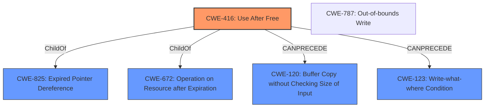

# Raw Analyzer Response for CVE-2021-30574

# Summary

| CWE ID | CWE Name | Confidence | CWE Abstraction Level | CWE Vulnerability Mapping Label | CWE-Vulnerability Mapping Notes |
|---|---|---|---|---|---|
| CWE-416 | Use After Free | 1.0 | Variant | Allowed | Primary CWE |
| CWE-787 | Out-of-bounds Write | 0.5 | Base | Allowed | Secondary Candidate |

## Evidence and Confidence

*   **Confidence Score:** 0.9
*   **Evidence Strength:** HIGH

## Relationship Analysis
The primary CWE is CWE-416, **Use After Free**, which is a Variant level CWE. CWE-416 has relationships to CWE-825 (Expired Pointer Dereference), CWE-672 (Operation on Resource after Expiration). A potential related CWE is CWE-787, **Out-of-Bounds Write**. CWE-416 can precede CWE-120 (**Buffer Copy without Checking Size of Input**) and CWE-123 (**Write-what-where Condition**).

## Vulnerability Chain
The vulnerability chain starts with a **Use After Free** (CWE-416). This can potentially lead to heap corruption, and potentially an **out-of-bounds write**.
- **Root Cause:** CWE-416 (**Use After Free**)
- **Impact:** Heap corruption, potentially leading to arbitrary code execution

## Summary of Analysis
The primary weakness is a **Use After Free** (CWE-416). The vulnerability description explicitly states "**Use after free** in protocol handling in Google Chrome prior to 92.0.4515.107 allowed a remote attacker to potentially exploit heap corruption via a crafted HTML page.". The "CVE Reference Links Content Summary" confirms this, stating, "root_cause": "Use-after-free vulnerability" and "weaknesses": ["Use after free"]. This aligns with the description of CWE-416, which involves reusing or referencing memory after it has been freed. The confidence in this mapping is very high (1.0) due to the explicit mention of "use-after-free" in the vulnerability description.

CWE-787 (**Out-of-bounds Write**) is considered as a secondary candidate because the **Use After Free** condition can potentially lead to memory corruption through out-of-bounds writes. The vulnerability description mentions "heap corruption," which could be caused by writing to memory locations that are no longer valid. Confidence is lower here (0.5) because the description doesn't explicitly state an out-of-bounds write, but it is a potential consequence of the **use-after-free**.

The selected CWEs are at the optimal level of specificity. CWE-416 is a Variant, which is preferred.