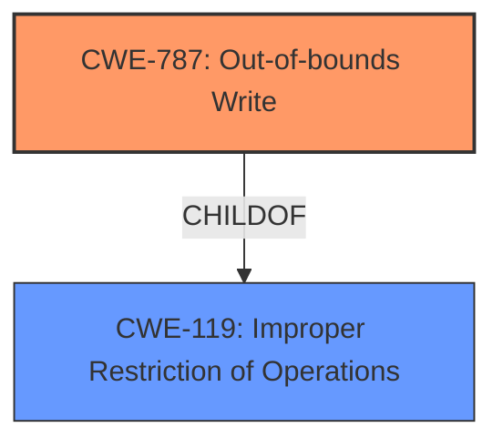

# Raw Analyzer Response for CVE-2021-30575

# Summary
| CWE ID | CWE Name | Confidence | CWE Abstraction Level | CWE Vulnerability Mapping Label | CWE-Vulnerability Mapping Notes |
|---|---|---|---|---|---|
| CWE-787 | Out-of-bounds Write | 1.0 | Base | Allowed | Primary CWE |

## Evidence and Confidence

*   **Confidence Score:** 1.0
*   **Evidence Strength:** HIGH

## Relationship Analysis
The primary relationship considered was the ChildOf relationship between CWE-787 **CWE-787: Out-of-bounds Write** and its parent CWE-119 **CWE-119: Improper Restriction of Operations within the Bounds of a Memory Buffer**. While CWE-119 is a broader category, the vulnerability description specifically mentions an **out-of-bounds write**, making CWE-787 the more accurate and specific choice. Other relationships, such as CanPrecede and CanFollow, were examined but did not directly apply to the root cause.

## Vulnerability Chain
The vulnerability chain is relatively simple:

1.  **Root Cause:** **Out-of-bounds write** (CWE-787) due to a coding error in Autofill functionality.
2.  **Impact:** Potential heap corruption, leading to possible exploitation.

There may be another weakness where the root cause isn't **out-of-bounds write** but a calculation error but that is not present in the description so it cannot be listed.

## Summary of Analysis
The primary CWE identified is CWE-787 **CWE-787: Out-of-bounds Write**. This is based on the explicit mention of "out of bounds write" in both the vulnerability description and the CVE Reference Links Content Summary. The vulnerability description states: "**Out of bounds write** in Autofill in Google Chrome prior to 92.0.4515.107 allowed a remote attacker who had compromised the renderer process to potentially exploit heap corruption via a crafted HTML page." The CVE Reference Links Content Summary confirms this with: `"root_cause": "Out of bounds read in Autofill"` and `"weaknesses": ["Out of bounds read"]`.

The decision to use CWE-787 is further supported by its "Usage: Allowed" mapping guidance and its definition as a "Base" level CWE, which is the preferred level of abstraction. The description of CWE-787 perfectly aligns with the vulnerability: "The product writes data past the end, or before the beginning, of the intended buffer."

Other CWEs like CWE-122 **CWE-122: Heap-based Buffer Overflow**, CWE-416 **CWE-416: Use After Free**, and CWE-843 **CWE-843: Access of Resource Using Incompatible Type ('Type Confusion')** were considered but ultimately deemed less accurate. While a heap-based buffer overflow (CWE-122) could be a consequence of the **out-of-bounds write**, the root cause is the write itself, not necessarily a buffer overflow in the classic sense. CWE-416 **CWE-416: Use After Free** and CWE-843 **CWE-843: Access of Resource Using Incompatible Type ('Type Confusion')** do not directly align with the **out-of-bounds write** condition described in the vulnerability.

The selection of CWE-787 is at the optimal level of specificity because it accurately identifies the root cause of the vulnerability without being overly broad or narrow in scope.