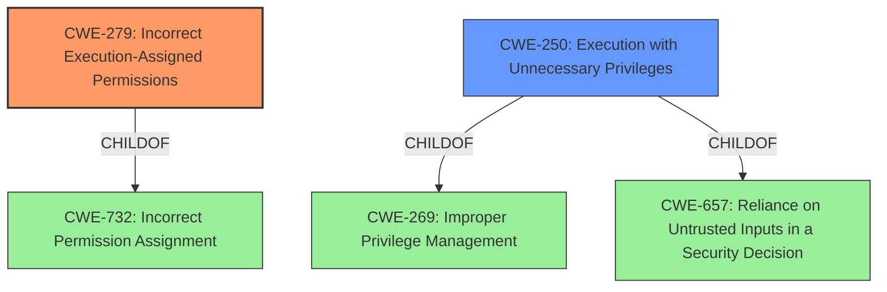

# Analysis Report for CVE-2021-30577

# Vulnerability Analysis Report: CVE-2021-30577

## Description


## Analysis (with Relationship Data)

# Summary
| CWE ID | CWE Name | Confidence | CWE Abstraction Level | CWE Vulnerability Mapping Label | CWE-Vulnerability Mapping Notes |
|---|---|---|---|---|---|
| CWE-279 | Incorrect Execution-Assigned Permissions | 0.8 | Variant | Allowed | Primary CWE |
| CWE-250 | Execution with Unnecessary Privileges | 0.6 | Base | Allowed | Secondary Candidate |

## Evidence and Confidence

*   **Confidence Score:** 0.7
*   **Evidence Strength:** MEDIUM

## Relationship Analysis
The primary CWE is CWE-279, which is a Variant of CWE-732 (Incorrect Permission Assignment). The retriever results also suggested CWE-250 (Execution with Unnecessary Privileges), which is a child of CWE-269 (Improper Privilege Management) and CWE-657 (Reliance on Untrusted Inputs in a Security Decision).



## Vulnerability Chain
The vulnerability chain starts with **insufficient policy enforcement** in the installer, leading to **incorrect execution-assigned permissions** and ultimately resulting in local privilege escalation.

## Summary of Analysis
The primary weakness is **insufficient policy enforcement** within the installer of Google Chrome, which allows a remote attacker to perform local privilege escalation.

The vulnerability description states "Insufficient policy enforcement in Installer in Google Chrome prior to 92.0.4515.107 allowed a remote attacker to perform local privilege escalation via a crafted file." The CVE Reference Links Content Summary elaborates: "Insufficient policy enforcement in the Installer component of the Chromium browser."

The Retriever Results identified several potential CWEs.

CWE-279 (Incorrect Execution-Assigned Permissions) is the best fit as the vulnerability leads to incorrect permissions being assigned during the installer execution. The vulnerability involves the installer failing to properly enforce security policies, leading to the execution of code with elevated privileges or incorrect permissions, and allowing privilege escalation.

CWE-250 (Execution with Unnecessary Privileges) is a plausible secondary candidate because **insufficient policy enforcement** could also mean that the installer runs with higher privileges than it needs to, amplifying the consequences of the **insufficient policy enforcement**.

Other CWEs considered but rejected:

*   CWE-416 (Use After Free): This CWE is related to memory management issues and does not fit the description of the vulnerability.
*   CWE-451 (User Interface (UI) Misrepresentation of Critical Information): This CWE is related to UI issues and does not fit the description of the vulnerability.
*   CWE-1386 (Insecure Operation on Windows Junction / Mount Point) and CWE-64 (Windows Shortcut Following (.LNK)): These CWEs are specific to file system vulnerabilities and don't directly align with the **insufficient policy enforcement** issue.
*   CWE-123 (Write-what-where Condition), CWE-843 (Access of Resource Using Incompatible Type ('Type Confusion')), CWE-358 (Improperly Implemented Security Check for Standard), CWE-356 (Product UI does not Warn User of Unsafe Actions): These CWEs are not directly related to the **insufficient policy enforcement** in the installer.

CWE-279 is the optimal level of specificity because it directly addresses the **incorrect permission assignment** during execution due to **insufficient policy enforcement**.


## CWE Relationship Analysis

Current CWEs represent these abstraction levels: .


### Vulnerability Chain Analysis

**Chain starting from CWE-732:**
- 732 (Incorrect Permission Assignment for Critical Resource) - ROOT


**Chain starting from CWE-657:**
- 657 (Violation of Secure Design Principles) - ROOT


### CWE Relationship Diagram

```mermaid
graph TD
    classDef primary fill:#f96,stroke:#333,stroke-width:2px
    classDef secondary fill:#69f,stroke:#333
    classDef tertiary fill:#9e9,stroke:#333
```


*Report generated on 2025-04-02 05:08:58*
